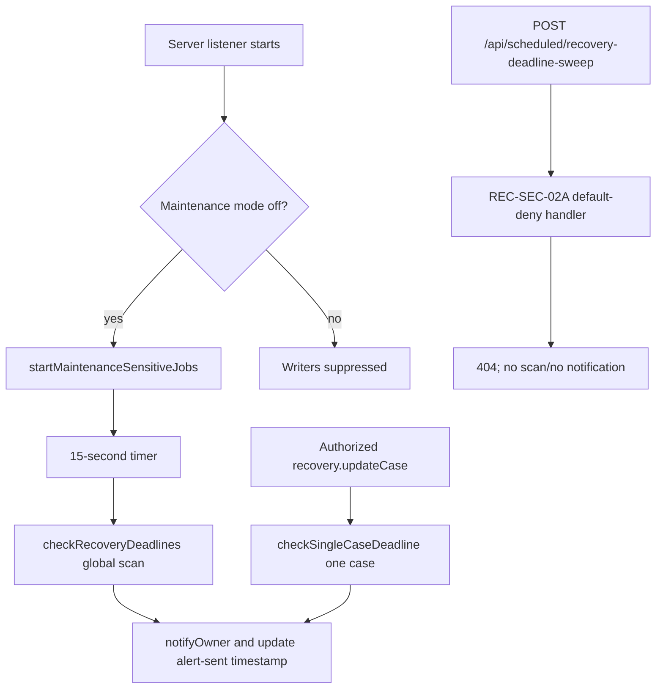

# Recovery-Deadline Sweep Removal Scope Analysis

**Date:** 2026-09-20
**Repository and reviewed revision:** `/home/ubuntu/kinga-replit`, `main` at `2d0b634d99d59af3c6893d9b0c96f3404c3ab1be`
**Authority and boundary:** Owner-authorized **read-only scope analysis** for deletion of the recovery-deadline sweep feature. This analysis made no source, Git, database, deployment, maintenance, credential, or schedule change. The working tree was clean before and after the review.

## Conclusion

The feature to remove is not one HTTP handler alone. On current `main`, it consists of an unreachable-by-design public route, a still-live **in-process startup invocation** of `checkRecoveryDeadlines()`, and the global notification scanner that invocation calls. The route is currently the REC-SEC-02A generic `404` containment handler, but normal application startup still schedules the global scan after 15 seconds whenever maintenance mode is off. Therefore, removing only `POST /api/scheduled/recovery-deadline-sweep` would **not** remove automated deadline notifications.

A minimal, coherent removal deletes the public route registration and its default-deny implementation/tests, removes the startup scheduling dependency and `checkRecoveryDeadlines()` export, and retains `checkSingleCaseDeadline()` plus its case-update call. The retained function is a distinct event-driven notification behavior. It runs only after an authorized recovery-case update; it is not an HTTP scheduler entry point or a global scan.

The Recovery Portal already provides substantial manual operational visibility: its live case table displays a deadline chip and status for each returned recovery case; its KPIs display the count of non-terminal cases due within 90 days; and its status tabs and case-detail page expose recovery status and a deadline warning. This means deletion does **not** remove the presently implemented user interface for seeing recovery deadlines or case status. It **does** remove the only identified periodic, proactive notification and lapsed-deadline discovery mechanism. The UI is a pull-based substitute for information visibility, not an equivalent push-notification control.

There is also an implementation limitation that prevents treating the Portal as a complete operational replacement without an explicit product decision: the “Approaching Deadline” buttons set `activeTab` to `approaching`, but `STATUS_CARDS` has no `approaching` entry and `getCases` only filters by status. Consequently, that control currently falls back to the unfiltered case query rather than a deadline-only queue. No exact “stalled case” or “90-day stalled-case” indicator exists in the reviewed Recovery Portal, Recovery Case Detail page, or recovery router. The portal has a **90-day approaching-deadlines count**, not a stalled-case queue.

> **Deletion decision:** It is safe to delete the obsolete public endpoint and the startup/global sweep as a feature if the owner accepts a shift from automatic reminder/lapsed detection to manual portal monitoring plus the retained update-triggered alert. It is not accurate to claim that the Portal preserves the sweep’s automatic notification behavior, and the nonfunctional deadline-filter control should be tracked separately if the 90-day count is expected to navigate to an actionable queue.

## Reviewed behavior and call graph

The current server composition imports both the global checker and the REC-SEC-02A denial handler. It registers the exact `POST /api/scheduled/recovery-deadline-sweep` route after the maintenance gate and before body parsing. The handler always returns `404 {"error":"Not found"}` and performs no authentication, database access, scan, or notification. This endpoint has no success path in current `main`. [1] [2]

After the listener starts, `server/_core/index.ts` calls `startMaintenanceSensitiveJobs`. When maintenance is disabled, that helper starts the intake and stuck-assessment jobs, then schedules `checkRecoveryDeadlines()` after 15,000 milliseconds. This call is the remaining active global automation. When maintenance is enabled, the helper suppresses all three listed writers. [1] [3]

`checkRecoveryDeadlines()` queries all non-terminal recovery cases with a deadline on or before the date 90 days from execution. For each case, it calculates days remaining and sends an owner notification at the 90-, 60-, 30-, 14-, and 7-day windows, or once after lapse, subject to the six-day/same-window suppression logic. Successful notification delivery updates `recovery_deadline_alert_sent_at`. This implementation is a global, cross-tenant scan; it has no lease, transactionally durable outbox, or concurrency fence. [4]

The same module also exports `checkSingleCaseDeadline(caseId)`. The recovery case update procedure calls it asynchronously after an authorized, tenant-scoped update. It applies the same threshold notification rules to that one case. This is a separate production dependency and must be retained if event-triggered alerts are to remain. Both the active modular recovery router and the legacy aggregate router source import it; current `appRouter` registers the modular `recoveryRouter`. [4] [5]

## Current-main dependency inventory

### Production source dependencies

| Artifact                                                                                                                                 | Current-main evidence                                                                                                                                                                                     | Removal disposition                                                                                                                                                                                                                                                                  |
| ---------------------------------------------------------------------------------------------------------------------------------------- | --------------------------------------------------------------------------------------------------------------------------------------------------------------------------------------------------------- | ------------------------------------------------------------------------------------------------------------------------------------------------------------------------------------------------------------------------------------------------------------------------------------ |
| `server/_core/index.ts`                                                                                                                  | Imports `checkRecoveryDeadlines` at line 56; imports the REC-SEC-02A handler at line 57; registers the exact POST route at line 129; passes the global checker to startup orchestration at lines 394–401. | **Edit.** Remove both imports, the route registration/comment, and the `checkRecoveryDeadlines` dependency entry. Retain the maintenance gate, other scheduled routes, and the two unrelated job dependencies.                                                                       |
| `server/_core/maintenance-write-jobs.ts`                                                                                                 | Its dependency type requires `checkRecoveryDeadlines`; when maintenance is off it schedules that function after 15 seconds at lines 29–38.                                                                | **Edit.** Remove the checker and `schedule` dependencies if no other use remains, and remove only the recovery-deadline timer. Keep the helper and its intake/stuck-recovery behavior. Update the suppression warning so it no longer says recovery-deadline writers are suppressed. |
| `server/recovery/recoveryDeadlineAlerts.ts`                                                                                              | Defines global `checkRecoveryDeadlines()` at lines 120–185 and shared threshold, notification, and per-case functions.                                                                                    | **Edit, not delete.** Delete only `checkRecoveryDeadlines()`. Retain `checkSingleCaseDeadline()`, shared threshold/suppression helpers, and `sendAlert()` if owner-approved event-triggered alerts remain.                                                                           |
| `server/routers/recovery.ts`                                                                                                             | Imports `checkSingleCaseDeadline` at line 19 and invokes it after `updateCase` at lines 177–180. It does not call the global checker.                                                                     | **No change.** This is the event-driven behavior to retain.                                                                                                                                                                                                                          |
| `server/routers.ts`                                                                                                                      | Also imports `checkSingleCaseDeadline`; `appRouter` registers the modular `recoveryRouter`.                                                                                                               | **No functional change required for the global-sweep deletion.** Retain its separate event-driven dependency.                                                                                                                                                                        |
| `server/recovery/recovery-deadline-sweep-default-deny-route.ts`                                                                          | REC-SEC-02A handler returns only generic `404`.                                                                                                                                                           | **Delete.** Its sole runtime caller is the route registration above.                                                                                                                                                                                                                 |
| `drizzle/schema.ts` and CI schema                                                                                                        | `recovery_cases.recovery_deadline`, `recovery_deadline_alert_sent_at`, and the recovery-deadline index remain.                                                                                            | **Do not change in the minimal deletion.** Deadline data is read by the Portal, case detail, KPI logic, and retained event-driven checker. The alert-sent field is still used by the retained per-case alert.                                                                        |
| `client/src/pages/RecoveryPortal.tsx`, `client/src/pages/RecoveryCaseDetail.tsx`, and `client/src/components/portal/SLADeadlineChip.tsx` | Read/present recovery deadlines and case status only; no dependency on the sweep endpoint or global checker.                                                                                              | **No deletion.** These are the manual visibility replacement, subject to the filter gap below.                                                                                                                                                                                       |

No current-main production source HTTP caller for the recovery-sweep endpoint was found. The current source configuration/automation inventory contains no active endpoint schedule manifest. The historical investigation records that the only active schedule at the time reviewed was a daily read-only user-contamination monitor, not this recovery sweep. Historical Manus task sessions did use `SCHEDULED_TASK_ENDPOINT_BASE` and `SCHEDULED_TASK_COOKIE` to obtain a 200 response in May 2026, but are not evidence of an enabled current schedule. [6]

### Test dependencies

| Test artifact                                                                | What it proves today                                                                                                                                | Removal disposition                                                                                                                                                                                                                                                                             |
| ---------------------------------------------------------------------------- | --------------------------------------------------------------------------------------------------------------------------------------------------- | ----------------------------------------------------------------------------------------------------------------------------------------------------------------------------------------------------------------------------------------------------------------------------------------------- |
| `server/recovery/recovery-deadline-sweep-default-deny-route.test.ts`         | Direct handler generic 404 for anonymous, human-looking, cron-looking, task-header, bearer, and trailing-slash forms.                               | **Delete.** It exists solely for the route being removed.                                                                                                                                                                                                                                       |
| `server/_core/recovery-deadline-sweep-default-deny.production-stack.test.ts` | Real Express composition: route preempts parser and returns 404 across representative inputs; maintenance remains 503 preemption.                   | **Delete.** It is exclusively REC-SEC-02A route coverage. Preserve separate maintenance coverage.                                                                                                                                                                                               |
| `server/_core/maintenance-mode.production-stack.test.ts`                     | Maintenance preempts multiple protected route classes, including the removed route.                                                                 | **Edit.** Remove only the recovery-sweep request from its protected-request array. Keep `/healthz`, OAuth, webhooks, uploads, tRPC, keep-warm, intake escalation, and stuck recovery assertions.                                                                                                |
| `server/_core/maintenance-write-jobs.test.ts`                                | Suppresses writers in maintenance; starts unrelated writers and schedules the sweep when released; reports checker rejection.                       | **Edit.** Delete or replace the two sweep-specific timer/error assertions. Retain tests that maintenance suppresses and normal mode starts intake/stuck jobs. Add an assertion that the removed timer/dependency is absent only if the revised helper still has observable scheduling behavior. |
| `server/_core/sdk.cron-session-compatibility.test.ts`                        | Exercises generic SDK cron-session compatibility, but fixtures are specifically named `cron_recovery-deadline-sweep` and `recovery-deadline-sweep`. | **Edit, do not necessarily delete.** Rename fixture identity to a retained scheduled task such as intake escalation or a neutral test task, preserving generic cron compatibility coverage without retaining stale feature naming.                                                              |

There are no current Portal, KPI, or deadline-component tests found by name in the reviewed test tree. This is a regression-coverage gap rather than a deletion dependency.

### Documentation and audit dependencies

The following documents describe the former route or REC-SEC response and must not silently become current-state documentation after feature removal. They are historical/security evidence, so the minimal plan is **retain and append a dated supersession/disposition note**, rather than delete or rewrite the record of the incident.

| Documentation artifact                                                   | Dependency / issue                                                                                                                                                                                                 | Required disposition after code removal                                                                                                                                                                                                           |
| ------------------------------------------------------------------------ | ------------------------------------------------------------------------------------------------------------------------------------------------------------------------------------------------------------------ | ------------------------------------------------------------------------------------------------------------------------------------------------------------------------------------------------------------------------------------------------- |
| `docs/security/rec-sec-02a-emergency-default-deny-release-2026-09-19.md` | Defines REC-SEC-02A as temporary default-deny containment. Its status line says “not been merged or published,” which conflicts with current `main`, where the default-deny source is present after PR #125 merge. | Retain as historical release design; append a supersession note that the owner-authorized feature removal retired both the route and temporary denial. Correct the stale status rather than treating the file as current operational instruction. |
| `audit/rec-sec-02a-manus-deployment-drift-escalation-2026-09-19.md`      | Records public/backend drift and expected 404/503 verification of the retained route.                                                                                                                              | Retain as incident evidence; append that route-presence verification is no longer applicable. Do not retain a post-removal expectation that the endpoint returns REC-SEC-02A’s 404.                                                               |
| `audit/rec-sec-self-service-investigation-2026-09-19.md`                 | Records startup invocation, historical scheduled tasks, no confirmed active caller, and current active schedule inventory.                                                                                         | Retain as historical schedule evidence; append final disposition of the startup/global scan and historical route.                                                                                                                                 |
| `audit/manus-deployment-binding-escalation-draft-2026-09-19.md`          | Refers to the default-deny source, pre-application route boundary, and production binding concern.                                                                                                                 | Retain as historical escalation evidence; append a closure/supersession reference if it is still presented as an open route-remediation action.                                                                                                   |
| `audit/rec-sec-recovery-sweep-removal-scope-2026-09-20.md`               | This scope record.                                                                                                                                                                                                 | Retain as the authoritative removal-scope and regression record.                                                                                                                                                                                  |
| `references/periodic-updates.md`                                         | Documents generic scheduled-task environment variables and a different `/api/scheduled/news` example; it does not name the recovery endpoint.                                                                      | **No change.** Do not remove generic scheduler documentation.                                                                                                                                                                                     |

The old schedule name also appears in one SDK test as noted above. It is not a production scheduler configuration.

## REC-SEC history and non-main durable design

### REC-SEC-02A on main

The insecure original route was introduced in the May 2026 recovery work. Its historical implementation accepted any successfully authenticated session and then called `checkRecoveryDeadlines()`; it did not require a cron identity, task UID, capability, role, or tenant-specific authorization. The emergency REC-SEC-02A change was authored in `0dcfb441`, merged through PR #125 in `4f00bfab`, and is now reachable from `main` through the default-deny handler/import/registration described above. [1] [7]

REC-SEC-02A is intentionally a temporary application-layer denial, not an authorization design. If the endpoint is deleted, its handler, registration, and tests should be deleted together. Retaining only a dead handler would be misleading and unnecessary.

### Durable REC-SEC-02 is unmerged and not a current-main deletion target

The durable design is on local/remote branch `fix/recovery-deadline-service-authorization` at `f7913a24`. It is **not merged into `main`**. Its merge base is `b4b6723e`; relative to current main, branch comparison reports 93 main-only commits and two branch-only commits. The design files do not exist in current `main`, so they must not be deleted from `main` as part of this source removal.

The unmerged design would replace the old route with a dedicated, environment-bound bearer capability, explicitly deny human session cookies, acquire a fenced database lease, create durable outbox effects, and retry delivery correctly. It adds database tables for service capabilities, leases, and alert outbox records. It also changes the checker to use the fenced executor for both global and per-case checks. [8]

| Unmerged REC-SEC-02 artifact group | Branch-only files / changes                                                                                                       | Removal relevance                                                                                                                           |
| ---------------------------------- | --------------------------------------------------------------------------------------------------------------------------------- | ------------------------------------------------------------------------------------------------------------------------------------------- |
| Durable design documentation       | `docs/security/rec-sec-02-source-remediation-plan-2026-09-19.md`                                                                  | Do not merge for a feature being retired. Mark the proposal superseded/close its PR or branch through separately authorized Git governance. |
| Authorization and route            | `server/recovery/recovery-deadline-service-authorization.ts`, `server/recovery/recovery-deadline-sweep-route.ts`, and their tests | Not on main. Do not cherry-pick or merge. No current-main deletion needed.                                                                  |
| Durable executor                   | `server/recovery/recovery-deadline-sweep-executor.ts` and test                                                                    | Not on main. Do not merge. It would preserve the automated sweep rather than delete it.                                                     |
| Schema/migration                   | `drizzle/0062_recovery_deadline_sweep_authorization.sql`, schema/meta/CI-schema changes                                           | Not on main and no migration is applied by this scope. Do not execute or merge.                                                             |
| Integration changes                | Branch edits to `server/_core/index.ts`, `server/_core/env.ts`, and `server/recovery/recoveryDeadlineAlerts.ts`                   | Not on main. Their route/capability wiring is contrary to removal.                                                                          |

The current deletion must not be represented as a partial implementation of durable REC-SEC-02. It is the opposite product/security choice: retiring the scheduled global sweep rather than making it safely callable.

## Recovery Portal visibility verification

### What is already visible

The Recovery Portal uses `trpc.recovery.getCases` and `trpc.recovery.getKPIs`, each refreshing every 60 seconds. The case table exposes **Claim #, Third Party, Quantum, Recovery Potential Score, Deadline, and Status**. Every displayed row sends `rc.recoveryDeadline` to `SLADeadlineChip` with `warnOnly={false}` and `showOk={true}`. The component calculates time remaining from the actual deadline and visibly labels breached, critical, warning, and okay states. [9] [10]

The Portal’s KPI/hero/attention areas display an **Approaching Deadline** count, labelled “Within 90 days” and “recovery case(s) approaching 90-day deadline.” The server computes this from tenant-scoped recovery cases whose deadline is on or before 90 days from the current date and whose status is non-terminal. [5] [9]

The Portal also exposes status queues for pending review, under investigation, open, demand sent, disputed/legal, settled, and archived. The case-detail header displays both a status pill and a deadline chip. For a deadline within 90 days, the detail page renders an explicit warning with the actual recovery deadline and days remaining. Its Key Dates card displays the deadline, demand-sent date, response due date, and closure date. [9] [11]

### What is not equivalent or not present

The reviewed sources contain **no exact stalled-case indicator**, no “90-day stalled case” calculation, and no deadline/status queue that filters specifically on the 90-day condition. `getCases` supports only status, assigned-to-me, repeat-offenders-only, paging; it orders by recovery potential score, not recovery deadline. The Portal’s “Approaching Deadline” control sets a non-enumerated tab value (`approaching`), which does not produce a `status` input and therefore requests the unfiltered case list. The count is visible, but the click-through is not an operational deadline-only queue. [5] [9]

The global checker sends automatic notification content that tells the recipient to log in and update the case. The Portal exposes the same core information once an authorized user visits it, but it neither sends a reminder nor guarantees that an officer sees a newly lapsed deadline absent a case update. `checkSingleCaseDeadline()` continues to send an alert when a case is updated and happens to meet a threshold, but it cannot replace a time-driven scan for unchanged cases. [4]

### Operational-capability finding

| Capability                                                                  | After minimal deletion          | Finding                                                                                               |
| --------------------------------------------------------------------------- | ------------------------------- | ----------------------------------------------------------------------------------------------------- |
| Per-case deadline, remaining-time/overdue indication, and status visibility | **Retained**                    | Portal table and case detail already supply this manually visible information.                        |
| Tenant 90-day approaching-deadlines aggregate                               | **Retained**                    | `recovery.getKPIs` calculates it independently of the sweep.                                          |
| Actionable 90-day deadline-only queue                                       | **Not currently established**   | Button/tab wiring does not filter the cases query; no dedicated deadline filter exists.               |
| 90-day stalled-case indicator                                               | **Not present before or after** | No source evidence of this feature in reviewed Portal/detail/router sources.                          |
| Global proactive threshold reminders and lapsed-case discovery              | **Removed**                     | This is the sole purpose of `checkRecoveryDeadlines()`. There is no equivalent automatic replacement. |
| Alert after an authorized recovery-case update                              | **Retained**                    | `checkSingleCaseDeadline()` remains if the minimal plan is followed.                                  |

Accordingly, deleting the automated sweep does **not** lose the existing manual, user-visible deadline/status capability. It **does** intentionally lose a user-visible notification outcome—proactive reminders to the notification recipient—and lapsed-case discovery for cases that nobody edits. The repository does not contain evidence that this push behavior is currently mandatory, but it is still an operational change and should be explicitly accepted rather than inferred from the Portal UI.

## Exact minimal deletion and edit list

The following list is deliberately limited to the public route and global-startup scanner. It does not remove recovery data, the UI, update-triggered alerting, unrelated scheduled endpoints, generic cron support, maintenance controls, or the unmerged durable design from history.

1. **Delete** `server/recovery/recovery-deadline-sweep-default-deny-route.ts`.
2. **Delete** `server/recovery/recovery-deadline-sweep-default-deny-route.test.ts`.
3. **Delete** `server/_core/recovery-deadline-sweep-default-deny.production-stack.test.ts`.
4. **Edit** `server/_core/index.ts` to remove the `checkRecoveryDeadlines` and `denyRecoveryDeadlineSweep` imports, the REC-SEC-02A route/comment, and the checker passed into `startMaintenanceSensitiveJobs`. Do not alter maintenance middleware, keep-warm, intake escalation, stuck recovery, tRPC, or listener startup otherwise.
5. **Edit** `server/_core/maintenance-write-jobs.ts` to remove the global checker dependency and its 15-second callback. Remove `schedule` from the dependency type if it is then unused. Keep the helper’s maintenance gate and startup calls for intake escalation and stuck-assessment recovery.
6. **Edit** `server/_core/maintenance-write-jobs.test.ts` to remove sweep-timer and sweep-failure expectations while retaining/reframing coverage of maintenance suppression and normal startup of the two unrelated jobs.
7. **Edit** `server/_core/maintenance-mode.production-stack.test.ts` to remove only the recovery-sweep route request from the protected-route matrix.
8. **Edit** `server/recovery/recoveryDeadlineAlerts.ts` to remove only the exported `checkRecoveryDeadlines()` global scan. Retain `checkSingleCaseDeadline()`, constants/helpers, and `sendAlert()` because `recovery.updateCase` still relies on them.
9. **Edit** `server/_core/sdk.cron-session-compatibility.test.ts` to replace recovery-sweep-specific fixture names with a retained or generic cron identity. Do not remove the generic SDK compatibility assertion merely because this one scheduled feature is retired.
10. **Append dated supersession notes; do not delete historical evidence** in the four documentation/audit records listed above. State that REC-SEC-02A and the global startup scanner were retired by owner-approved deletion and that durable REC-SEC-02 must not be merged for this retired feature.

### Explicitly out of scope for the minimal deletion

- `client/src/pages/RecoveryPortal.tsx`, `client/src/pages/RecoveryCaseDetail.tsx`, `client/src/components/portal/SLADeadlineChip.tsx`, `server/routers/recovery.ts`, `server/routers.ts`, `drizzle/schema.ts`, and the CI schema.
- `POST /api/scheduled/keepwarm`, `POST /api/scheduled/intake-escalation`, and `POST /api/scheduled/stuck-recovery`.
- Maintenance-mode middleware and environment settings.
- Existing database rows, `recovery_deadline_alert_sent_at`, indexes, migrations, production deployment, credentials, and all schedules.
- The unmerged `fix/recovery-deadline-service-authorization` branch and its database design, except for separately authorized PR/branch closure or marking its design superseded.
- A Portal enhancement to make the 90-day count filterable. That is a separate product improvement, not a prerequisite to compiling the deletion.

## Regression matrix

No tests were run for this read-only analysis because the task prohibits database and other modifications, and the repository’s test runner is designed to use a dedicated CI database. The matrix below is the required post-change validation plan. Execute all stateful tests only through the repository’s guarded `kinga_ci_test` process; never point them at a production or managed application database.

| Area / retained contract          | Validation                                                                                                                                                                                                                                                                                             | Expected result after deletion                                                                                                                                                                                                                                                 | Evidence source / target test                                          |
| --------------------------------- | ------------------------------------------------------------------------------------------------------------------------------------------------------------------------------------------------------------------------------------------------------------------------------------------------------ | ------------------------------------------------------------------------------------------------------------------------------------------------------------------------------------------------------------------------------------------------------------------------------ | ---------------------------------------------------------------------- |
| Removed public endpoint           | Compose the real application in normal mode and POST `/api/scheduled/recovery-deadline-sweep` with well-formed JSON, trailing slash, and representative placeholder credentials. Exercise malformed/oversized JSON against a retained scheduled endpoint to prove the global parser remains unchanged. | Well-formed removed-route requests reach **404/not found** by normal Express fall-through, not a 200, 401/403/500, scanner, notification, or database work. Malformed/oversized JSON retain their established parser rejection; no namespace-wide parser bypass is introduced. | `createApplication` composition test.                                  |
| Maintenance boundary              | With maintenance enabled, verify `/healthz` remains allowed and unrelated protected routes remain 503. Exclude removed route from the dedicated matrix or separately assert ordinary fall-through is preempted by the global gate.                                                                     | Existing maintenance behavior remains intact; no route-specific exception is introduced.                                                                                                                                                                                       | Revised `maintenance-mode.production-stack.test.ts`.                   |
| Startup jobs                      | Unit-test `startMaintenanceSensitiveJobs(true, ...)` and `false`.                                                                                                                                                                                                                                      | Maintenance suppresses intake/stuck writers; normal mode starts exactly those two. No timer/global recovery checker is scheduled or injectable.                                                                                                                                | Revised `maintenance-write-jobs.test.ts`.                              |
| No global recovery scan           | Static/call-graph check plus mocked module test if added.                                                                                                                                                                                                                                              | No `checkRecoveryDeadlines` export/import/call remains in production source. Server startup cannot call `notifyOwner` for a global deadline scan.                                                                                                                              | `git grep`; server bundle check.                                       |
| Retained event-driven alert       | Mock `getDb` and `notifyOwner`; invoke `recovery.updateCase` for an authorized same-tenant case with a qualifying deadline.                                                                                                                                                                            | Update remains tenant-scoped; `checkSingleCaseDeadline(caseId)` is called asynchronously; one-case notification suppression rules still work.                                                                                                                                  | Add/retain focused recovery-router and `recoveryDeadlineAlerts` tests. |
| Recovery Portal manual visibility | Component/integration test `getCases` data containing an overdue, near-term, and future deadline, plus `getKPIs.approachingDeadlines`.                                                                                                                                                                 | Table renders deadline/status columns and SLA chips; 90-day count and detail warning render.                                                                                                                                                                                   | Add Portal/component tests; no current named test covers this.         |
| 90-day navigation limitation      | Test or manually inspect a case set with both in/out-of-window cases and click “Approaching Deadline.”                                                                                                                                                                                                 | Document current behavior: it does not issue a deadline-only filtered query. If product expects a queue, open a separate defect and add a deadline filter before claiming equivalence.                                                                                         | `RecoveryPortal.tsx` plus `recovery.getCases`.                         |
| Recovery actions                  | Test `getCases`, `getCase`, `updateCase`, demand-letter generation, correspondence log, and access-role enforcement.                                                                                                                                                                                   | All recovery case management remains; no deleted sweep import causes build or router breakage.                                                                                                                                                                                 | Existing recovery authorization/tenant tests plus targeted CI test.    |
| Other scheduled endpoints         | Compose application and exercise auth/error behavior for keep-warm, intake escalation, and stuck recovery with harmless invalid inputs.                                                                                                                                                                | Endpoints retain their pre-existing route registration and behavior.                                                                                                                                                                                                           | Production-stack route tests; no scheduler activation.                 |
| Generic cron bridge               | Run rewritten `sdk.cron-session-compatibility.test.ts`.                                                                                                                                                                                                                                                | Generic cron identity compatibility remains, without stale recovery-sweep task naming.                                                                                                                                                                                         | Revised SDK test.                                                      |
| Build and source integrity        | Run `npm run check:server`, TypeScript checks applicable to the project, formatter/lint checks, and guarded isolated tests.                                                                                                                                                                            | No dangling imports/types, no dead route handler, and no unintended recovery UI/schema change.                                                                                                                                                                                 | Package scripts and guarded CI workflow.                               |

## Risks, decisions, and blocks

The principal functional risk is not route availability. REC-SEC-02A already denies the route in current source. The principal functional change is removal of the active startup/global scanner. If the product still requires timely notification without a case update, deletion is a product-policy decision rather than a no-impact cleanup.

The Portal supplies manual visibility but does not demonstrate an equivalent deadline-only work queue. The false-looking “Approaching Deadline” click-through should not be cited as proof that officers can action all 90-day cases through a prefiltered queue. This gap does not block deletion if pull-based case-table monitoring is accepted, but it blocks a claim of full UI equivalence.

The repository contains historical schedule evidence but no active source schedule configuration for this endpoint. The prior investigation states that old recovery-titled task sessions are historical and the active schedule is a different read-only monitor. Because this work is read-only, that conclusion was not revalidated by changing or querying a live schedule. Before a future deployment of the removal, the schedule owner should perform a read-only schedule inventory and confirm no external scheduler still invokes the endpoint; any stale caller should be retired through its own authorized scheduling workflow, not by this code change.

The durable REC-SEC-02 branch is unmerged and contains migration/capability/outbox machinery. Merging it after feature deletion would reintroduce the feature in a more complex form, including data structures and credentials. The branch/PR must be visibly marked obsolete or closed through separately authorized Git governance; this analysis did not perform that action.

Finally, current records disagree on deployment facts: the REC-SEC-02A design document says the source was not merged/published, while Git history/current source show the default-deny change on `main`; other audit records describe historical production binding drift. This removal scope is based on the checked-out `main` source, not a claim about the live deployment. Any release must separately verify the actual deployed revision using a harmless no-auth fall-through response and must not use a real session request that could invoke an older vulnerable handler.

## References

[1]: https://github.com/Tavshok/KINGA/blob/2d0b634d99d59af3c6893d9b0c96f3404c3ab1be/server/_core/index.ts "Current main application composition and recovery sweep registration"
[2]: https://github.com/Tavshok/KINGA/blob/2d0b634d99d59af3c6893d9b0c96f3404c3ab1be/server/recovery/recovery-deadline-sweep-default-deny-route.ts "REC-SEC-02A default-deny route handler"
[3]: https://github.com/Tavshok/KINGA/blob/2d0b634d99d59af3c6893d9b0c96f3404c3ab1be/server/_core/maintenance-write-jobs.ts "Maintenance-sensitive startup job orchestration"
[4]: https://github.com/Tavshok/KINGA/blob/2d0b634d99d59af3c6893d9b0c96f3404c3ab1be/server/recovery/recoveryDeadlineAlerts.ts "Recovery deadline global and per-case notification logic"
[5]: https://github.com/Tavshok/KINGA/blob/2d0b634d99d59af3c6893d9b0c96f3404c3ab1be/server/routers/recovery.ts "Recovery router KPI, visibility, and update-triggered deadline logic"
[6]: https://github.com/Tavshok/KINGA/blob/2d0b634d99d59af3c6893d9b0c96f3404c3ab1be/audit/rec-sec-self-service-investigation-2026-09-19.md "REC-SEC schedule and startup-call investigation"
[7]: https://github.com/Tavshok/KINGA/commit/0dcfb4415a2ecf6f55f14346ae73d3c487ccd67f "REC-SEC-02A default-deny implementation commit"
[8]: https://github.com/Tavshok/KINGA/commit/264512db3ba959cc6cd8a2da7de4034f9d0e6c9a "Unmerged durable REC-SEC-02 service authorization design"
[9]: https://github.com/Tavshok/KINGA/blob/2d0b634d99d59af3c6893d9b0c96f3404c3ab1be/client/src/pages/RecoveryPortal.tsx "Recovery Portal deadline and status visibility"
[10]: https://github.com/Tavshok/KINGA/blob/2d0b634d99d59af3c6893d9b0c96f3404c3ab1be/client/src/components/portal/SLADeadlineChip.tsx "Shared SLA deadline chip component"
[11]: https://github.com/Tavshok/KINGA/blob/2d0b634d99d59af3c6893d9b0c96f3404c3ab1be/client/src/pages/RecoveryCaseDetail.tsx "Recovery case detail deadline warning and key dates"
