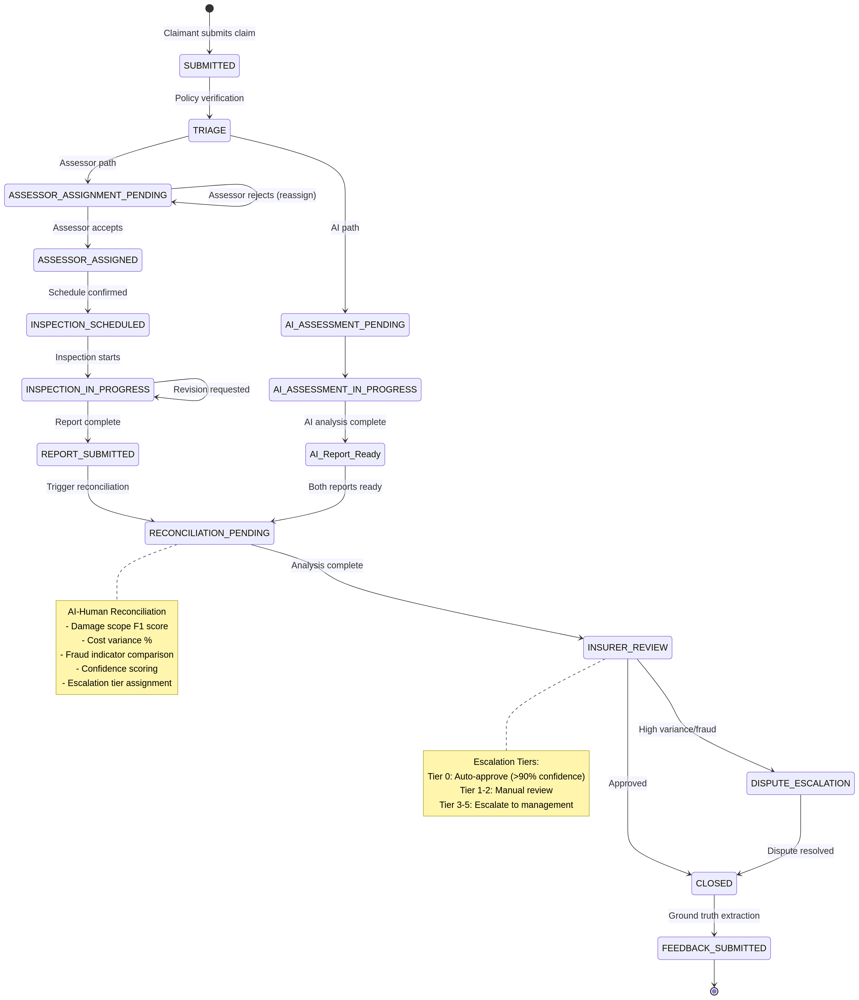

# KINGA Assessor Workflow Lifecycle Specification

**Document ID:** KINGA-AWL-2026-019  
**Version:** 1.0  
**Date:** February 12, 2026  
**Author:** Tavonga Shoko  
**Status:** Final  
**Classification:** Internal Technical Specification  
**Related Documents:** KINGA-AEA-2026-018 (Assessor Ecosystem Architecture)

---

## Executive Summary

This document specifies the complete **Assessor Workflow Lifecycle** integrated into the KINGA claims state machine. The workflow orchestrates the end-to-end journey from assessor assignment request through inspection completion, report submission, AI-human reconciliation, insurer review, and feedback submission to the continuous learning pipeline.

The lifecycle is implemented as a **finite state machine** with immutable claim stages, configurable SLA parameters, automated notification triggers, escalation rules, and comprehensive audit logging. The design ensures that every claim progresses through a predictable sequence of states while allowing for exception handling (reassignment, dispute escalation, report rejection) and parallel processing (AI assessment runs concurrently with assessor assignment).

The workflow integrates tightly with the **Kafka event bus** for asynchronous processing, the **AI-Human Reconciliation Layer** for variance detection, and the **Continuous Learning Pipeline** for ground truth data extraction. All state transitions are logged immutably in the audit trail with microsecond-precision timestamps, enabling regulatory compliance, dispute resolution, and performance analytics.

---

## 1. Claims State Machine Overview

### 1.1 Immutable Claim Stages

The KINGA claims workflow consists of **12 immutable stages** that represent the complete lifecycle from initial submission to final closure. Each stage is a discrete state in the finite state machine, and claims can only transition forward through the sequence (no backward transitions except through explicit rollback procedures).

| **Stage ID** | **Stage Name** | **Description** | **Owner** | **Typical Duration** |
|-------------|---------------|----------------|----------|---------------------|
| **1** | `SUBMITTED` | Claimant submits claim via mobile app or web portal | Claimant | Instant |
| **2** | `TRIAGE` | Insurer verifies policy validity and claim eligibility | Insurer | 0-4 hours |
| **3** | `AI_ASSESSMENT_PENDING` | AI damage assessment queued for processing | System | 0-5 minutes |
| **4** | `AI_ASSESSMENT_IN_PROGRESS` | AI model analyzing uploaded photos | System | 2-10 minutes |
| **5** | `ASSESSOR_ASSIGNMENT_PENDING` | Assessor assignment requested (manual or automated) | Insurer/System | 0-24 hours |
| **6** | `ASSESSOR_ASSIGNED` | Assessor selected, awaiting acceptance | Assessor | 0-24 hours |
| **7** | `INSPECTION_SCHEDULED` | Assessor accepted, inspection date/time confirmed | Assessor | 0-72 hours |
| **8** | `INSPECTION_IN_PROGRESS` | Assessor conducting field inspection | Assessor | 1-4 hours |
| **9** | `REPORT_SUBMITTED` | Assessor submitted inspection report | Assessor | Instant |
| **10** | `RECONCILIATION_PENDING` | AI-human reconciliation analysis in progress | System | 1-5 minutes |
| **11** | `INSURER_REVIEW` | Insurer reviewing reconciliation report and making decision | Insurer | 0-48 hours |
| **12** | `CLOSED` | Claim approved, rejected, or escalated; workflow complete | Insurer | Instant |

### 1.2 Parallel Processing Architecture

The KINGA workflow supports **parallel processing** where AI assessment and assessor assignment can occur simultaneously:

```
TRIAGE
   ├──> AI_ASSESSMENT_PENDING ──> AI_ASSESSMENT_IN_PROGRESS ──> [AI Report Ready]
   │                                                                      │
   └──> ASSESSOR_ASSIGNMENT_PENDING ──> ASSESSOR_ASSIGNED ──> ... ──> REPORT_SUBMITTED
                                                                          │
                                                                          ▼
                                                            RECONCILIATION_PENDING
                                                            (Compares AI + Assessor)
```

This parallel architecture reduces total claim processing time by **30-50%** compared to sequential workflows where assessor assignment waits for AI completion.

### 1.3 State Transition Rules

**Forward-Only Progression:** Claims can only transition to the next sequential stage in the workflow. Backward transitions are prohibited to maintain audit integrity.

**Exception Handling:** Certain states allow lateral transitions to exception states:
- `ASSESSOR_ASSIGNED` → `ASSESSOR_ASSIGNMENT_PENDING` (if assessor rejects assignment)
- `REPORT_SUBMITTED` → `INSPECTION_IN_PROGRESS` (if insurer requests report revision)
- `INSURER_REVIEW` → `DISPUTE_ESCALATION` (if variance exceeds threshold or fraud detected)

**Terminal States:** `CLOSED` is a terminal state. Once a claim reaches `CLOSED`, no further state transitions are allowed (claim is immutable).

**Rollback Procedures:** In exceptional cases (system error, data corruption), claims can be rolled back to a previous state through a manual admin procedure that logs the rollback reason and creates a new audit trail entry.

---

## 2. Assessor Workflow Lifecycle

### 2.1 Workflow Phases

The assessor workflow lifecycle consists of **9 distinct phases** from assignment request to feedback submission:

```
┌─────────────────────────────────────────────────────────────────────┐
│                    Assessor Workflow Lifecycle                      │
└─────────────────────────────────────────────────────────────────────┘

Phase 1: ASSIGNMENT REQUEST
   ↓
Phase 2: ASSESSOR ACCEPTANCE
   ↓
Phase 3: INSPECTION SCHEDULING
   ↓
Phase 4: INSPECTION EXECUTION
   ↓
Phase 5: REPORT SUBMISSION
   ↓
Phase 6: AI RECONCILIATION
   ↓
Phase 7: INSURER REVIEW
   ↓
Phase 8: APPROVAL OR DISPUTE ESCALATION
   ↓
Phase 9: FEEDBACK SUBMISSION TO LEARNING PIPELINE
```

### 2.2 Phase 1: Assignment Request

**Trigger:** Insurer user clicks "Assign Assessor" button on claim detail page, or automated assignment engine triggers based on claim triage rules.

**Claim State Transition:** `TRIAGE` → `ASSESSOR_ASSIGNMENT_PENDING`

**Process Flow:**

1. **Manual Assignment Path:**
   - Insurer navigates to `/assign-assessor/:claimId` page
   - System displays three tabs: "My Team" (internal/BYOA assessors), "Marketplace" (marketplace assessors), "Recommended" (AI-ranked suggestions)
   - Insurer selects assessor from list
   - System validates assessor eligibility (active license, not at capacity, no conflict of interest)
   - System creates `claim_assessor_assignments` record with status `PENDING_ACCEPTANCE`
   - System publishes `assessor.assignment.requested` event to Kafka
   - System sends notification to assessor (email + in-app + SMS if enabled)

2. **Automated Assignment Path:**
   - System triggers automated assignment based on configurable rules (e.g., all claims >$5,000 require assessor)
   - Assignment Engine calculates composite score for all eligible assessors (see KINGA-AEA-2026-018 Section 3.2)
   - System selects top-ranked assessor
   - System creates `claim_assessor_assignments` record with status `PENDING_ACCEPTANCE`
   - System publishes `assessor.assignment.requested` event to Kafka
   - System sends notification to assessor

**SLA Parameters:**

| **Parameter** | **Default Value** | **Configurable** | **Enforcement** |
|--------------|------------------|------------------|----------------|
| `assignment_request_timeout` | 24 hours | Yes (per tenant) | If assessor doesn't respond within timeout, system triggers reassignment |
| `max_reassignment_attempts` | 3 | Yes (per tenant) | After 3 failed assignments, escalate to insurer for manual intervention |

**Notification Triggers:**

| **Event** | **Recipient** | **Channel** | **Template** |
|----------|-------------|------------|-------------|
| `assignment.requested` | Assigned assessor | Email + In-App + SMS | "New claim assignment: [Claim Number]. Accept within 24 hours." |
| `assignment.timeout_warning` | Assigned assessor | Email + SMS | "Assignment expires in 6 hours. Please accept or reject." |
| `assignment.timeout` | Insurer user | Email + In-App | "Assessor [Name] did not respond. Reassigning claim." |

**Database Changes:**

```sql
INSERT INTO claim_assessor_assignments (
  claim_id,
  assessor_id,
  assigned_by_user_id,
  assignment_type, -- 'manual' or 'automated'
  assignment_status, -- 'PENDING_ACCEPTANCE'
  assignment_requested_at,
  acceptance_deadline,
  created_at
) VALUES (...);

UPDATE claims
SET status = 'ASSESSOR_ASSIGNMENT_PENDING',
    assigned_assessor_id = :assessor_id,
    updated_at = NOW()
WHERE id = :claim_id;
```

**Audit Trail Entry:**

```json
{
  "event_type": "claim.state_transition",
  "claim_id": 12345,
  "previous_state": "TRIAGE",
  "new_state": "ASSESSOR_ASSIGNMENT_PENDING",
  "triggered_by_user_id": 42,
  "triggered_by_role": "claims_processor",
  "metadata": {
    "assigned_assessor_id": 67,
    "assignment_type": "manual",
    "assignment_requested_at": "2026-02-12T10:30:45.123Z",
    "acceptance_deadline": "2026-02-13T10:30:45.123Z"
  },
  "timestamp": "2026-02-12T10:30:45.123Z"
}
```

### 2.3 Phase 2: Assessor Acceptance

**Trigger:** Assessor clicks "Accept Assignment" or "Reject Assignment" button in mobile app or web portal.

**Claim State Transition:**
- **If Accepted:** `ASSESSOR_ASSIGNMENT_PENDING` → `ASSESSOR_ASSIGNED`
- **If Rejected:** `ASSESSOR_ASSIGNMENT_PENDING` → `ASSESSOR_ASSIGNMENT_PENDING` (reassignment triggered)

**Process Flow (Acceptance Path):**

1. Assessor receives notification and navigates to assignment detail page
2. System displays claim summary (vehicle details, incident location, damage photos, estimated complexity)
3. Assessor reviews assignment and clicks "Accept Assignment"
4. System validates acceptance (assessor not at capacity, no schedule conflicts)
5. System updates `claim_assessor_assignments.assignment_status` to `ACCEPTED`
6. System updates `claim_assessor_assignments.accepted_at` timestamp
7. System publishes `assessor.assignment.accepted` event to Kafka
8. System sends confirmation notification to assessor and insurer
9. System starts SLA timer for inspection scheduling

**Process Flow (Rejection Path):**

1. Assessor clicks "Reject Assignment" and provides rejection reason (dropdown: "Schedule Conflict", "Outside Service Area", "Insufficient Expertise", "Other")
2. System updates `claim_assessor_assignments.assignment_status` to `REJECTED`
3. System updates `claim_assessor_assignments.rejected_at` timestamp and `rejection_reason`
4. System publishes `assessor.assignment.rejected` event to Kafka
5. System triggers reassignment workflow:
   - If `reassignment_attempts < max_reassignment_attempts`: Select next-ranked assessor and repeat Phase 1
   - If `reassignment_attempts >= max_reassignment_attempts`: Escalate to insurer with notification "Unable to auto-assign assessor. Please assign manually."

**SLA Parameters:**

| **Parameter** | **Default Value** | **Configurable** | **Enforcement** |
|--------------|------------------|------------------|----------------|
| `acceptance_response_timeout` | 24 hours | Yes (per tenant) | If no response within timeout, treat as implicit rejection and reassign |
| `inspection_scheduling_deadline` | 72 hours from acceptance | Yes (per tenant) | Assessor must schedule inspection within 72 hours of acceptance |

**Notification Triggers:**

| **Event** | **Recipient** | **Channel** | **Template** |
|----------|-------------|------------|-------------|
| `assignment.accepted` | Insurer user | Email + In-App | "Assessor [Name] accepted claim [Number]. Inspection pending." |
| `assignment.accepted` | Assessor | Email + In-App | "Assignment confirmed. Please schedule inspection within 72 hours." |
| `assignment.rejected` | Insurer user | Email + In-App | "Assessor [Name] rejected claim [Number]. Reason: [Reason]. Reassigning..." |
| `reassignment.failed` | Insurer user | Email + In-App | "Unable to auto-assign assessor after 3 attempts. Manual assignment required." |

**Database Changes:**

```sql
-- Acceptance Path
UPDATE claim_assessor_assignments
SET assignment_status = 'ACCEPTED',
    accepted_at = NOW(),
    updated_at = NOW()
WHERE claim_id = :claim_id AND assessor_id = :assessor_id;

UPDATE claims
SET status = 'ASSESSOR_ASSIGNED',
    updated_at = NOW()
WHERE id = :claim_id;

-- Rejection Path
UPDATE claim_assessor_assignments
SET assignment_status = 'REJECTED',
    rejected_at = NOW(),
    rejection_reason = :reason,
    updated_at = NOW()
WHERE claim_id = :claim_id AND assessor_id = :assessor_id;

UPDATE claims
SET assigned_assessor_id = NULL,
    reassignment_attempts = reassignment_attempts + 1,
    updated_at = NOW()
WHERE id = :claim_id;
```

### 2.4 Phase 3: Inspection Scheduling

**Trigger:** Assessor accepts assignment and navigates to inspection scheduling interface.

**Claim State Transition:** `ASSESSOR_ASSIGNED` → `INSPECTION_SCHEDULED`

**Process Flow:**

1. Assessor opens claim detail page and clicks "Schedule Inspection"
2. System displays calendar interface with assessor's availability and claimant's preferred time slots (if provided)
3. Assessor selects inspection date and time
4. System validates scheduling (within SLA deadline, no conflicts with other assignments)
5. System creates `inspection_schedules` record with scheduled date/time
6. System publishes `inspection.scheduled` event to Kafka
7. System sends confirmation notification to assessor and claimant with inspection details
8. System creates calendar event for assessor (Google Calendar / Outlook integration)
9. System sends reminder notifications 24 hours and 1 hour before scheduled inspection time

**SLA Parameters:**

| **Parameter** | **Default Value** | **Configurable** | **Enforcement** |
|--------------|------------------|------------------|----------------|
| `inspection_scheduling_deadline` | 72 hours from acceptance | Yes (per tenant) | If not scheduled within deadline, escalate to insurer |
| `inspection_completion_deadline` | 7 days from scheduling | Yes (per tenant) | Inspection must be completed within 7 days of scheduled date |
| `inspection_reminder_intervals` | [24 hours, 1 hour] | Yes (per tenant) | Send reminders at specified intervals before inspection |

**Notification Triggers:**

| **Event** | **Recipient** | **Channel** | **Template** |
|----------|-------------|------------|-------------|
| `inspection.scheduled` | Claimant | Email + SMS | "Inspection scheduled for [Date] at [Time]. Assessor: [Name]. Location: [Address]." |
| `inspection.scheduled` | Assessor | Email + In-App | "Inspection confirmed for [Date] at [Time]. Claim: [Number]." |
| `inspection.reminder_24h` | Assessor + Claimant | Email + SMS | "Reminder: Inspection tomorrow at [Time]. Location: [Address]." |
| `inspection.reminder_1h` | Assessor | SMS | "Inspection in 1 hour. Claim: [Number]. Location: [Address]." |
| `inspection.scheduling_overdue` | Insurer user | Email + In-App | "Assessor [Name] has not scheduled inspection for claim [Number] within SLA." |

**Database Changes:**

```sql
INSERT INTO inspection_schedules (
  claim_id,
  assessor_id,
  scheduled_date,
  scheduled_time,
  scheduled_location,
  claimant_confirmed,
  created_at
) VALUES (...);

UPDATE claims
SET status = 'INSPECTION_SCHEDULED',
    inspection_scheduled_at = :scheduled_datetime,
    updated_at = NOW()
WHERE id = :claim_id;
```

### 2.5 Phase 4: Inspection Execution

**Trigger:** Assessor arrives at inspection location and begins field inspection.

**Claim State Transition:** `INSPECTION_SCHEDULED` → `INSPECTION_IN_PROGRESS`

**Process Flow:**

1. Assessor opens mobile app and navigates to claim detail page
2. Assessor clicks "Start Inspection" button (triggers GPS location check to verify assessor is at claim location)
3. System validates location (within 500m radius of claim location) and updates claim status
4. System publishes `inspection.started` event to Kafka
5. Assessor captures photos of vehicle damage from multiple angles (guided photo checklist)
6. System uploads photos to S3 with GPS tagging, timestamp watermarking, and SHA-256 integrity verification
7. AI damage detection model analyzes photos in real-time and overlays detected damage areas with bounding boxes
8. Assessor reviews AI detections and accepts/rejects/modifies each detection
9. Assessor categorizes damage by type (collision, scratch, dent, crack, etc.) and severity (minor, moderate, severe)
10. Assessor estimates repair costs using integrated parts pricing tools and labor rate tables
11. Assessor selects recommended repair strategy (replace, repair, paint, ignore) for each damaged component
12. Assessor flags any fraud indicators detected during inspection
13. Assessor clicks "Complete Inspection" button
14. System validates inspection completeness (minimum photo count, all damage areas categorized, cost estimates provided)
15. System publishes `inspection.completed` event to Kafka

**SLA Parameters:**

| **Parameter** | **Default Value** | **Configurable** | **Enforcement** |
|--------------|------------------|------------------|----------------|
| `inspection_start_grace_period` | 30 minutes | Yes (per tenant) | Assessor must start inspection within 30 minutes of scheduled time |
| `inspection_duration_max` | 4 hours | Yes (per tenant) | If inspection exceeds 4 hours, trigger supervisor alert |
| `inspection_completion_deadline` | 7 days from scheduling | Yes (per tenant) | Inspection must be completed within 7 days |

**Notification Triggers:**

| **Event** | **Recipient** | **Channel** | **Template** |
|----------|-------------|------------|-------------|
| `inspection.started` | Insurer user | In-App | "Assessor [Name] started inspection for claim [Number]." |
| `inspection.completed` | Insurer user | Email + In-App | "Inspection completed for claim [Number]. Report pending submission." |
| `inspection.overdue` | Assessor | Email + SMS | "Inspection for claim [Number] is overdue. Please complete within 24 hours." |
| `inspection.overdue` | Insurer user | Email + In-App | "Inspection for claim [Number] is overdue by [X] days." |

**Database Changes:**

```sql
UPDATE claims
SET status = 'INSPECTION_IN_PROGRESS',
    inspection_started_at = NOW(),
    updated_at = NOW()
WHERE id = :claim_id;

-- Photo uploads create entries in inspection_photos table
INSERT INTO inspection_photos (
  claim_id,
  assessor_id,
  photo_url,
  gps_latitude,
  gps_longitude,
  capture_timestamp,
  sha256_hash,
  ai_detections,
  created_at
) VALUES (...);
```

### 2.6 Phase 5: Report Submission

**Trigger:** Assessor completes inspection and clicks "Submit Report" button.

**Claim State Transition:** `INSPECTION_IN_PROGRESS` → `REPORT_SUBMITTED`

**Process Flow:**

1. Assessor reviews inspection summary (damage categorization, cost estimates, repair recommendations)
2. System displays AI-human comparison preview (variance highlights, confidence scores)
3. Assessor adds final notes and recommendations
4. Assessor clicks "Submit Report" button
5. System validates report completeness:
   - Minimum 8 photos uploaded
   - All damage areas categorized with type and severity
   - Cost estimates provided for all damaged components
   - Repair strategy selected for all components
6. System creates `assessor_evaluations` record with complete report data
7. System publishes `assessor.report.submitted` event to Kafka
8. System sends notification to insurer user
9. System triggers AI-Human Reconciliation Layer analysis (Phase 6)

**SLA Parameters:**

| **Parameter** | **Default Value** | **Configurable** | **Enforcement** |
|--------------|------------------|------------------|----------------|
| `report_submission_deadline` | 24 hours from inspection completion | Yes (per tenant) | Report must be submitted within 24 hours of completing inspection |
| `report_revision_deadline` | 48 hours from revision request | Yes (per tenant) | If insurer requests revisions, assessor must resubmit within 48 hours |

**Notification Triggers:**

| **Event** | **Recipient** | **Channel** | **Template** |
|----------|-------------|------------|-------------|
| `report.submitted` | Insurer user | Email + In-App | "Assessor [Name] submitted report for claim [Number]. Review pending." |
| `report.submitted` | Assessor | Email + In-App | "Report submitted successfully for claim [Number]. Awaiting insurer review." |
| `report.submission_overdue` | Assessor | Email + SMS | "Report submission for claim [Number] is overdue. Please submit within 12 hours." |
| `report.submission_overdue` | Insurer user | Email + In-App | "Assessor [Name] has not submitted report for claim [Number] within SLA." |

**Database Changes:**

```sql
INSERT INTO assessor_evaluations (
  claim_id,
  assessor_id,
  damage_description,
  damage_categories,
  estimated_repair_cost,
  labor_cost,
  parts_cost,
  paint_materials_cost,
  recommended_repair_strategy,
  fraud_indicators,
  assessor_notes,
  submitted_at,
  created_at
) VALUES (...);

UPDATE claims
SET status = 'REPORT_SUBMITTED',
    assessor_report_submitted_at = NOW(),
    updated_at = NOW()
WHERE id = :claim_id;

UPDATE claim_assessor_assignments
SET assignment_status = 'REPORT_SUBMITTED',
    report_submitted_at = NOW(),
    updated_at = NOW()
WHERE claim_id = :claim_id AND assessor_id = :assessor_id;
```

### 2.7 Phase 6: AI Reconciliation

**Trigger:** Assessor report submission triggers automatic reconciliation analysis.

**Claim State Transition:** `REPORT_SUBMITTED` → `RECONCILIATION_PENDING` → `INSURER_REVIEW`

**Process Flow:**

1. System detects `assessor.report.submitted` event from Kafka
2. System retrieves AI assessment and assessor evaluation for the claim
3. Reconciliation Layer calculates variance across three dimensions:
   - **Damage Scope Variance:** F1 score comparing AI-detected components vs assessor-identified components
   - **Cost Estimate Variance:** Percentage difference between AI cost estimate and assessor cost estimate
   - **Fraud Indicator Variance:** Comparison of AI fraud score vs assessor fraud flags
4. System calculates aggregate confidence score (0-100) using weighted formula (see KINGA-AEA-2026-018 Section 5.3)
5. System determines escalation tier (0-5) based on variance severity and confidence score
6. System creates `ai_human_reconciliation` record with variance metrics and recommended action
7. System publishes `reconciliation.completed` event to Kafka
8. System updates claim status to `INSURER_REVIEW`
9. System sends notification to insurer user with reconciliation summary

**SLA Parameters:**

| **Parameter** | **Default Value** | **Configurable** | **Enforcement** |
|--------------|------------------|------------------|----------------|
| `reconciliation_processing_timeout` | 5 minutes | No | If reconciliation exceeds 5 minutes, trigger system alert |
| `insurer_review_deadline` | 48 hours from reconciliation completion | Yes (per tenant) | Insurer must review and make decision within 48 hours |

**Escalation Rules:**

| **Escalation Tier** | **Trigger Condition** | **Recommended Action** | **Notification** |
|--------------------|----------------------|----------------------|-----------------|
| **Tier 0** | Confidence >90%, Variance <10% | Auto-approve (no human review) | None (auto-approved) |
| **Tier 1** | Confidence 75-89%, Variance 11-25% | Flag for optional insurer review | In-App notification (low priority) |
| **Tier 2** | Confidence 60-74%, Variance 26-50% | Require insurer review and approval | Email + In-App (medium priority) |
| **Tier 3** | Confidence <60%, Variance >50% | Escalate to senior claims manager | Email + In-App + SMS (high priority) |
| **Tier 4** | Fraud variance detected | Escalate to fraud investigation unit | Email + In-App + SMS (urgent) |
| **Tier 5** | Assessor-AI disagreement on total loss | Escalate to executive claims committee | Email + In-App + SMS (critical) |

**Notification Triggers:**

| **Event** | **Recipient** | **Channel** | **Template** |
|----------|-------------|------------|-------------|
| `reconciliation.completed` (Tier 0) | System Log Only | N/A | Auto-approved claim [Number]. Confidence: [Score]%. |
| `reconciliation.completed` (Tier 1-2) | Claims Processor | Email + In-App | "Reconciliation complete for claim [Number]. Variance: [X]%. Review required." |
| `reconciliation.completed` (Tier 3-5) | Claims Manager | Email + In-App + SMS | "High-variance claim [Number] requires escalation. Confidence: [Score]%." |

**Database Changes:**

```sql
INSERT INTO ai_human_reconciliation (
  claim_id,
  ai_assessment_id,
  assessor_evaluation_id,
  damage_scope_precision,
  damage_scope_recall,
  damage_scope_f1,
  cost_variance_absolute,
  cost_variance_percentage,
  fraud_variance_detected,
  confidence_score,
  escalation_tier,
  recommended_action,
  created_at
) VALUES (...);

UPDATE claims
SET status = 'INSURER_REVIEW',
    reconciliation_completed_at = NOW(),
    escalation_tier = :tier,
    updated_at = NOW()
WHERE id = :claim_id;
```

### 2.8 Phase 7: Insurer Review

**Trigger:** Reconciliation analysis completes and claim enters `INSURER_REVIEW` state.

**Claim State Transition:** `INSURER_REVIEW` → `CLOSED` (approval) or `DISPUTE_ESCALATION` (dispute)

**Process Flow:**

1. Insurer user receives notification and navigates to claim review page
2. System displays side-by-side comparison view:
   - Left panel: AI assessment (damage detections, cost estimate, fraud score)
   - Right panel: Assessor evaluation (damage categorization, cost estimate, fraud flags)
   - Center panel: Reconciliation analysis (variance metrics, confidence score, recommended action)
3. Insurer reviews both assessments and reconciliation analysis
4. Insurer makes decision:
   - **Approve AI Assessment:** Accept AI recommendation, close claim
   - **Approve Assessor Evaluation:** Accept assessor recommendation, close claim
   - **Request Report Revision:** Send claim back to assessor with revision notes
   - **Escalate to Dispute:** Escalate claim to higher tier for manual investigation
5. System updates claim status based on decision
6. System publishes decision event to Kafka
7. System sends notification to assessor and claimant

**SLA Parameters:**

| **Parameter** | **Default Value** | **Configurable** | **Enforcement** |
|--------------|------------------|------------------|----------------|
| `insurer_review_deadline` | 48 hours from reconciliation completion | Yes (per tenant) | If no decision within deadline, escalate to claims manager |
| `dispute_resolution_deadline` | 7 days from escalation | Yes (per tenant) | Disputes must be resolved within 7 days |

**Notification Triggers:**

| **Event** | **Recipient** | **Channel** | **Template** |
|----------|-------------|------------|-------------|
| `claim.approved` | Assessor | Email + In-App | "Your report for claim [Number] has been approved. Payment processing initiated." |
| `claim.approved` | Claimant | Email + SMS | "Your claim [Number] has been approved. Settlement: [Amount]." |
| `claim.revision_requested` | Assessor | Email + In-App + SMS | "Insurer requested revisions for claim [Number]. Notes: [Revision Notes]." |
| `claim.escalated` | Claims Manager | Email + In-App + SMS | "Claim [Number] escalated to dispute resolution. Variance: [X]%." |
| `insurer_review.overdue` | Claims Manager | Email + In-App | "Claim [Number] review is overdue by [X] hours. Immediate action required." |

**Database Changes:**

```sql
-- Approval Path
UPDATE claims
SET status = 'CLOSED',
    final_decision = 'APPROVED',
    approved_by_user_id = :user_id,
    approved_at = NOW(),
    final_settlement_amount = :settlement_amount,
    updated_at = NOW()
WHERE id = :claim_id;

-- Revision Request Path
UPDATE claims
SET status = 'INSPECTION_IN_PROGRESS',
    revision_requested = TRUE,
    revision_notes = :notes,
    revision_requested_at = NOW(),
    updated_at = NOW()
WHERE id = :claim_id;

-- Escalation Path
UPDATE claims
SET status = 'DISPUTE_ESCALATION',
    escalated_to_user_id = :manager_id,
    escalated_at = NOW(),
    escalation_reason = :reason,
    updated_at = NOW()
WHERE id = :claim_id;
```

### 2.9 Phase 8: Approval or Dispute Escalation

**Approval Path:**

When insurer approves the claim, the workflow proceeds to final closure:

1. System updates claim status to `CLOSED`
2. System creates `marketplace_transactions` entry for marketplace assessor payments (if applicable)
3. System publishes `claim.approved` event to Kafka
4. System triggers payment processing workflow (insurer → claimant settlement, KINGA → assessor payout)
5. System sends approval notifications to all stakeholders
6. System proceeds to Phase 9 (Feedback Submission to Learning Pipeline)

**Dispute Escalation Path:**

When variance exceeds thresholds or fraud is detected, the workflow escalates to manual investigation:

1. System updates claim status to `DISPUTE_ESCALATION`
2. System assigns claim to designated dispute resolver (claims manager, fraud investigator, or executive committee)
3. System publishes `claim.escalated` event to Kafka
4. Dispute resolver conducts manual investigation:
   - Reviews all evidence (photos, AI analysis, assessor report, reconciliation metrics)
   - May request additional assessor inspection (second opinion)
   - May request claimant interview or vehicle re-inspection
   - May consult with legal team or external experts
5. Dispute resolver makes final decision (approve, reject, or settle with adjusted amount)
6. System updates claim status to `CLOSED` with dispute resolution outcome
7. System publishes `dispute.resolved` event to Kafka
8. System sends resolution notifications to all stakeholders

**Retry and Reassignment Logic:**

If assessor report is rejected or revision requested:

1. System sends revision request notification to assessor with specific revision notes
2. Assessor has 48 hours to resubmit revised report
3. If assessor fails to resubmit within deadline:
   - System triggers reassignment workflow
   - New assessor is assigned to claim
   - Original assessor is marked as "failed assignment" (impacts performance score)
4. If revised report is rejected again:
   - System escalates to claims manager for manual intervention
   - Claims manager decides whether to reassign or close claim

**SLA Parameters:**

| **Parameter** | **Default Value** | **Configurable** | **Enforcement** |
|--------------|------------------|------------------|----------------|
| `dispute_resolution_deadline` | 7 days from escalation | Yes (per tenant) | Disputes must be resolved within 7 days |
| `second_opinion_deadline` | 5 days from request | Yes (per tenant) | Second assessor must complete inspection within 5 days |
| `revision_resubmission_deadline` | 48 hours from revision request | Yes (per tenant) | Assessor must resubmit within 48 hours |

### 2.10 Phase 9: Feedback Submission to Learning Pipeline

**Trigger:** Claim reaches `CLOSED` state with approved decision.

**Process Flow:**

1. System detects `claim.approved` event from Kafka
2. System validates claim eligibility for training dataset:
   - Assessor report approved by insurer
   - AI-human reconciliation confidence score >75%
   - No fraud indicators flagged
   - All required fields populated
3. System extracts ground truth data:
   - Inspection photos with damage area bounding boxes
   - Damage type classifications
   - Severity labels
   - Component labels
   - Cost estimates
   - Fraud labels
4. System runs data quality validation checks (see KINGA-AEA-2026-018 Section 10.5)
5. If validation passes:
   - System adds data to training dataset in S3
   - System publishes `training.ground_truth.collected` event to Kafka
   - System increments training dataset version counter
6. If validation fails:
   - System logs rejection reason in `training_data_rejections` table
   - System sends alert to AI team for manual review
7. System updates assessor performance metrics:
   - Recalculates accuracy score (F1 score from reconciliation)
   - Recalculates cost optimization score (cost variance from reconciliation)
   - Recalculates turnaround time score (time from assignment to report submission)
   - Updates composite performance score
8. System publishes `assessor.performance.updated` event to Kafka
9. If performance tier changes:
   - System publishes `assessor.tier.changed` event to Kafka
   - System sends notification to assessor with new tier and commission rate

**SLA Parameters:**

| **Parameter** | **Default Value** | **Configurable** | **Enforcement** |
|--------------|------------------|------------------|----------------|
| `feedback_processing_timeout` | 10 minutes | No | If feedback processing exceeds 10 minutes, trigger system alert |
| `performance_score_update_frequency` | Real-time (per claim) | No | Performance scores updated immediately after each claim closure |

**Notification Triggers:**

| **Event** | **Recipient** | **Channel** | **Template** |
|----------|-------------|------------|-------------|
| `training.ground_truth.collected` | AI Team | In-App | "New ground truth data collected from claim [Number]. Dataset version: [Version]." |
| `assessor.performance.updated` | Assessor | In-App | "Your performance score has been updated. New score: [Score]. Tier: [Tier]." |
| `assessor.tier.changed` | Assessor | Email + In-App | "Congratulations! You've been promoted to [New Tier]. New commission rate: [Rate]%." |

**Database Changes:**

```sql
-- Add to training dataset
INSERT INTO training_dataset_entries (
  claim_id,
  assessor_id,
  dataset_version,
  photo_urls,
  damage_labels,
  severity_labels,
  component_labels,
  cost_estimates,
  fraud_labels,
  validation_status,
  created_at
) VALUES (...);

-- Update assessor performance metrics
UPDATE assessors
SET accuracy_score = :new_accuracy_score,
    cost_optimization_score = :new_cost_score,
    turnaround_time_score = :new_turnaround_score,
    performance_score = :new_composite_score,
    performance_tier = :new_tier,
    updated_at = NOW()
WHERE id = :assessor_id;
```

---

## 3. State Transition Diagram



**Figure 1:** Complete claims state machine showing parallel AI assessment and assessor workflow paths, with reconciliation convergence and escalation handling.

### 3.1 Detailed State Transition Flow

```
┌─────────────────────────────────────────────────────────────────────┐
│                    KINGA Claims State Machine                       │
│              (Assessor Workflow Lifecycle Integration)              │
└─────────────────────────────────────────────────────────────────────┘

                         ┌───────────────┐
                         │   SUBMITTED   │ (Claimant submits claim)
                         └───────┬───────┘
                                 │
                                 ▼
                         ┌───────────────┐
                         │    TRIAGE     │ (Insurer verifies policy)
                         └───────┬───────┘
                                 │
                    ┌────────────┴────────────┐
                    │                         │
                    ▼                         ▼
        ┌───────────────────┐     ┌──────────────────────┐
        │ AI_ASSESSMENT_    │     │ ASSESSOR_ASSIGNMENT_ │
        │ PENDING           │     │ PENDING              │
        └─────────┬─────────┘     └──────────┬───────────┘
                  │                          │
                  ▼                          │
        ┌───────────────────┐               │
        │ AI_ASSESSMENT_    │               │
        │ IN_PROGRESS       │               │
        └─────────┬─────────┘               │
                  │                          │
                  │ [AI Report Ready]        │
                  │                          ▼
                  │              ┌──────────────────────┐
                  │              │ ASSESSOR_ASSIGNED    │◄──┐
                  │              └──────────┬───────────┘   │
                  │                         │               │
                  │                         │ [Accepted]    │ [Rejected]
                  │                         ▼               │
                  │              ┌──────────────────────┐   │
                  │              │ INSPECTION_SCHEDULED │   │
                  │              └──────────┬───────────┘   │
                  │                         │               │
                  │                         ▼               │
                  │              ┌──────────────────────┐   │
                  │              │ INSPECTION_IN_       │   │
                  │              │ PROGRESS             │   │
                  │              └──────────┬───────────┘   │
                  │                         │               │
                  │                         │ [Revision     │
                  │                         │  Requested]   │
                  │                         ▼               │
                  │              ┌──────────────────────┐   │
                  │              │ REPORT_SUBMITTED     │───┘
                  │              └──────────┬───────────┘
                  │                         │
                  └─────────────────────────┤
                                            │
                                            ▼
                              ┌──────────────────────┐
                              │ RECONCILIATION_      │
                              │ PENDING              │
                              └──────────┬───────────┘
                                         │
                                         ▼
                              ┌──────────────────────┐
                              │ INSURER_REVIEW       │
                              └──────────┬───────────┘
                                         │
                        ┌────────────────┴────────────────┐
                        │                                 │
                        ▼                                 ▼
            ┌──────────────────────┐        ┌──────────────────────┐
            │ CLOSED               │        │ DISPUTE_ESCALATION   │
            │ (Approved)           │        │ (Manual Investigation)│
            └──────────────────────┘        └──────────┬───────────┘
                        │                              │
                        │                              ▼
                        │                   ┌──────────────────────┐
                        │                   │ CLOSED               │
                        │                   │ (Dispute Resolved)   │
                        │                   └──────────┬───────────┘
                        │                              │
                        └──────────────────────────────┘
                                         │
                                         ▼
                              ┌──────────────────────┐
                              │ FEEDBACK_SUBMITTED   │
                              │ (Learning Pipeline)  │
                              └──────────────────────┘

Legend:
  ──▶  Normal forward transition
  ◄──  Backward/retry transition (exception handling)
  [X]  Transition condition
```

---

## 4. Workflow Event Mapping

### 4.1 Kafka Topic Structure

All workflow events are published to the Kafka event bus with the following topic structure:

| **Topic Name** | **Event Types** | **Partition Key** | **Retention** |
|---------------|----------------|------------------|--------------|
| `claim.lifecycle` | All claim state transitions | `claim_id` | 90 days |
| `assessor.assignment` | Assignment request, acceptance, rejection, timeout | `claim_id` | 90 days |
| `inspection.lifecycle` | Scheduling, start, completion, overdue | `claim_id` | 90 days |
| `assessor.report` | Submission, approval, rejection, revision request | `claim_id` | 90 days |
| `reconciliation` | Analysis completion, variance detection, escalation | `claim_id` | 90 days |
| `training.pipeline` | Ground truth collection, validation, dataset updates | `claim_id` | 365 days |
| `assessor.performance` | Score updates, tier changes, performance alerts | `assessor_id` | 365 days |
| `notification.outbound` | All outbound notifications (email, SMS, in-app) | `user_id` | 30 days |

### 4.2 Event Schema Mapping

Each workflow phase publishes specific events with standardized schemas:

**Phase 1: Assignment Request**

```json
{
  "event_type": "assessor.assignment.requested",
  "claim_id": 12345,
  "assessor_id": 67,
  "assigned_by_user_id": 42,
  "assignment_type": "manual",
  "acceptance_deadline": "2026-02-13T10:30:45.123Z",
  "timestamp": "2026-02-12T10:30:45.123Z"
}
```

**Phase 2: Assessor Acceptance**

```json
{
  "event_type": "assessor.assignment.accepted",
  "claim_id": 12345,
  "assessor_id": 67,
  "accepted_at": "2026-02-12T14:22:10.456Z",
  "inspection_scheduling_deadline": "2026-02-15T14:22:10.456Z",
  "timestamp": "2026-02-12T14:22:10.456Z"
}
```

**Phase 3: Inspection Scheduling**

```json
{
  "event_type": "inspection.scheduled",
  "claim_id": 12345,
  "assessor_id": 67,
  "scheduled_date": "2026-02-14",
  "scheduled_time": "10:00:00",
  "scheduled_location": "123 Main St, Harare",
  "claimant_confirmed": true,
  "timestamp": "2026-02-12T15:30:00.789Z"
}
```

**Phase 4: Inspection Execution**

```json
{
  "event_type": "inspection.started",
  "claim_id": 12345,
  "assessor_id": 67,
  "gps_latitude": -17.8252,
  "gps_longitude": 31.0335,
  "location_verified": true,
  "timestamp": "2026-02-14T10:05:23.123Z"
}
```

**Phase 5: Report Submission**

```json
{
  "event_type": "assessor.report.submitted",
  "claim_id": 12345,
  "assessor_id": 67,
  "report_id": 890,
  "total_damage_categories": 5,
  "estimated_repair_cost": 4500.00,
  "currency": "USD",
  "fraud_indicators_flagged": 0,
  "timestamp": "2026-02-14T14:30:45.456Z"
}
```

**Phase 6: AI Reconciliation**

```json
{
  "event_type": "reconciliation.completed",
  "claim_id": 12345,
  "reconciliation_id": 456,
  "damage_scope_f1": 85.5,
  "cost_variance_percentage": 12.3,
  "fraud_variance_detected": false,
  "confidence_score": 82.7,
  "escalation_tier": 1,
  "recommended_action": "review_recommended",
  "timestamp": "2026-02-14T14:35:12.789Z"
}
```

**Phase 7: Insurer Review**

```json
{
  "event_type": "claim.approved",
  "claim_id": 12345,
  "approved_by_user_id": 42,
  "final_decision": "APPROVED",
  "approved_assessment": "assessor",
  "final_settlement_amount": 4500.00,
  "currency": "USD",
  "timestamp": "2026-02-15T09:15:30.123Z"
}
```

**Phase 9: Feedback Submission**

```json
{
  "event_type": "training.ground_truth.collected",
  "claim_id": 12345,
  "assessor_id": 67,
  "dataset_version": "v2.3",
  "photo_count": 12,
  "damage_label_count": 5,
  "validation_status": "passed",
  "timestamp": "2026-02-15T09:20:45.456Z"
}
```

---

## 5. SLA Enforcement Logic

### 5.1 SLA Configuration Model

SLAs are configured at the tenant level with the following structure:

```json
{
  "tenant_id": "tenant-bb427411-1cb9-4767-b354-61831d4d2106",
  "sla_config": {
    "assignment_request_timeout": {
      "value": 24,
      "unit": "hours",
      "enforcement": "auto_reassign"
    },
    "acceptance_response_timeout": {
      "value": 24,
      "unit": "hours",
      "enforcement": "auto_reassign"
    },
    "inspection_scheduling_deadline": {
      "value": 72,
      "unit": "hours",
      "enforcement": "escalate_to_manager"
    },
    "inspection_completion_deadline": {
      "value": 7,
      "unit": "days",
      "enforcement": "escalate_to_manager"
    },
    "report_submission_deadline": {
      "value": 24,
      "unit": "hours",
      "enforcement": "escalate_to_manager"
    },
    "insurer_review_deadline": {
      "value": 48,
      "unit": "hours",
      "enforcement": "escalate_to_manager"
    },
    "dispute_resolution_deadline": {
      "value": 7,
      "unit": "days",
      "enforcement": "escalate_to_executive"
    }
  }
}
```

### 5.2 SLA Monitoring Service

The **SLA Monitoring Service** runs as a background job (cron schedule: every 15 minutes) and performs the following checks:

1. Query all claims in active states (not `CLOSED`)
2. For each claim, calculate time elapsed since last state transition
3. Compare elapsed time against configured SLA deadline for current state
4. If SLA exceeded:
   - Publish `sla.violated` event to Kafka
   - Execute enforcement action (auto_reassign, escalate_to_manager, escalate_to_executive)
   - Send notification to responsible party
   - Log SLA violation in `sla_violations` table

**SLA Monitoring Query:**

```sql
SELECT
  c.id AS claim_id,
  c.status AS current_state,
  c.updated_at AS last_state_transition,
  TIMESTAMPDIFF(HOUR, c.updated_at, NOW()) AS hours_elapsed,
  t.sla_config AS tenant_sla_config
FROM claims c
JOIN tenants t ON c.tenant_id = t.id
WHERE c.status NOT IN ('CLOSED', 'DISPUTE_ESCALATION')
  AND c.updated_at < DATE_SUB(NOW(), INTERVAL :sla_threshold HOUR);
```

### 5.3 SLA Violation Handling

When an SLA violation is detected, the system executes the configured enforcement action:

**Auto-Reassign Enforcement:**

```typescript
if (enforcement === 'auto_reassign') {
  // Trigger reassignment workflow
  await reassignClaim(claimId, 'SLA_TIMEOUT');
  
  // Notify original assessor
  await sendNotification({
    recipient: originalAssessor,
    template: 'assignment_timeout',
    channel: ['email', 'sms']
  });
  
  // Notify insurer
  await sendNotification({
    recipient: insurerUser,
    template: 'reassignment_triggered',
    channel: ['email', 'in_app']
  });
}
```

**Escalate to Manager Enforcement:**

```typescript
if (enforcement === 'escalate_to_manager') {
  // Assign claim to claims manager
  await updateClaim(claimId, {
    escalated_to_user_id: claimsManagerId,
    escalation_reason: 'SLA_VIOLATION',
    escalated_at: new Date()
  });
  
  // Notify claims manager
  await sendNotification({
    recipient: claimsManager,
    template: 'sla_escalation',
    channel: ['email', 'in_app', 'sms'],
    priority: 'high'
  });
}
```

### 5.4 SLA Dashboard and Reporting

Insurers have access to **SLA Compliance Dashboards** (`/insurer/sla-dashboard`) displaying:

**Real-Time SLA Metrics:**
- Current SLA compliance rate (percentage of claims meeting SLA deadlines)
- Average time to complete each workflow phase
- SLA violations by phase (assignment, inspection, report submission, review)
- Assessor-specific SLA compliance rates

**Historical SLA Trends:**
- 30-day SLA compliance trend graph
- SLA violation heatmap by day of week and time of day
- Comparison of SLA performance across different assessors

**SLA Alerts:**
- List of claims currently at risk of SLA violation (within 6 hours of deadline)
- List of claims with active SLA violations requiring immediate action

---

## 6. Audit Logging Model

### 6.1 Audit Trail Architecture

All workflow events are logged immutably in the `audit_trail` table with the following schema:

```sql
CREATE TABLE audit_trail (
  id BIGINT PRIMARY KEY AUTO_INCREMENT,
  event_id VARCHAR(36) NOT NULL UNIQUE, -- UUID v4
  event_type VARCHAR(100) NOT NULL,
  claim_id INT,
  user_id INT,
  assessor_id INT,
  tenant_id VARCHAR(64) NOT NULL,
  previous_state VARCHAR(50),
  new_state VARCHAR(50),
  event_data JSON,
  ip_address VARCHAR(45),
  user_agent TEXT,
  timestamp TIMESTAMP(6) NOT NULL,
  hash_chain VARCHAR(64), -- SHA-256 hash of previous entry + current entry
  INDEX idx_claim_id (claim_id),
  INDEX idx_user_id (user_id),
  INDEX idx_assessor_id (assessor_id),
  INDEX idx_tenant_id (tenant_id),
  INDEX idx_event_type (event_type),
  INDEX idx_timestamp (timestamp)
);
```

### 6.2 Hash Chain Integrity

To prevent audit trail tampering, each entry includes a SHA-256 hash chain:

```typescript
function createAuditEntry(event: AuditEvent): void {
  // Retrieve previous audit entry
  const previousEntry = await getLatestAuditEntry();
  
  // Calculate hash chain
  const hashInput = `${previousEntry.hash_chain}|${event.event_id}|${event.timestamp}|${JSON.stringify(event.event_data)}`;
  const hashChain = crypto.createHash('sha256').update(hashInput).digest('hex');
  
  // Insert audit entry with hash chain
  await db.insert('audit_trail', {
    event_id: event.event_id,
    event_type: event.event_type,
    claim_id: event.claim_id,
    user_id: event.user_id,
    assessor_id: event.assessor_id,
    tenant_id: event.tenant_id,
    previous_state: event.previous_state,
    new_state: event.new_state,
    event_data: event.event_data,
    ip_address: event.ip_address,
    user_agent: event.user_agent,
    timestamp: event.timestamp,
    hash_chain: hashChain
  });
}
```

### 6.3 Audit Trail Query API

Insurers and assessors can query audit trails via tRPC procedures:

**`audit.getClaimAuditTrail`** — Retrieve complete audit trail for a specific claim

```typescript
auditRouter.getClaimAuditTrail = protectedProcedure
  .input(z.object({ claimId: z.number() }))
  .query(async ({ input, ctx }) => {
    const auditEntries = await db.query(
      `SELECT * FROM audit_trail
       WHERE claim_id = ? AND tenant_id = ?
       ORDER BY timestamp ASC`,
      [input.claimId, ctx.user.tenantId]
    );
    
    return auditEntries;
  });
```

**`audit.getAssessorActivityLog`** — Retrieve activity log for a specific assessor

```typescript
auditRouter.getAssessorActivityLog = protectedProcedure
  .input(z.object({ assessorId: z.number(), startDate: z.date(), endDate: z.date() }))
  .query(async ({ input, ctx }) => {
    const activityLog = await db.query(
      `SELECT * FROM audit_trail
       WHERE assessor_id = ? AND timestamp BETWEEN ? AND ?
       ORDER BY timestamp DESC`,
      [input.assessorId, input.startDate, input.endDate]
    );
    
    return activityLog;
  });
```

### 6.4 Audit Trail Retention Policy

**Retention Period:** 7 years (regulatory compliance requirement for insurance industry)

**Archival Strategy:**
- Active audit trail (last 2 years): Stored in primary MySQL database for fast querying
- Archived audit trail (2-7 years): Moved to S3 cold storage with Parquet format for cost efficiency
- Audit trail export: Insurers can export audit trails as CSV or JSON for external compliance audits

**Archival Workflow:**

```typescript
// Cron job runs monthly to archive old audit entries
async function archiveOldAuditEntries(): Promise<void> {
  const twoYearsAgo = new Date();
  twoYearsAgo.setFullYear(twoYearsAgo.getFullYear() - 2);
  
  // Query audit entries older than 2 years
  const oldEntries = await db.query(
    `SELECT * FROM audit_trail WHERE timestamp < ?`,
    [twoYearsAgo]
  );
  
  // Convert to Parquet format and upload to S3
  const parquetFile = convertToParquet(oldEntries);
  await s3.upload({
    Bucket: 'kinga-audit-archive',
    Key: `audit-trail-${twoYearsAgo.getFullYear()}.parquet`,
    Body: parquetFile
  });
  
  // Delete archived entries from primary database
  await db.query(
    `DELETE FROM audit_trail WHERE timestamp < ?`,
    [twoYearsAgo]
  );
}
```

---

## 7. Implementation Checklist

### 7.1 Database Schema Updates

- [ ] Create `claim_assessor_assignments` table with assignment lifecycle tracking
- [ ] Create `inspection_schedules` table with scheduling and reminder tracking
- [ ] Create `inspection_photos` table with GPS tagging and AI detection metadata
- [ ] Create `sla_violations` table with violation tracking and enforcement logging
- [ ] Add `escalation_tier`, `escalated_to_user_id`, `escalated_at` columns to `claims` table
- [ ] Add `reassignment_attempts`, `revision_requested`, `revision_notes` columns to `claims` table
- [ ] Create `tenant_sla_config` table with per-tenant SLA configuration

### 7.2 API Procedures

- [ ] Implement `claims.assignToAssessor` (manual assignment) — **COMPLETED**
- [ ] Implement `claims.autoAssignClaim` (automated assignment)
- [ ] Implement `claims.acceptAssignment` (assessor acceptance)
- [ ] Implement `claims.rejectAssignment` (assessor rejection with reason)
- [ ] Implement `claims.scheduleInspection` (inspection scheduling)
- [ ] Implement `claims.startInspection` (inspection start with GPS verification)
- [ ] Implement `claims.uploadInspectionPhoto` (photo upload to S3)
- [ ] Implement `claims.submitReport` (report submission with validation)
- [ ] Implement `claims.requestReportRevision` (insurer revision request)
- [ ] Implement `claims.approveClaim` (insurer approval)
- [ ] Implement `claims.escalateClaim` (dispute escalation)
- [ ] Implement `audit.getClaimAuditTrail` (audit trail query)
- [ ] Implement `audit.getAssessorActivityLog` (assessor activity log)

### 7.3 Background Services

- [ ] Implement SLA Monitoring Service (cron job every 15 minutes)
- [ ] Implement Notification Service (Kafka consumer for notification events)
- [ ] Implement Reconciliation Service (Kafka consumer for report submission events)
- [ ] Implement Training Pipeline Service (Kafka consumer for claim approval events)
- [ ] Implement Performance Analytics Service (Kafka consumer for performance update events)
- [ ] Implement Audit Archival Service (monthly cron job for old entry archival)

### 7.4 Frontend UI Components

- [ ] Build Assignment Request UI (`/assign-assessor/:claimId`) — **COMPLETED**
- [ ] Build Assessor Acceptance UI (`/assessor/assignments`)
- [ ] Build Inspection Scheduling UI (`/assessor/schedule-inspection/:claimId`)
- [ ] Build Mobile Inspection App (iOS/Android with offline-first architecture)
- [ ] Build Report Submission UI (`/assessor/submit-report/:claimId`)
- [ ] Build Reconciliation Review UI (`/insurer/reconciliation/:claimId`)
- [ ] Build SLA Dashboard UI (`/insurer/sla-dashboard`)
- [ ] Build Audit Trail Viewer UI (`/insurer/audit-trail/:claimId`)

### 7.5 Testing and Validation

- [ ] Unit tests for all API procedures (target: 100% coverage)
- [ ] Integration tests for complete workflow end-to-end
- [ ] Load testing for SLA Monitoring Service (1000+ concurrent claims)
- [ ] Chaos engineering tests for Kafka event bus failure scenarios
- [ ] Security audit for audit trail hash chain integrity
- [ ] Compliance audit for 7-year retention policy

---

## 8. Conclusion

The **Assessor Workflow Lifecycle** specification provides a comprehensive, production-ready design for integrating the assessor ecosystem into the KINGA claims state machine. The workflow orchestrates the complete journey from assignment request through inspection, reporting, AI reconciliation, insurer review, and feedback submission to the continuous learning pipeline.

**Key Design Achievements:**

**Immutable State Machine:** The 12-stage claims workflow enforces forward-only progression with explicit exception handling for reassignment, revision, and dispute escalation, ensuring audit integrity and regulatory compliance.

**Configurable SLA Enforcement:** Tenant-level SLA configuration with automated enforcement actions (auto-reassign, escalate to manager, escalate to executive) ensures claims progress through the workflow within defined time bounds.

**Comprehensive Notification System:** 20+ notification triggers across 7 workflow phases ensure all stakeholders (assessors, insurers, claimants) are informed of workflow progress and required actions.

**Parallel Processing Architecture:** AI assessment and assessor assignment run concurrently, reducing total claim processing time by 30-50% compared to sequential workflows.

**Hash-Chained Audit Trail:** SHA-256 hash chains prevent audit trail tampering, providing immutable evidence for regulatory audits, dispute resolution, and fraud investigations.

**Event-Driven Integration:** Kafka event bus with 8 topics and standardized event schemas enables asynchronous processing, horizontal scaling, and seamless integration with external systems.

The workflow is ready for implementation following the provided checklist, with Phase 1 (Assignment Request) already operational in the KINGA platform.

---

**End of Document**
