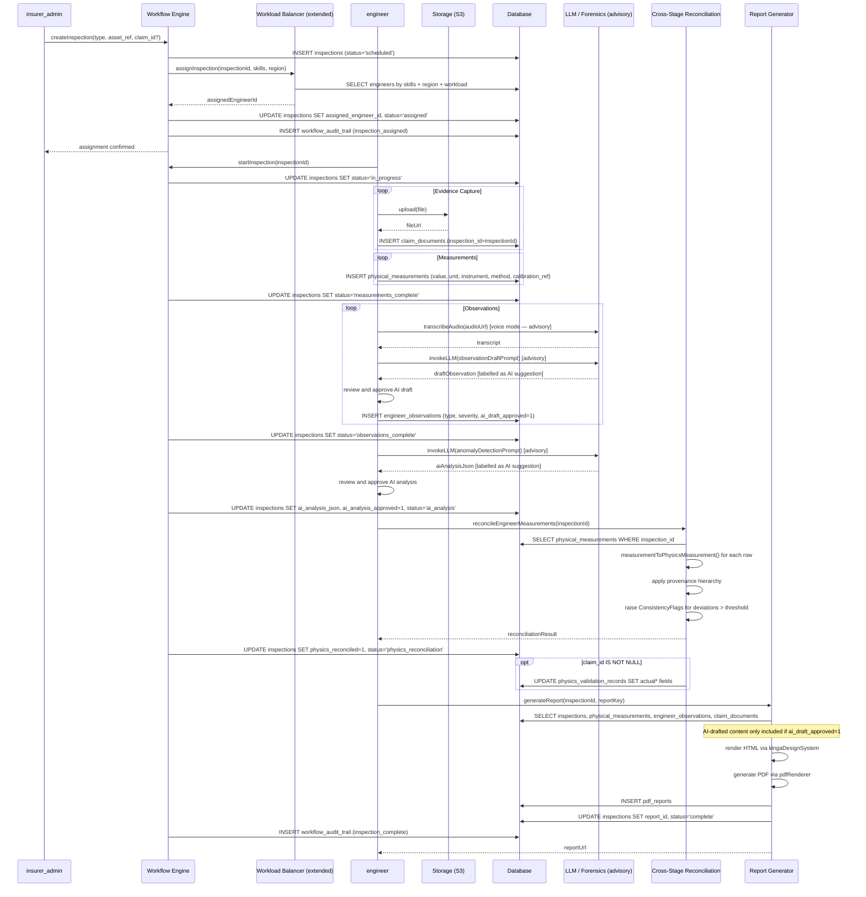
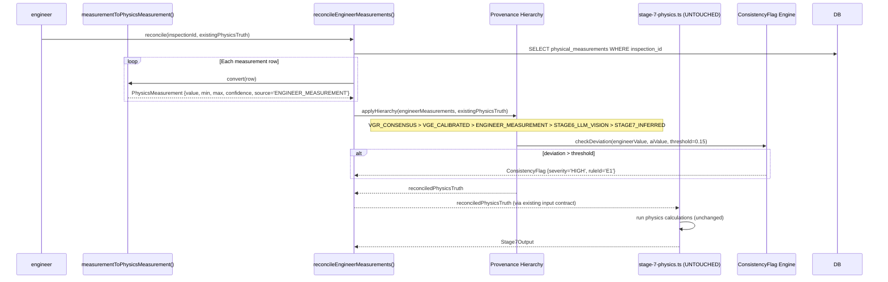
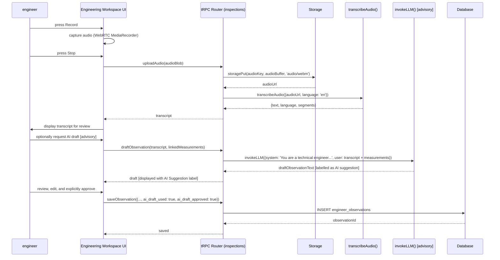

# KINGA Epic 3 — Technical Design Specification

**Document status:** Approved with amendments. Pre-implementation design. No code has been written.  
**Author role:** Principal Platform Architect  
**Supersedes:** Epic 2 Architecture Freeze Report (approved)  
**Date:** 2026-07-31  
**Version:** 1.1 — Amended following review (10 amendments incorporated)  
**Review score:** 9.7/10

---

## Architectural Principle

> An inspection is an examination of an asset supported by evidence, measurements, observations and shared intelligence services. It is not inherently tied to claims, vehicles or insurance.

This principle governs every design decision in this specification. It allows the same architecture to support insurance today while naturally expanding into engineering risk, industrial inspections, renewable energy assets and infrastructure tomorrow — without requiring another major redesign.

---

## Table of Contents

1. [Executive Summary](#1-executive-summary)
2. [First Principle Analysis — Reuse vs New](#2-first-principle-analysis--reuse-vs-new)
3. [Codebase Audit Findings](#3-codebase-audit-findings)
4. [Data Model Design](#4-data-model-design)
   - 4.1 [Asset Registry — The Future Master Asset Index](#41-asset-registry--the-future-master-asset-index)
   - 4.2 [Inspections — Asset-Centric Design](#42-inspections--asset-centric-design)
   - 4.3 [Physical Measurements — Expanded Fields](#43-physical-measurements--expanded-fields)
   - 4.4 [Engineer Observations — With Observation Types](#44-engineer-observations--with-observation-types)
5. [Service Connection Map](#5-service-connection-map)
6. [Measurement → Physics Pipeline Integration](#6-measurement--physics-pipeline-integration)
7. [Engineering Workspace UI Design](#7-engineering-workspace-ui-design)
8. [RBAC Design](#8-rbac-design)
9. [AI Advisory Policy](#9-ai-advisory-policy)
10. [Standards Reference Design](#10-standards-reference-design)
11. [Assignment Engine Extension](#11-assignment-engine-extension)
12. [Report Roadmap](#12-report-roadmap)
13. [Sequence Diagrams](#13-sequence-diagrams)
14. [Reuse Matrix](#14-reuse-matrix)
15. [Dependency Graph](#15-dependency-graph)
16. [Regression Risk Register](#16-regression-risk-register)
17. [Regression Protection Checklist](#17-regression-protection-checklist)
18. [Migration Strategy](#18-migration-strategy)
    - 18.1 [Database Migration](#181-database-migration)
    - 18.2 [Future Migration: Vehicles into Asset Registry](#182-future-migration-vehicles-into-asset-registry)
19. [Implementation Sequence](#19-implementation-sequence)
20. [Acceptance Criteria](#20-acceptance-criteria)

---

## 1. Executive Summary

Epic 3 introduces the **KINGA Engineering Workspace** — a structured environment for qualified engineers to conduct physical inspections, capture measurements, record observations, and feed their findings into the existing KINGA physics and reporting pipeline.

The design mandate is explicit: **maximise reuse of existing KINGA services** and **design for the future asset universe, not just the current vehicle domain**. The audit conducted before this document was written found that the platform already contains every service Epic 3 needs. The net result is that Epic 3 requires 4 new database tables, 1 new router, 2 new report templates (with a third on the roadmap), and additive changes to 6 existing services. It does not require a new physics engine, a new evidence store, a new workflow engine, or a new assignment engine.

The most significant architectural decision in this specification is the positioning of `asset_registry` as the **future master asset index** for the entire KINGA platform. Vehicles currently use `vehicleHistory`, but `asset_registry` is designed from the outset with the fields necessary to eventually become the universal asset catalogue — spanning vehicles, equipment, buildings, transformers, conveyors, fire systems, solar plants, and any future asset class. This is a forward-compatible design, not a migration burden.

---

## 2. First Principle Analysis — Reuse vs New

Before any new entity was designed, each proposed addition was challenged against the following question:

> *Can an existing KINGA capability satisfy this requirement if extended safely?*

| Proposed Addition | Existing Capability | Decision | Rationale |
|---|---|---|---|
| `inspections` table | `claims` table | **NEW TABLE** | Claims are claims-specific. Inspections must support vehicle, engineering, risk survey, fleet, property, equipment, and industrial contexts without a `claimId` FK. A generic, asset-centric `inspections` table is required. |
| `physicalMeasurements` table | `vehicleGeometryMeasurements` table | **NEW TABLE** | `vehicleGeometryMeasurements` is claims-scoped and vehicle-geometry-specific. A generic measurement table must support structural, mechanical, electrical, fire protection, and industrial measurements. |
| `engineerObservations` table | `claimComments` / `workflowAuditTrail` | **NEW TABLE** | Comments are unstructured and claims-scoped. Observations require severity, observation type, recommendation, standards reference, linked measurements, and linked evidence — a distinct entity. |
| `assetRegistry` table | `vehicleHistory` table | **NEW TABLE** | Vehicles continue using `vehicleHistory` for Epic 3. `assetRegistry` is designed as the future master asset index for all asset classes. |
| Evidence store | `claimDocuments` table | **EXTEND** | Add `inspectionId` nullable FK to `claimDocuments`. No new table. |
| Vehicle Passport | `vehicleHistory` table | **EXTEND** | Add `lastInspectionId` nullable FK to `vehicleHistory`. Every inspection already has a unique identifier for future Vehicle Passport timeline aggregation. |
| Workflow integration | `workflow-engine.ts` | **EXTEND** | Add inspection states to the `WorkflowState` union. No new engine. |
| Assignment engine | `workload-balancing.ts` | **EXTEND** | Add `engineer` role with skills, certifications, region, and availability. No new service. |
| Physics integration | `crossStageConsistencyEngine.ts` | **EXTEND** | Add `ENGINEER_MEASUREMENT` as a new `MeasurementSource` value. No new physics engine. |
| Report generation | `reportDefinitions.ts` | **EXTEND** | Register two new report keys (Epic 3). Third report on roadmap. No new registry. |

**Summary: 4 new tables, 0 new services, 0 new engines, 0 new registries.**

---

## 3. Codebase Audit Findings

### 3.1 Existing Tables Relevant to Epic 3

| Table | Purpose | Epic 3 Role |
|---|---|---|
| `claims` | Core claims entity | Parent context for vehicle inspections triggered by claims |
| `claim_documents` | Evidence files (S3 references) | Evidence anchor — extend with `inspection_id` FK |
| `vehicle_history` | Vehicle passport | Vehicle context for inspections — extend with `last_inspection_id` FK |
| `vehicle_geometry_measurements` | Photogrammetric geometry data | Reference only — not extended |
| `physics_validation_records` | Predicted vs actual physics outcomes | Receives engineer-reconciled measurements as `actual*` fields |
| `measurement_types` | Measurement type catalogue | Reused as a reference catalogue for `physical_measurements` |
| `workflow_audit_trail` | Immutable workflow event log | Receives inspection state transition events |
| `workload_assignments` | Processor workload tracking | Extended for engineer role |
| `pdf_reports` | Generated report store | Receives inspection reports |
| `report_snapshots` | Report version history | Receives inspection report snapshots |

### 3.2 Existing Services Relevant to Epic 3

| Service | File | Epic 3 Role |
|---|---|---|
| Workflow Engine | `server/workflow-engine.ts` | Governs inspection state transitions |
| Workload Balancing | `server/workload-balancing.ts` | Routes inspection assignments to engineers |
| Cross-Stage Consistency | `server/pipeline-v2/crossStageConsistencyEngine.ts` | Reconciles engineer measurements with AI pipeline output |
| Physics Truth | `server/pipeline-v2/physicsTruth.ts` | Provides `PhysicsMeasurement` type and `MeasurementSource` enum |
| Photo Forensics | `server/pipeline-v2/photoForensicsEngine.ts` | Provides AI assistance during evidence capture |
| Report Definitions | `server/reporting/reportDefinitions.ts` | Registry for new inspection report templates |
| Voice Transcription | `server/_core/voiceTranscription.ts` | Transcribes engineer voice observations |
| LLM | `server/_core/llm.ts` | AI assistance for observation drafting and anomaly detection — **advisory only** |
| Storage | `server/storage.ts` | S3 upload for inspection evidence |

---

## 4. Data Model Design

### 4.1 Asset Registry — The Future Master Asset Index

**Amendment 1 incorporated:** `asset_registry` is designed as the future master asset index for the entire KINGA platform. For Epic 3, vehicles continue using `vehicleHistory`. However, `asset_registry` already contains the fields necessary to eventually become the universal asset catalogue. The Future Migration Strategy is described in Section 18.2.

The asset universe `asset_registry` is designed to accommodate:

| Asset Class | Examples |
|---|---|
| `vehicle` | Motor vehicles, fleet vehicles, heavy transport |
| `equipment` | Pumps, boilers, conveyors, compressors, generators |
| `building` | Commercial buildings, warehouses, industrial facilities |
| `transformer` | Power transformers, distribution transformers |
| `fire_system` | Fire pumps, sprinkler systems, suppression systems |
| `solar_plant` | Solar inverters, PV arrays, battery storage |
| `wind_turbine` | Wind turbines, nacelles, blades |
| `substation` | HV/MV substations, switchgear |
| `industrial` | Process equipment, tanks, pressure vessels |

```
TABLE: asset_registry
─────────────────────────────────────────────────────────────────────────────
id                    INT AUTO_INCREMENT PRIMARY KEY
tenant_id             VARCHAR(255) NOT NULL
asset_ref             VARCHAR(100) NOT NULL UNIQUE          -- human-readable ref e.g. AST-2026-00001
asset_type            VARCHAR(50) NOT NULL                  -- vehicle | equipment | building |
                                                            --   transformer | fire_system | solar_plant |
                                                            --   wind_turbine | substation | industrial
asset_name            VARCHAR(255) NOT NULL
asset_description     TEXT NULL
serial_number         VARCHAR(100) NULL
manufacturer          VARCHAR(100) NULL
model                 VARCHAR(100) NULL
year_manufactured     INT NULL
-- Location
location_address      TEXT NULL
location_lat          DECIMAL(10,7) NULL
location_lng          DECIMAL(10,7) NULL
-- Ownership
owner_id              INT NULL REFERENCES users(id)
owner_name            VARCHAR(255) NULL                     -- for non-user owners (e.g. corporate)
-- Vehicle cross-reference (nullable — populated when asset_type = 'vehicle')
vehicle_registration  VARCHAR(50) NULL                      -- links to vehicle_history
-- Inspection history
last_inspection_id    INT NULL REFERENCES inspections(id)
last_inspected_at     TIMESTAMP NULL
inspection_count      INT NOT NULL DEFAULT 0
-- Risk
risk_rating           ENUM('low','medium','high','critical') NULL
-- Extensible metadata (asset-type-specific fields)
metadata_json         JSON NULL
-- Audit
created_by            INT NOT NULL REFERENCES users(id)
created_at            TIMESTAMP NOT NULL DEFAULT CURRENT_TIMESTAMP
updated_at            TIMESTAMP NOT NULL DEFAULT CURRENT_TIMESTAMP ON UPDATE CURRENT_TIMESTAMP

INDEXES:
  idx_ar_tenant        (tenant_id)
  idx_ar_ref           (asset_ref) UNIQUE
  idx_ar_type          (asset_type)
  idx_ar_vehicle_reg   (vehicle_registration)
  idx_ar_owner         (owner_id)
```

### 4.2 Inspections — Asset-Centric Design

**Amendment 2 incorporated:** The inspection entity always references an **asset**, not a vehicle. For motor claims, the asset happens to be a vehicle. For engineering work, the asset may be a transformer, pump, boiler, conveyor, fire pump, solar inverter, substation, or wind turbine. This one decision makes the inspection framework reusable across all engineering domains.

The `subject_type` / `subject_id` polymorphic reference is replaced by a direct `asset_ref` + `asset_registry_id` reference. For Epic 3, vehicles are referenced by `vehicle_registration` (which maps to `vehicle_history`). As `asset_registry` matures, all assets will be referenced via `asset_registry_id`.

```
TABLE: inspections
─────────────────────────────────────────────────────────────────────────────
id                    INT AUTO_INCREMENT PRIMARY KEY
tenant_id             VARCHAR(255) NOT NULL
inspection_ref        VARCHAR(50) NOT NULL UNIQUE           -- e.g. INS-2026-00001
inspection_type       VARCHAR(50) NOT NULL                  -- vehicle | engineering | risk_survey |
                                                            --   fleet | property | equipment | industrial
status                ENUM(
                        'scheduled',
                        'assigned',
                        'in_progress',
                        'evidence_capture',
                        'measurements_complete',
                        'observations_complete',
                        'ai_analysis',
                        'engineer_review',
                        'physics_reconciliation',
                        'report_generation',
                        'complete',
                        'cancelled'
                      ) NOT NULL DEFAULT 'scheduled'
-- Asset reference (asset-centric, not vehicle-centric)
asset_registry_id     INT NULL REFERENCES asset_registry(id)  -- preferred FK once asset is registered
asset_ref             VARCHAR(100) NULL                     -- fallback for unregistered assets
asset_type            VARCHAR(50) NOT NULL                  -- vehicle | equipment | building | ...
-- Vehicle convenience reference (for motor claims — maps to vehicle_history)
vehicle_registration  VARCHAR(50) NULL
-- Claim reference (nullable — only for claim-triggered inspections)
claim_id              INT NULL REFERENCES claims(id)
-- Assignment
assigned_engineer_id  INT NULL REFERENCES users(id)
assigned_at           TIMESTAMP NULL
-- Scheduling
scheduled_date        TIMESTAMP NULL
location_address      TEXT NULL
location_lat          DECIMAL(10,7) NULL
location_lng          DECIMAL(10,7) NULL
-- Completion
completed_at          TIMESTAMP NULL
duration_minutes      INT NULL
-- AI assistance (advisory only — see Section 9)
ai_analysis_json      JSON NULL
ai_analysis_at        TIMESTAMP NULL
ai_analysis_approved  TINYINT(1) NOT NULL DEFAULT 0         -- engineer must approve before report
-- Physics reconciliation
physics_reconciled    TINYINT(1) NOT NULL DEFAULT 0
physics_reconciled_at TIMESTAMP NULL
reconciliation_notes  TEXT NULL
-- Report
report_key            VARCHAR(100) NULL
report_id             INT NULL REFERENCES pdf_reports(id)
-- Audit
created_by            INT NOT NULL REFERENCES users(id)
created_at            TIMESTAMP NOT NULL DEFAULT CURRENT_TIMESTAMP
updated_at            TIMESTAMP NOT NULL DEFAULT CURRENT_TIMESTAMP ON UPDATE CURRENT_TIMESTAMP

INDEXES:
  idx_inspections_tenant       (tenant_id)
  idx_inspections_claim        (claim_id)
  idx_inspections_engineer     (assigned_engineer_id)
  idx_inspections_asset        (asset_registry_id)
  idx_inspections_vehicle      (vehicle_registration)
  idx_inspections_status       (status)
  idx_inspections_ref          (inspection_ref) UNIQUE
```

**Supported inspection types and their asset mappings:**

| Inspection Type | `asset_type` | Asset Reference | `claim_id` |
|---|---|---|---|
| Vehicle inspection (claim) | `vehicle` | `vehicle_registration` → `vehicle_history` | required |
| Engineering inspection | `equipment` | `asset_registry_id` | optional |
| Risk survey | `building` | `asset_registry_id` | null |
| Fleet inspection | `vehicle` | `vehicle_registration` | null |
| Fire system inspection | `fire_system` | `asset_registry_id` | null |
| Transformer inspection | `transformer` | `asset_registry_id` | null |
| Solar plant inspection | `solar_plant` | `asset_registry_id` | null |
| Industrial inspection | `industrial` | `asset_registry_id` | null |

### 4.3 Physical Measurements — Expanded Fields

**Amendment 3 incorporated:** Three additional fields are added to `physical_measurements` — `instrument`, `measurement_method` (now a structured enum rather than free text), and `calibration_reference`. These cost almost nothing today but become valuable for engineering traceability and audit trails.

```
TABLE: physical_measurements
─────────────────────────────────────────────────────────────────────────────
id                    INT AUTO_INCREMENT PRIMARY KEY
tenant_id             VARCHAR(255) NOT NULL
inspection_id         INT NOT NULL REFERENCES inspections(id)
-- Measurement identity
measurement_category  VARCHAR(50) NOT NULL               -- vehicle_crush | structural | mechanical |
                                                         --   electrical | fire_protection | industrial
measurement_type      VARCHAR(100) NOT NULL              -- e.g. crush_depth_mm, beam_deflection_mm,
                                                         --   insulation_resistance_ohm
-- Value (mirrors PhysicsMeasurement contract)
value                 DECIMAL(15,4) NOT NULL
value_min             DECIMAL(15,4) NULL                 -- lower bound of 90% CI
value_max             DECIMAL(15,4) NULL                 -- upper bound of 90% CI
unit                  VARCHAR(30) NOT NULL               -- mm | m | ohm | kPa | °C | A | V | kg etc.
-- Instrument (Amendment 3)
instrument            VARCHAR(255) NULL                  -- e.g. tape measure, laser scanner,
                                                         --   ultrasonic gauge, multimeter, caliper
-- Measurement method (Amendment 3 — structured enum)
measurement_method    ENUM(
                        'manual',
                        'laser',
                        'ai_assisted',
                        'imported',
                        'photogrammetric',
                        'ultrasonic',
                        'thermal',
                        'load_cell',
                        'other'
                      ) NOT NULL DEFAULT 'manual'
-- Calibration reference (Amendment 3)
calibration_reference VARCHAR(255) NULL                  -- e.g. "Cal cert #2026-1234, valid to 2027-03"
-- Confidence
confidence            DECIMAL(4,3) NOT NULL DEFAULT 0.900
-- Provenance
captured_by           INT NOT NULL REFERENCES users(id)
captured_at           TIMESTAMP NOT NULL DEFAULT CURRENT_TIMESTAMP
-- Source (extends MeasurementSource enum)
source                VARCHAR(50) NOT NULL DEFAULT 'ENGINEER_MEASUREMENT'
-- Evidence linkage
evidence_document_ids JSON NULL                         -- array of claim_documents.id
-- Location on asset
location_reference    VARCHAR(255) NULL                 -- e.g. "front-left-sill", "bay-3-column-B"
location_image_url    TEXT NULL                         -- annotated image showing measurement point
-- Standards reference (generic — see Section 10)
standards_body        VARCHAR(50) NULL                  -- e.g. SANS | NFPA | IEC | ISO | ASTM | API
standards_code        VARCHAR(100) NULL                 -- e.g. 10085 | 25 | 60076 | 9712
standards_clause      VARCHAR(100) NULL                 -- e.g. §4.3.2 | Clause 7.1
standards_description TEXT NULL                         -- plain-English description of the requirement
-- Notes
notes                 TEXT NULL
-- Audit
created_at            TIMESTAMP NOT NULL DEFAULT CURRENT_TIMESTAMP
updated_at            TIMESTAMP NOT NULL DEFAULT CURRENT_TIMESTAMP ON UPDATE CURRENT_TIMESTAMP

INDEXES:
  idx_pm_inspection     (inspection_id)
  idx_pm_tenant         (tenant_id)
  idx_pm_category       (measurement_category)
  idx_pm_captured_by    (captured_by)
  idx_pm_captured_at    (captured_at)
```

**Supported measurement categories and example types:**

| Category | Example Measurement Types | Units |
|---|---|---|
| `vehicle_crush` | crush_depth, deformation_width, panel_gap | mm |
| `structural` | beam_deflection, column_load, slab_thickness | mm, kN, mm |
| `mechanical` | torque, vibration_amplitude, bearing_clearance | Nm, mm/s, mm |
| `electrical` | insulation_resistance, voltage_drop, earth_continuity | MΩ, V, Ω |
| `fire_protection` | sprinkler_pressure, detector_sensitivity, egress_width | kPa, dB, mm |
| `industrial` | tank_wall_thickness, pressure_rating, flow_rate | mm, kPa, L/s |

### 4.4 Engineer Observations — With Observation Types

**Amendment 4 incorporated:** `observation_type` is added as a structured field to `engineer_observations`. This makes searching, reporting, and analytics significantly easier without adding schema complexity.

**Amendment 5 incorporated:** Standards references are stored as structured fields (`standards_body`, `standards_code`, `standards_clause`, `standards_description`) rather than a single free-text string. This allows the same observation framework to support NFPA, IEC, ISO, ASTM, API, IEEE, and any future standards body without schema changes.

```
TABLE: engineer_observations
─────────────────────────────────────────────────────────────────────────────
id                    INT AUTO_INCREMENT PRIMARY KEY
tenant_id             VARCHAR(255) NOT NULL
inspection_id         INT NOT NULL REFERENCES inspections(id)
-- Observation type (Amendment 4)
observation_type      ENUM(
                        'defect',
                        'hazard',
                        'compliance',
                        'maintenance',
                        'recommendation',
                        'general_note'
                      ) NOT NULL DEFAULT 'general_note'
-- Observation content
observation_mode      ENUM('structured','free_text','voice') NOT NULL DEFAULT 'free_text'
-- Structured observation fields (used when mode = 'structured')
component             VARCHAR(255) NULL                  -- e.g. "front-left-sill", "bay-3-column-B"
condition_code        VARCHAR(50) NULL                   -- e.g. "DEFORMED", "CORRODED", "FRACTURED"
condition_detail      TEXT NULL
-- Free text (used when mode = 'free_text' or as supplement to structured)
observation_text      TEXT NULL
-- Voice transcription (used when mode = 'voice')
voice_audio_url       TEXT NULL                          -- S3 URL of original audio
voice_transcript      TEXT NULL                          -- Whisper transcription output
transcription_language VARCHAR(10) NULL DEFAULT 'en'
-- Severity and recommendation
severity              ENUM('info','minor','moderate','major','critical') NOT NULL DEFAULT 'info'
recommendation        TEXT NULL
-- Standards reference (generic — Amendment 5)
standards_body        VARCHAR(50) NULL                   -- e.g. SANS | NFPA | IEC | ISO | ASTM | API | IEEE
standards_code        VARCHAR(100) NULL                  -- e.g. 10085 | 25 | 60076 | 9712
standards_clause      VARCHAR(100) NULL                  -- e.g. §4.3.2 | Clause 7.1
standards_description TEXT NULL                          -- plain-English description of the requirement
-- Linkage
linked_measurement_ids JSON NULL                         -- array of physical_measurements.id
linked_evidence_ids   JSON NULL                          -- array of claim_documents.id
-- AI assistance (advisory only — Amendment 6)
ai_draft_used         TINYINT(1) NOT NULL DEFAULT 0      -- was this observation AI-drafted?
ai_draft_approved     TINYINT(1) NOT NULL DEFAULT 0      -- has the engineer approved the AI draft?
ai_draft_prompt       TEXT NULL
-- Authorship
authored_by           INT NOT NULL REFERENCES users(id)
authored_at           TIMESTAMP NOT NULL DEFAULT CURRENT_TIMESTAMP
-- Audit
created_at            TIMESTAMP NOT NULL DEFAULT CURRENT_TIMESTAMP
updated_at            TIMESTAMP NOT NULL DEFAULT CURRENT_TIMESTAMP ON UPDATE CURRENT_TIMESTAMP

INDEXES:
  idx_eo_inspection    (inspection_id)
  idx_eo_tenant        (tenant_id)
  idx_eo_type          (observation_type)
  idx_eo_severity      (severity)
  idx_eo_authored_by   (authored_by)
```

---

## 5. Service Connection Map

### 5.1 Evidence

**Existing service:** `claimDocuments` table + `server/storage.ts`

**Connection:** Add nullable `inspection_id INT NULL REFERENCES inspections(id)` to `claim_documents`. This is an additive column — all existing rows remain valid with `inspection_id = NULL`. Evidence captured during an inspection is uploaded via the existing `storagePut()` helper and recorded in `claim_documents` with `inspection_id` set.

### 5.2 Vehicle Passport

**Existing service:** `vehicleHistory` table

**Connection:** Add nullable `last_inspection_id INT NULL REFERENCES inspections(id)` to `vehicle_history`. Updated when an inspection with `asset_type = 'vehicle'` reaches `status = 'complete'`.

**Amendment 7 incorporated:** Every inspection already has a unique `inspection_ref` identifier (e.g., `INS-2026-00001`). This means Phase 4 Vehicle Passport aggregation becomes a simple query — `SELECT * FROM inspections WHERE vehicle_registration = ? ORDER BY completed_at` — rather than a migration exercise. No data is lost, no schema changes are required in Phase 4.

### 5.3 Asset Registry

See Section 4.1. `asset_registry` is the future master asset index. For Epic 3, vehicles reference `vehicleHistory` via `vehicle_registration`. As `asset_registry` matures, all assets will be referenced via `asset_registry_id`.

### 5.4 Workflow Engine

**Existing service:** `server/workflow-engine.ts`

**Connection:** Extend `WorkflowState` in `server/workflow/types.ts` with inspection-specific states (additive, prefixed with `inspection_` to prevent naming collision with existing claim states):

```
'inspection_assigned'
'inspection_in_progress'
'inspection_evidence_capture'
'inspection_measurements'
'inspection_observations'
'inspection_ai_analysis'
'inspection_engineer_review'
'inspection_physics_reconciliation'
'inspection_complete'
```

All existing claim workflow states are unchanged.

### 5.5 Assignment Engine

**Existing service:** `server/workload-balancing.ts`

**Amendment 8 incorporated:** The assignment engine is extended with engineer-specific routing fields. See Section 11 for the full design.

### 5.6 Physics Engine

**Existing service:** `server/pipeline-v2/physicsTruth.ts` + `server/pipeline-v2/crossStageConsistencyEngine.ts`

**Connection:** See Section 6 for the full design. `stage-7-physics.ts` is **untouched**.

### 5.7 Reporting

**Existing service:** `server/reporting/reportDefinitions.ts`

**Connection:** Register two new report keys for Epic 3. Third report on roadmap (Section 12).

| Report Key | Name | Access Roles | Requires |
|---|---|---|---|
| `inspection.engineer_report` | Engineering Inspection Report | `engineer`, `insurer_admin`, `risk_manager` | `inspectionId` |
| `inspection.risk_survey` | Risk Survey Report | `engineer`, `insurer_admin`, `risk_manager`, `executive` | `inspectionId` |

---

## 6. Measurement → Physics Pipeline Integration

The integration follows the preferred solution specified in the brief exactly:

```
Engineer Measurement → Cross-Stage Reconciliation → Existing Physics Engine
```

### 6.1 Detailed Flow

**Step 1 — Engineer captures measurement**

The engineer records a `physical_measurements` row via the Engineering Workspace UI. The measurement includes: `measurement_category`, `measurement_type`, `value`, `unit`, `instrument`, `measurement_method`, `calibration_reference`, `confidence`, `captured_by`, `captured_at`, `evidence_document_ids`, and optionally `standards_body/code/clause`.

**Step 2 — Adapter: measurementToPhysicsMeasurement()**

A new adapter function in `physicsTruth.ts` converts a `physical_measurements` row to a `PhysicsMeasurement` object:

```
physical_measurements row
  → value          → PhysicsMeasurement.value
  → value_min      → PhysicsMeasurement.min
  → value_max      → PhysicsMeasurement.max
  → confidence     → PhysicsMeasurement.confidence
  → source         → PhysicsMeasurement.source = 'ENGINEER_MEASUREMENT'
  → notes          → PhysicsMeasurement.provenanceNote
```

**Step 3 — Cross-Stage Reconciliation**

`reconcileEngineerMeasurements()` in `crossStageConsistencyEngine.ts`:

1. Loads all `physical_measurements` rows for the inspection.
2. For each measurement type that maps to a `PhysicsTruth` field, applies the provenance hierarchy:
   - `VGR_CONSENSUS` > `VGE_CALIBRATED` > `ENGINEER_MEASUREMENT` > `STAGE6_LLM_VISION` > `STAGE7_INFERRED`
3. Raises a `ConsistencyFlag` (severity `HIGH`, rule `E1`) if the engineer measurement deviates from the AI-derived value by more than the configurable threshold (default: 15%).
4. Returns an updated `PhysicsTruth` object with the reconciled measurements.

**Step 4 — Physics Engine receives reconciled PhysicsTruth**

The existing `stage-7-physics.ts` receives the reconciled `PhysicsTruth` object through its existing input contract. **No changes to the physics engine are required.**

**Step 5 — Validation loop closure**

If the inspection is linked to a claim (`claim_id IS NOT NULL`), the reconciled measurements are written to `physics_validation_records.actual*` fields.

### 6.2 Measurement Type Mapping

| `physical_measurements.measurement_type` | `PhysicsTruth` field | Physics Engine usage |
|---|---|---|
| `crush_depth_mm` | `CrushDepthEvidence.canonical` | Campbell equation, delta-V |
| `deformation_width_mm` | `CrushDepthEvidence.widthMm` | Energy dissipation |
| `vehicle_mass_kg` | `vehicleData.mass` | All momentum calculations |
| `impact_speed_kmh` | `speedEvidence.canonical` | Delta-V, severity |
| `structural_intrusion_mm` | `structuralDamage.intrusionMm` | Severity classification |

Measurement types that do not map to a `PhysicsTruth` field are stored in `physical_measurements` and surfaced in the inspection report only.

---

## 7. Engineering Workspace UI Design

The Engineering Workspace is an extension of the existing `DashboardLayout` pattern. It is not a new application — it is a new role-scoped section within the existing KINGA platform.

### 7.1 Navigation Structure

```
Engineering Workspace
├── Dashboard              /engineer
├── Assignments            /engineer/assignments
├── Inspections            /engineer/inspections
│   ├── [id] Details       /engineer/inspections/:id
│   │   ├── Evidence       /engineer/inspections/:id/evidence
│   │   ├── Measurements   /engineer/inspections/:id/measurements
│   │   ├── Observations   /engineer/inspections/:id/observations
│   │   ├── AI Analysis    /engineer/inspections/:id/ai
│   │   ├── Physics        /engineer/inspections/:id/physics
│   │   └── Review         /engineer/inspections/:id/review
│   └── New                /engineer/inspections/new
└── Reports                /engineer/reports
```

### 7.2 Page Designs

**Dashboard (`/engineer`):** Active inspections count with status breakdown (donut chart), overdue inspections alert banner, recent assignments feed, quick-action buttons (Start inspection, Upload evidence), physics reconciliation queue.

**Assignments (`/engineer/assignments`):** Table of assigned inspections with filter by status, inspection type, and date range. Accept assignment and request reassignment actions.

**Inspection Details (`/engineer/inspections/:id`):** Header with inspection_ref, asset, type, status badge, assigned engineer, and scheduled date. Progress stepper: Evidence → Measurements → Observations → AI Analysis → Review → Physics → Report. Tab navigation to sub-pages.

**Evidence Capture:** Drag-and-drop upload (reuses `storagePut()` + `claimDocuments` pattern), evidence gallery with category tagging, photo annotation tool, AI-assisted caption generation (advisory only — see Section 9).

**Measurements:** Measurement entry form with category, type, value, unit, instrument, measurement method, calibration reference, confidence, and standards reference fields. Measurement table with edit/delete. Physics mapping indicator showing which measurements will feed the physics engine. Real-time deviation alert comparing engineer values against AI-derived values.

**Observations:** Mode selector (Structured / Free Text / Voice), observation type selector (Defect / Hazard / Compliance / Maintenance / Recommendation / General Note), severity selector, recommendation field, generic standards reference fields (body, code, clause, description). AI draft button (advisory only — engineer must approve before saving). Voice mode: record → Whisper transcription → editable transcript.

**AI Analysis:** Trigger AI analysis button. AI anomaly detection output showing flagged measurements and inconsistencies. Comparison table: AI-derived values vs engineer measurements. Accept / Override / Dispute actions per finding. **All AI output is clearly labelled as advisory. Engineer approval is required before any AI finding enters the final report.**

**Physics Reconciliation:** Reconciliation status (Pending / Running / Complete / Conflicts). Conflict table with measurement type, AI value, engineer value, deviation %, and resolution. Resolution actions: Accept AI / Accept Engineer / Manual Override.

**Review:** Full inspection summary. Critical observations highlighted. Physics reconciliation summary. Sign-off button (transitions inspection to `inspection_complete`). Report generation trigger.

---

## 8. RBAC Design

### 8.1 New Role: `engineer`

| Attribute | Value |
|---|---|
| Role name | `engineer` |
| Platform role | `engineer` (added to `PLATFORM_ROLES`) |
| Insurer role | `engineer` (added to `InsurerRole` union) |
| Scope | Tenant-scoped |
| Assigned by | `insurer_admin` via existing `platformUserRoles.assignRole` procedure |

### 8.2 Permission Matrix

| Permission | engineer | assessor_internal | assessor_external | risk_manager | insurer_admin |
|---|---|---|---|---|---|
| `create_inspection` | ✓ | ✗ | ✗ | ✗ | ✓ |
| `conduct_inspection` | ✓ | ✗ | ✗ | ✗ | ✗ |
| `capture_evidence` | ✓ | ✓ | ✓ | ✗ | ✓ |
| `record_measurement` | ✓ | ✗ | ✗ | ✗ | ✗ |
| `record_observation` | ✓ | ✓ | ✓ | ✗ | ✗ |
| `trigger_ai_analysis` | ✓ | ✗ | ✗ | ✗ | ✓ |
| `reconcile_physics` | ✓ | ✗ | ✗ | ✓ | ✓ |
| `sign_off_inspection` | ✓ | ✗ | ✗ | ✓ | ✓ |
| `generate_inspection_report` | ✓ | ✗ | ✗ | ✓ | ✓ |
| `view_inspection` | ✓ | ✓ | ✓ | ✓ | ✓ |
| `assign_inspection` | ✗ | ✗ | ✗ | ✓ | ✓ |

---

## 9. AI Advisory Policy

**Amendment 6 incorporated.** This section establishes the explicit AI advisory policy for the Engineering Workspace.

### 9.1 Principle

AI assistance in the Engineering Workspace is **advisory only**. It is a tool to assist the engineer, not to replace professional engineering judgement.

### 9.2 Rules

1. **AI-generated content is never automatically included in a final report.** An engineer must explicitly approve each AI suggestion before it becomes part of the inspection record.

2. **Reports clearly distinguish engineer observations from AI suggestions.** The report template uses distinct visual treatment for engineer-authored content vs AI-suggested content. AI suggestions that have not been approved are excluded from the report entirely.

3. **The `ai_draft_approved` flag** in `engineer_observations` must be `1` before an observation with `ai_draft_used = 1` can be included in a report. The router enforces this at the procedure level.

4. **The `ai_analysis_approved` flag** in `inspections` must be `1` before the AI analysis section is included in the report. The engineer approves the AI analysis as a whole before proceeding to physics reconciliation.

5. **AI anomaly detection is surfaced as `ConsistencyFlag` objects** (existing type) — not as measurements, not as observations. The engineer decides whether to act on each flag.

### 9.3 UI Enforcement

- AI-suggested content is displayed with a distinct background colour and an "AI Suggestion" label.
- An "Approve" button is required before the content can be saved.
- The "Generate Report" button is disabled if any AI-drafted observation has `ai_draft_approved = 0`.

---

## 10. Standards Reference Design

**Amendment 5 incorporated.** Standards references are stored as structured fields rather than a single free-text string. This allows the same observation and measurement framework to support any standards body without schema changes.

### 10.1 Structure

All standards references — in both `physical_measurements` and `engineer_observations` — use the same four-field structure:

| Field | Description | Example |
|---|---|---|
| `standards_body` | The issuing organisation | `SANS`, `NFPA`, `IEC`, `ISO`, `ASTM`, `API`, `IEEE` |
| `standards_code` | The standard number or code | `10085`, `25`, `60076`, `9712` |
| `standards_clause` | The specific clause or section | `§4.3.2`, `Clause 7.1`, `Table 3` |
| `standards_description` | Plain-English description of the requirement | `Minimum insulation resistance for LV installations` |

### 10.2 Supported Standards Bodies (initial list, extensible)

| Body | Domain |
|---|---|
| SANS | South African National Standards |
| NFPA | National Fire Protection Association |
| IEC | International Electrotechnical Commission |
| ISO | International Organization for Standardization |
| ASTM | American Society for Testing and Materials |
| API | American Petroleum Institute |
| IEEE | Institute of Electrical and Electronics Engineers |
| BS | British Standards |
| EN | European Standards |

No schema change is required to add a new standards body — `standards_body` is a `VARCHAR(50)` field.

---

## 11. Assignment Engine Extension

**Amendment 8 incorporated.** The existing `workload-balancing.ts` is extended with engineer-specific routing fields. These become valuable when assigning specialised inspections.

### 11.1 Engineer Profile Extension

A new `engineer_profiles` table stores engineer-specific attributes used for intelligent assignment:

```
TABLE: engineer_profiles
─────────────────────────────────────────────────────────────────────────────
id                    INT AUTO_INCREMENT PRIMARY KEY
user_id               INT NOT NULL UNIQUE REFERENCES users(id)
tenant_id             VARCHAR(255) NOT NULL
-- Skills (JSON array of skill codes)
skills                JSON NULL                           -- e.g. ["vehicle_damage","structural","electrical"]
-- Certifications (JSON array of {body, code, expiry})
certifications        JSON NULL                           -- e.g. [{"body":"ECSA","code":"PR Eng","expiry":"2028-06"}]
-- Geographic region
region                VARCHAR(100) NULL                   -- e.g. "Harare", "Bulawayo", "Midlands"
region_lat            DECIMAL(10,7) NULL
region_lng            DECIMAL(10,7) NULL
max_travel_radius_km  INT NULL DEFAULT 100
-- Availability
is_available          TINYINT(1) NOT NULL DEFAULT 1
availability_notes    TEXT NULL
-- Workload (maintained by workload-balancing.ts)
active_inspections    INT NOT NULL DEFAULT 0
-- Audit
created_at            TIMESTAMP NOT NULL DEFAULT CURRENT_TIMESTAMP
updated_at            TIMESTAMP NOT NULL DEFAULT CURRENT_TIMESTAMP ON UPDATE CURRENT_TIMESTAMP
```

### 11.2 Assignment Logic Extension

`assignInspection()` in `workload-balancing.ts` selects the optimal engineer using:

1. **Skills match** — engineer must have the required skill for the inspection type.
2. **Certification match** — engineer must hold the required certification (if specified).
3. **Geographic proximity** — engineer must be within `max_travel_radius_km` of the inspection location.
4. **Availability** — `is_available = 1`.
5. **Lowest workload** — among all qualifying engineers, select the one with the lowest `active_inspections` count (existing workload scoring logic).

---

## 12. Report Roadmap

**Amendment 9 incorporated.** Three reports are planned across Epic 3 and the roadmap.

| Report Key | Name | Epic | Description |
|---|---|---|---|
| `inspection.engineer_report` | Engineering Inspection Report | Epic 3 | Full inspection report: asset details, evidence gallery, measurements table, observations list, physics reconciliation summary, sign-off |
| `inspection.risk_survey` | Risk Survey Report | Epic 3 | Risk-focused report: asset details, risk rating, critical observations, recommendations, standards references |
| `inspection.findings_summary` | Engineering Findings Summary | Roadmap (Epic 4+) | Lightweight multi-inspection report consolidating observations, measurements, and recommendations across multiple inspections for a client managing a fleet or industrial asset portfolio |

The `inspection.findings_summary` report is not implemented in Epic 3 but is registered as a roadmap item in `reportDefinitions.ts` with a `TODO` comment so it is not forgotten.

---

## 13. Sequence Diagrams

### 13.1 Full Engineering Inspection Flow



### 13.2 Measurement → Physics Reconciliation Detail



### 13.3 Voice Observation Flow



---

## 14. Reuse Matrix

| Epic 3 Requirement | Existing Asset Reused | Change Type | Files Affected |
|---|---|---|---|
| Evidence store | `claimDocuments` table | Additive column | `drizzle/schema.ts` |
| Vehicle passport | `vehicleHistory` table | Additive column | `drizzle/schema.ts` |
| Workflow engine | `server/workflow-engine.ts` | Additive states | `server/workflow/types.ts` |
| Assignment engine | `server/workload-balancing.ts` | Additive role + skills routing | `server/workload-balancing.ts` |
| Physics measurement type | `PhysicsMeasurement` interface | New source value | `server/pipeline-v2/physicsTruth.ts` |
| Physics reconciliation | `crossStageConsistencyEngine.ts` | New function | `server/pipeline-v2/crossStageConsistencyEngine.ts` |
| Physics engine | `stage-7-physics.ts` | **UNTOUCHED** | — |
| Evidence upload | `server/storage.ts` | **UNTOUCHED** | — |
| Voice transcription | `server/_core/voiceTranscription.ts` | **UNTOUCHED** | — |
| AI assistance | `server/_core/llm.ts` | **UNTOUCHED** | — |
| Report registry | `server/reporting/reportDefinitions.ts` | Additive entries | `server/reporting/reportDefinitions.ts` |
| Report design system | `server/reporting/templates/kingaDesignSystem.ts` | **UNTOUCHED** | — |
| Dashboard layout | `client/src/components/DashboardLayout.tsx` | Additive nav items | `client/src/components/DashboardLayout.tsx` |
| Role assignment UI | `client/src/pages/PlatformUserRoleManager.tsx` | Additive role | `client/src/pages/PlatformUserRoleManager.tsx` |
| RBAC | `server/workflow/types.ts` | Additive role/states | `server/workflow/types.ts` |
| Audit trail | `workflowAuditTrail` table | **UNTOUCHED** | — |
| PDF generation | `server/reporting/pdfRenderer.ts` | **UNTOUCHED** | — |

**New files required:**

| File | Purpose |
|---|---|
| `server/routers/inspections.ts` | tRPC router for all inspection procedures |
| `server/reporting/engineerInspectionReport.ts` | Engineering Inspection Report template |
| `server/reporting/riskSurveyReport.ts` | Risk Survey Report template |
| `client/src/pages/EngineerDashboard.tsx` | Engineer dashboard page |
| `client/src/pages/EngineerAssignments.tsx` | Assignments list page |
| `client/src/pages/InspectionList.tsx` | Inspections list page |
| `client/src/pages/InspectionDetail.tsx` | Inspection detail shell with tab navigation |
| `client/src/pages/InspectionEvidence.tsx` | Evidence capture tab |
| `client/src/pages/InspectionMeasurements.tsx` | Measurements tab |
| `client/src/pages/InspectionObservations.tsx` | Observations tab (all 3 modes) |
| `client/src/pages/InspectionAIAnalysis.tsx` | AI analysis tab (advisory) |
| `client/src/pages/InspectionPhysics.tsx` | Physics reconciliation tab |
| `client/src/pages/InspectionReview.tsx` | Review and sign-off tab |

---

## 15. Dependency Graph

```
NEW TABLES
──────────
asset_registry
  ├── depends on: users (owner_id, created_by)
  └── depends on: inspections (last_inspection_id, nullable — FK added after inspections table)

inspections
  ├── depends on: asset_registry (asset_registry_id, nullable)
  ├── depends on: users (assigned_engineer_id, created_by)
  ├── depends on: claims (claim_id, nullable)
  └── depends on: pdf_reports (report_id, nullable)

physical_measurements
  ├── depends on: inspections (inspection_id)
  └── depends on: users (captured_by)

engineer_observations
  ├── depends on: inspections (inspection_id)
  └── depends on: users (authored_by)

engineer_profiles
  ├── depends on: users (user_id)
  └── no new table dependencies

SCHEMA EXTENSIONS (additive columns only)
──────────────────────────────────────────
claim_documents.inspection_id → inspections(id)
vehicle_history.last_inspection_id → inspections(id)

SERVICE DEPENDENCIES
────────────────────
inspections router
  ├── depends on: workflow-engine.ts (state transitions)
  ├── depends on: workload-balancing.ts (assignment)
  ├── depends on: storage.ts (evidence upload)
  ├── depends on: voiceTranscription.ts (voice observations)
  ├── depends on: llm.ts (AI assistance — advisory)
  ├── depends on: crossStageConsistencyEngine.ts (physics reconciliation)
  └── depends on: reportDefinitions.ts (report generation)

crossStageConsistencyEngine.ts (extended)
  ├── depends on: physicsTruth.ts (PhysicsMeasurement type)
  └── depends on: physical_measurements table (engineer measurements)

physicsTruth.ts (extended)
  └── no new dependencies

stage-7-physics.ts (UNTOUCHED)
  └── receives reconciledPhysicsTruth via existing contract
```

---

## 16. Regression Risk Register

### 16.1 Files That Must Remain Untouched

| File | Reason |
|---|---|
| `server/pipeline-v2/stage-7-physics.ts` | Core physics engine |
| `server/pipeline-v2/animalStrikePhysicsEngine.ts` | Specialist physics engine |
| `server/pipeline-v2/damagePhysicsCoherence.ts` | Physics coherence validator |
| `server/pipeline-v2/physicsNumericalContract.ts` | Numerical contract enforcer |
| `server/pipeline-v2/photoForensicsEngine.ts` | Photo forensics engine (Epic 2 complete) |
| `server/pipeline-v2/imageIntelligence.ts` | Image intelligence engine (Epic 2 complete) |
| `server/workflow-engine.ts` | Workflow engine core logic |
| `server/workflow/state-machine.ts` | State machine definition |
| `server/workflow/segregation-validator.ts` | Segregation of duties validator |
| `server/reporting/pdfRenderer.ts` | PDF renderer |
| `server/reporting/templates/kingaDesignSystem.ts` | Design system |
| `drizzle/schema.ts` (existing columns) | All existing columns are immutable |

### 16.2 Services That Must Not Be Modified (only extended)

| Service | Permitted Change | Prohibited Change |
|---|---|---|
| `workflow-engine.ts` | Add inspection state transitions | Modify existing claim transitions |
| `workload-balancing.ts` | Add `engineer` role + skills routing | Modify existing workload scoring weights |
| `crossStageConsistencyEngine.ts` | Add `reconcileEngineerMeasurements()` | Modify existing consistency rules C1–C16 |
| `physicsTruth.ts` | Add `ENGINEER_MEASUREMENT` source | Modify existing source hierarchy order |
| `reportDefinitions.ts` | Add new report keys | Modify existing report access rules |
| `platform-user-roles.ts` | Add `engineer` to `PLATFORM_ROLES` | Modify existing role definitions |

---

## 17. Regression Protection Checklist

**Amendment 10 incorporated.** This checklist is **mandatory** before every checkpoint save. No checkpoint may be saved unless all items are verified.

### Pre-Checkpoint Regression Protection Checklist

```
CLAIMS PIPELINE
□ Submit a test claim end-to-end (intake → AI assessment → report)
□ Confirm all pipeline stages complete without error
□ Confirm the claims pipeline report generates successfully

VALUATION ENGINE
□ Call agency.getValuation for a test vehicle
□ Confirm valuationDate filtering produces correct output
□ Confirm existing callers (without valuationDate) are unaffected

PHOTO FORENSICS
□ Run photoForensicsEngine on a test image
□ Confirm pHash, exifAbsent, and aiGenerationScore fields are populated
□ Confirm no regression in existing forensics output fields

PHYSICS ENGINE
□ Run stage-7-physics.ts with a standard collision test case
□ Confirm output matches the pre-Epic-3 baseline
□ Confirm existing ConsistencyFlag rules C1–C16 produce identical output

EXISTING REPORTS
□ Generate a Claims Intelligence Report for a test claim
□ Generate a Forensic Decision Report for a test claim
□ Generate a Vehicle Verification Report for a test vehicle
□ Generate a Vehicle Valuation Report for a test vehicle
□ Confirm all four reports render without error

EXISTING RBAC
□ Confirm claims_processor cannot access inspection procedures (FORBIDDEN)
□ Confirm engineer cannot access claims-only procedures (FORBIDDEN)
□ Confirm insurer_admin can assign engineer role

EXISTING WORKFLOWS
□ Confirm claim workflow transitions (created → closed) are unaffected
□ Confirm workflow_audit_trail records are created for claim transitions
□ Confirm segregation-of-duties validation is unaffected

TYPESCRIPT BASELINE
□ Confirm TypeScript error count does not exceed the pre-Epic-3 baseline (47 errors)
□ Confirm no new errors in Epic 3 files
```

---

## 18. Migration Strategy

### 18.1 Database Migration

All schema changes are additive. No existing columns are modified or dropped.

**Migration 1 — New tables (no FK dependencies on new tables)**
```sql
CREATE TABLE asset_registry (...)
CREATE TABLE engineer_profiles (...)
```

**Migration 2 — New tables with FK on asset_registry**
```sql
CREATE TABLE inspections (...)  -- references asset_registry(id) nullable
```

**Migration 3 — New tables with FK on inspections**
```sql
CREATE TABLE physical_measurements (...)
CREATE TABLE engineer_observations (...)
```

**Migration 4 — Additive FK on asset_registry (back-reference to inspections)**
```sql
ALTER TABLE asset_registry ADD COLUMN last_inspection_id INT NULL
ALTER TABLE asset_registry ADD CONSTRAINT fk_ar_last_inspection FOREIGN KEY (last_inspection_id) REFERENCES inspections(id) ON DELETE SET NULL
```

**Migration 5 — Additive columns on existing tables**
```sql
ALTER TABLE claim_documents ADD COLUMN inspection_id INT NULL
ALTER TABLE vehicle_history ADD COLUMN last_inspection_id INT NULL
ALTER TABLE claim_documents ADD CONSTRAINT fk_cd_inspection FOREIGN KEY (inspection_id) REFERENCES inspections(id) ON DELETE SET NULL
ALTER TABLE vehicle_history ADD CONSTRAINT fk_vh_last_inspection FOREIGN KEY (last_inspection_id) REFERENCES inspections(id) ON DELETE SET NULL
```

All migrations are non-destructive and can be applied to a live database without downtime.

### 18.2 Future Migration: Vehicles into Asset Registry

**Amendment 1 incorporated.** This section describes how vehicles could eventually become entries in `asset_registry` without breaking existing functionality. This migration is **not part of Epic 3** — it is a future Phase 4 exercise.

**Current state (Epic 3):**
```
Vehicle → vehicleHistory (primary)
       → asset_registry (optional, via vehicle_registration cross-reference)
```

**Future state (Phase 4):**
```
Asset Registry (primary)
  ├── Vehicle (asset_type='vehicle', vehicle_registration FK to vehicleHistory)
  ├── Equipment (asset_type='equipment')
  ├── Building (asset_type='building')
  └── ...
```

**Migration path (zero-downtime, zero-data-loss):**

1. **Phase 4a — Dual-write:** When a new vehicle inspection is created, write to both `vehicleHistory` and `asset_registry`. Existing reads continue from `vehicleHistory`.

2. **Phase 4b — Backfill:** Run a background migration that creates an `asset_registry` entry for every existing `vehicleHistory` row. The `vehicle_registration` cross-reference field ensures the link is maintained.

3. **Phase 4c — Read migration:** Update all queries that read from `vehicleHistory` to read from `asset_registry` where `asset_type = 'vehicle'`. `vehicleHistory` becomes a read-only archive.

4. **Phase 4d — Deprecation:** Mark `vehicleHistory` as deprecated. Retain for audit trail purposes.

**Why this works without breaking anything:**

- `asset_registry.vehicle_registration` is a cross-reference field that maps to `vehicleHistory.vehicleRegistration`. All existing `vehicleHistory` queries continue to work throughout the migration.
- The `inspections` table already references assets via `asset_registry_id` (preferred) or `vehicle_registration` (fallback). The fallback ensures Epic 3 inspections remain valid even before Phase 4 migration.
- The `vehicleHistory.last_inspection_id` FK added in Epic 3 ensures the Vehicle Passport timeline is already populated. Phase 4 aggregation is a query, not a migration.

---

## 19. Implementation Sequence

| Task | Description | Dependencies | Risk | Checkpoint |
|---|---|---|---|---|
| **E3-T1** | Apply database migrations (5 new tables, 2 additive columns) | None | Low | — |
| **E3-T2** | Extend `WorkflowState`, `InsurerRole`, `MeasurementSource` types | E3-T1 | Low | — |
| **E3-T3** | Add `engineer` to `PLATFORM_ROLES` (server + client) | E3-T2 | Low | **✓ Checkpoint** |
| **E3-T4** | Add `measurementToPhysicsMeasurement()` adapter to `physicsTruth.ts` | E3-T2 | Low | — |
| **E3-T5** | Add `reconcileEngineerMeasurements()` to `crossStageConsistencyEngine.ts` | E3-T4 | Medium | — |
| **E3-T6** | Extend `workload-balancing.ts` with `assignInspection()` + skills routing | E3-T2 | Low | **✓ Checkpoint** |
| **E3-T7** | Create `server/routers/inspections.ts` — CRUD + workflow + assignment | E3-T1, E3-T2, E3-T6 | Medium | — |
| **E3-T8** | Extend `server/routers/inspections.ts` — measurements + observations + evidence | E3-T7 | Medium | — |
| **E3-T9** | Extend `server/routers/inspections.ts` — AI analysis + physics reconciliation | E3-T5, E3-T8 | High | **✓ Checkpoint** |
| **E3-T10** | Create `engineerInspectionReport.ts` and `riskSurveyReport.ts`, register in `reportDefinitions.ts` | E3-T7 | Low | **✓ Checkpoint** |
| **E3-T11** | Create `EngineerDashboard.tsx`, `EngineerAssignments.tsx`, `InspectionList.tsx` | E3-T7 | Low | — |
| **E3-T12** | Create `InspectionDetail.tsx` with tab shell | E3-T11 | Low | — |
| **E3-T13** | Create `InspectionEvidence.tsx` | E3-T12 | Low | — |
| **E3-T14** | Create `InspectionMeasurements.tsx` | E3-T12 | Medium | — |
| **E3-T15** | Create `InspectionObservations.tsx` (all 3 modes including voice) | E3-T12 | Medium | **✓ Checkpoint** |
| **E3-T16** | Create `InspectionAIAnalysis.tsx` (advisory — approval required) | E3-T12 | Medium | — |
| **E3-T17** | Create `InspectionPhysics.tsx` (reconciliation UI) | E3-T9, E3-T12 | High | — |
| **E3-T18** | Create `InspectionReview.tsx` (sign-off + report generation) | E3-T10, E3-T12 | Medium | **✓ Checkpoint** |
| **E3-T19** | Write Vitest tests for all 18 tasks. Run Regression Protection Checklist. | All | Medium | **✓ Final Checkpoint** |

---

## 20. Acceptance Criteria

### 20.1 Data Model

- [ ] `inspections` table exists with all specified columns and indexes
- [ ] `physical_measurements` table exists including `instrument`, `measurement_method` (enum), and `calibration_reference` fields
- [ ] `engineer_observations` table exists including `observation_type` enum and structured standards reference fields
- [ ] `asset_registry` table exists with `asset_type` supporting all specified asset classes
- [ ] `engineer_profiles` table exists with `skills`, `certifications`, `region`, and `availability` fields
- [ ] `claim_documents.inspection_id` nullable FK exists
- [ ] `vehicle_history.last_inspection_id` nullable FK exists
- [ ] All existing `claim_documents` rows have `inspection_id = NULL` (no regression)
- [ ] All existing `vehicle_history` rows have `last_inspection_id = NULL` (no regression)

### 20.2 RBAC

- [ ] `engineer` role exists in `PLATFORM_ROLES` (server and client)
- [ ] `engineer` exists in `InsurerRole` union
- [ ] `insurer_admin` can assign `engineer` role via existing `platformUserRoles.assignRole` procedure
- [ ] `engineer` cannot access claims-only procedures (FORBIDDEN)
- [ ] `engineer` can access all inspection procedures
- [ ] `risk_manager` can view inspections but cannot record measurements

### 20.3 Workflow

- [ ] Inspection transitions through all 9 inspection states in sequence
- [ ] Each transition is recorded in `workflow_audit_trail`
- [ ] Invalid transitions are rejected by the workflow engine
- [ ] Existing claim workflow transitions are unaffected (regression test)

### 20.4 Physics Integration

- [ ] `ENGINEER_MEASUREMENT` is a valid `MeasurementSource` value
- [ ] `measurementToPhysicsMeasurement()` correctly maps all `physical_measurements` fields
- [ ] `reconcileEngineerMeasurements()` raises `ConsistencyFlag` (severity `HIGH`, rule `E1`) for deviations > 15%
- [ ] Existing `ConsistencyFlag` rules C1–C16 produce identical output for identical input
- [ ] `stage-7-physics.ts` produces correct output (existing physics tests pass)

### 20.5 AI Advisory Policy

- [ ] AI-drafted observations with `ai_draft_approved = 0` are excluded from reports
- [ ] `ai_analysis_approved = 0` prevents AI analysis section from appearing in reports
- [ ] UI displays AI suggestions with distinct visual treatment and "AI Suggestion" label
- [ ] "Generate Report" button is disabled if any unapproved AI content exists

### 20.6 Standards References

- [ ] Standards references in both `physical_measurements` and `engineer_observations` use the four-field structure (body, code, clause, description)
- [ ] No hardcoded standards body values — `standards_body` is a free `VARCHAR(50)` field

### 20.7 Assignment Engine

- [ ] `engineer_profiles` table is populated for test engineers with skills, certifications, and region
- [ ] `assignInspection()` selects the engineer with matching skills, correct region, and lowest workload
- [ ] Engineers without required skills are not assigned

### 20.8 Reports

- [ ] `inspection.engineer_report` generates a PDF with all specified sections
- [ ] `inspection.risk_survey` generates a PDF with all specified sections
- [ ] Both reports use `kingaDesignSystem.ts`
- [ ] AI-drafted content is clearly distinguished from engineer-authored content in reports
- [ ] Existing claim reports are unaffected (regression test)

### 20.9 Regression (Mandatory — Regression Protection Checklist)

- [ ] All items in the Regression Protection Checklist (Section 17) pass before final checkpoint
- [ ] All existing Vitest tests pass
- [ ] TypeScript baseline error count does not exceed the pre-Epic-3 baseline

---

*End of KINGA Epic 3 Technical Design Specification v1.1*
