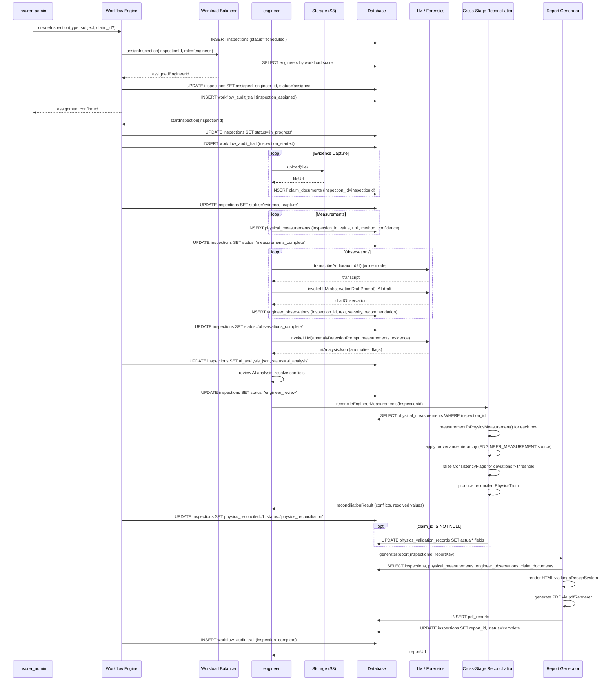
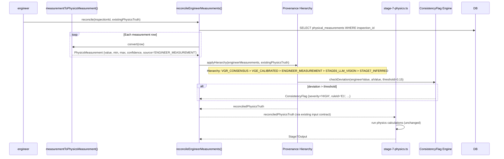
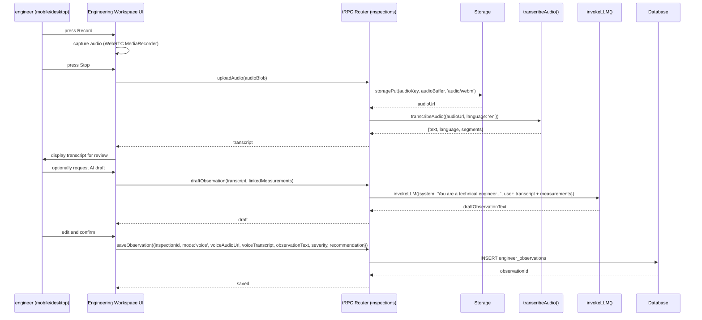

# KINGA Epic 3 — Technical Design Specification

**Document status:** Pre-implementation design. No code has been written.  
**Author role:** Principal Platform Architect  
**Supersedes:** Epic 2 Architecture Freeze Report (approved)  
**Date:** 2026-07-31  
**Version:** 1.0

---

## Table of Contents

1. [Executive Summary](#1-executive-summary)
2. [First Principle Analysis — Reuse vs New](#2-first-principle-analysis--reuse-vs-new)
3. [Codebase Audit Findings](#3-codebase-audit-findings)
4. [Data Model Design](#4-data-model-design)
   - 4.1 [Entity Decision: inspections](#41-entity-decision-inspections)
   - 4.2 [Entity Decision: physicalMeasurements](#42-entity-decision-physicalmeasurements)
   - 4.3 [Entity Decision: engineerObservations](#43-entity-decision-engineerobservations)
   - 4.4 [Generic Inspection Model](#44-generic-inspection-model)
   - 4.5 [Generic Physical Measurement Model](#45-generic-physical-measurement-model)
   - 4.6 [Engineer Observation Model](#46-engineer-observation-model)
5. [Service Connection Map](#5-service-connection-map)
   - 5.1 [Evidence](#51-evidence)
   - 5.2 [Vehicle Passport](#52-vehicle-passport)
   - 5.3 [Asset Registry](#53-asset-registry)
   - 5.4 [Workflow Engine](#54-workflow-engine)
   - 5.5 [Assignment Engine](#55-assignment-engine)
   - 5.6 [Physics Engine](#56-physics-engine)
   - 5.7 [Reporting](#57-reporting)
6. [Measurement → Physics Pipeline Integration](#6-measurement--physics-pipeline-integration)
7. [Engineering Workspace UI Design](#7-engineering-workspace-ui-design)
8. [RBAC Design](#8-rbac-design)
9. [Sequence Diagrams](#9-sequence-diagrams)
10. [Reuse Matrix](#10-reuse-matrix)
11. [Dependency Graph](#11-dependency-graph)
12. [Regression Risk Register](#12-regression-risk-register)
13. [Migration Strategy](#13-migration-strategy)
14. [Implementation Sequence](#14-implementation-sequence)
15. [Acceptance Criteria](#15-acceptance-criteria)

---

## 1. Executive Summary

Epic 3 introduces the **KINGA Engineering Workspace** — a structured environment for qualified engineers and assessors to conduct physical inspections, capture measurements, record observations, and feed their findings into the existing KINGA physics and reporting pipeline.

The design mandate is explicit: **maximise reuse of existing KINGA services**. The audit conducted before this document was written found that the platform already contains:

- A `PhysicsMeasurement` type with value, min, max, confidence, source, and provenance fields
- A `crossStageConsistencyEngine` that is the correct integration point for engineer-supplied measurements
- A `claimDocuments` table that is the correct evidence anchor
- A `vehicleHistory` table that is the correct vehicle passport
- A `workload-balancing.ts` service that is the correct assignment engine
- A `workflow-engine.ts` that is the correct workflow integration point
- A `reportDefinitions.ts` registry that is the correct report integration point

The net result is that **Epic 3 requires 3 new database tables, 1 new router, 2 new report templates, and additive changes to 4 existing services**. It does not require a new physics engine, a new evidence store, a new workflow engine, or a new assignment engine.

---

## 2. First Principle Analysis — Reuse vs New

Before any new entity was designed, each proposed addition was challenged against the following question:

> *Can an existing KINGA capability satisfy this requirement if extended safely?*

| Proposed Addition | Existing Capability | Decision | Rationale |
|---|---|---|---|
| `inspections` table | `claims` table | **NEW TABLE** | Claims are claims-specific. Inspections must support vehicle, engineering, risk survey, fleet, property, and equipment contexts without a `claimId` foreign key. A generic `inspections` table is required. |
| `physicalMeasurements` table | `vehicleGeometryMeasurements` table | **NEW TABLE** | `vehicleGeometryMeasurements` is claims-scoped and vehicle-geometry-specific. A generic measurement table must support structural, mechanical, electrical, fire protection, and industrial measurements without a `vehicleModelId` FK. |
| `engineerObservations` table | `claimComments` / `workflowAuditTrail` | **NEW TABLE** | Comments are unstructured and claims-scoped. Observations require severity, recommendation, standards reference, linked measurements, and linked evidence — a distinct entity. |
| Evidence store | `claimDocuments` table | **EXTEND** | Add `inspectionId` nullable FK to `claimDocuments`. No new table. |
| Vehicle Passport | `vehicleHistory` table | **EXTEND** | Add `lastInspectionId` nullable FK to `vehicleHistory`. No new table. |
| Asset Registry | `vehicleHistory` table | **EXTEND** | Non-vehicle assets (equipment, property) require a new `assetRegistry` table. Vehicle assets reuse `vehicleHistory`. |
| Workflow integration | `workflow-engine.ts` | **EXTEND** | Add `inspection_assigned`, `inspection_in_progress`, `inspection_complete` states to the `WorkflowState` union. No new engine. |
| Assignment engine | `workload-balancing.ts` | **EXTEND** | Add `engineer` role to the workload scorer. No new service. |
| Physics integration | `crossStageConsistencyEngine.ts` | **EXTEND** | Add `ENGINEER_MEASUREMENT` as a new `MeasurementSource` value. Engineer measurements enter via the existing cross-stage reconciliation path. No new physics engine. |
| Report generation | `reportDefinitions.ts` | **EXTEND** | Register two new report keys: `inspection.engineer_report` and `inspection.risk_survey`. No new registry. |

**Summary: 3 new tables, 0 new services, 0 new engines, 0 new registries.**

---

## 3. Codebase Audit Findings

### 3.1 Existing Tables Relevant to Epic 3

| Table | Purpose | Epic 3 Role |
|---|---|---|
| `claims` | Core claims entity | Parent context for vehicle inspections triggered by claims |
| `claim_documents` | Evidence files (S3 references) | Evidence anchor — extend with `inspection_id` FK |
| `vehicle_history` | Vehicle passport | Vehicle context for inspections — extend with `last_inspection_id` FK |
| `vehicle_geometry_measurements` | Photogrammetric geometry data | Reference only — not extended |
| `physics_validation_records` | Predicted vs actual physics outcomes | Receives engineer-reconciled measurements as `actual*` fields |
| `measurement_types` | Measurement type catalogue | Reused as a reference catalogue for `physical_measurements` |
| `workflow_audit_trail` | Immutable workflow event log | Receives inspection state transition events |
| `workload_assignments` | Processor workload tracking | Extended for engineer role |
| `pdf_reports` | Generated report store | Receives inspection reports |
| `report_snapshots` | Report version history | Receives inspection report snapshots |

### 3.2 Existing Services Relevant to Epic 3

| Service | File | Epic 3 Role |
|---|---|---|
| Workflow Engine | `server/workflow-engine.ts` | Governs inspection state transitions |
| Workload Balancing | `server/workload-balancing.ts` | Routes inspection assignments to engineers |
| Cross-Stage Consistency | `server/pipeline-v2/crossStageConsistencyEngine.ts` | Reconciles engineer measurements with AI pipeline output |
| Physics Truth | `server/pipeline-v2/physicsTruth.ts` | Provides `PhysicsMeasurement` type and `MeasurementSource` enum |
| Photo Forensics | `server/pipeline-v2/photoForensicsEngine.ts` | Provides AI assistance during evidence capture |
| Report Definitions | `server/reporting/reportDefinitions.ts` | Registry for new inspection report templates |
| Voice Transcription | `server/_core/voiceTranscription.ts` | Transcribes engineer voice observations |
| LLM | `server/_core/llm.ts` | AI assistance for observation drafting and anomaly detection |
| Storage | `server/storage.ts` | S3 upload for inspection evidence |

### 3.3 Existing Types Relevant to Epic 3

| Type | File | Epic 3 Role |
|---|---|---|
| `PhysicsMeasurement` | `physicsTruth.ts` | Base type for all physical measurements |
| `MeasurementSource` | `physicsTruth.ts` | Extended with `ENGINEER_MEASUREMENT` |
| `InsurerRole` | `workflow/types.ts` | Extended with `engineer` |
| `WorkflowState` | `workflow/types.ts` | Extended with inspection states |
| `ConsistencyFlag` | `crossStageConsistencyEngine.ts` | Used to surface engineer-AI discrepancies |

---

## 4. Data Model Design

### 4.1 Entity Decision: `inspections`

**Decision: NEW TABLE — `inspections`**

The `claims` table cannot be generalised to support non-claims inspection contexts (fleet, property, equipment, risk survey) without introducing nullable columns and conditional logic that would violate the single-responsibility principle. A standalone `inspections` table with a polymorphic subject reference is the correct design.

**Key design decisions:**

- `subject_type` + `subject_id` polymorphic reference supports all inspection contexts without foreign key coupling to any single entity.
- `claim_id` is a nullable convenience FK for the common case where an inspection is triggered by a claim.
- `inspection_type` is an open enum that can be extended without schema migration (stored as `VARCHAR(50)`).
- `status` follows the same state-machine pattern as `claims.status`.
- `tenant_id` is mandatory for multi-tenant isolation.

### 4.2 Entity Decision: `physicalMeasurements`

**Decision: NEW TABLE — `physical_measurements`**

The existing `vehicle_geometry_measurements` table is tightly coupled to `vehicle_model_id` and is designed exclusively for photogrammetric geometry data. It cannot be generalised to support structural, mechanical, electrical, fire protection, and industrial measurements without breaking its existing consumers.

The new `physical_measurements` table reuses the `PhysicsMeasurement` type contract (value, min, max, confidence, source) and adds the mandatory fields specified in the brief: measurement type, unit, method, captured-by, timestamp, linked evidence, and linked inspection.

### 4.3 Entity Decision: `engineerObservations`

**Decision: NEW TABLE — `engineer_observations`**

The existing `claim_comments` table is unstructured free text with no severity, recommendation, standards reference, or measurement linkage. The `workflow_audit_trail` is an immutable event log, not an observation record. Neither can be extended to satisfy the observation requirements without corrupting their existing semantics.

The new `engineer_observations` table supports structured observations, free text, voice transcription, severity, recommendation, standards reference, linked measurements, and linked evidence as specified.

### 4.4 Generic Inspection Model

```
TABLE: inspections
─────────────────────────────────────────────────────────────────────────────
id                    INT AUTO_INCREMENT PRIMARY KEY
tenant_id             VARCHAR(255) NOT NULL
inspection_ref        VARCHAR(50) NOT NULL UNIQUE          -- human-readable ref e.g. INS-2026-00001
inspection_type       VARCHAR(50) NOT NULL                 -- vehicle | engineering | risk_survey |
                                                           --   fleet | property | equipment | industrial
status                ENUM(
                        'scheduled',
                        'assigned',
                        'in_progress',
                        'evidence_capture',
                        'measurements_complete',
                        'observations_complete',
                        'ai_analysis',
                        'engineer_review',
                        'physics_reconciliation',
                        'report_generation',
                        'complete',
                        'cancelled'
                      ) NOT NULL DEFAULT 'scheduled'
-- Polymorphic subject reference (vehicle, asset, property, equipment)
subject_type          VARCHAR(50) NOT NULL                 -- vehicle | asset | property | equipment
subject_id            VARCHAR(100) NOT NULL                -- registration, asset_id, property_ref etc.
-- Convenience FK for claim-triggered inspections (nullable)
claim_id              INT NULL REFERENCES claims(id)
-- Assignment
assigned_engineer_id  INT NULL REFERENCES users(id)
assigned_at           TIMESTAMP NULL
-- Scheduling
scheduled_date        TIMESTAMP NULL
location_address      TEXT NULL
location_lat          DECIMAL(10,7) NULL
location_lng          DECIMAL(10,7) NULL
-- Completion
completed_at          TIMESTAMP NULL
duration_minutes      INT NULL
-- AI assistance
ai_analysis_json      JSON NULL                           -- LLM anomaly detection output
ai_analysis_at        TIMESTAMP NULL
-- Physics reconciliation
physics_reconciled    TINYINT(1) NOT NULL DEFAULT 0
physics_reconciled_at TIMESTAMP NULL
reconciliation_notes  TEXT NULL
-- Report
report_key            VARCHAR(100) NULL                   -- e.g. inspection.engineer_report
report_id             INT NULL REFERENCES pdf_reports(id)
-- Audit
created_by            INT NOT NULL REFERENCES users(id)
created_at            TIMESTAMP NOT NULL DEFAULT CURRENT_TIMESTAMP
updated_at            TIMESTAMP NOT NULL DEFAULT CURRENT_TIMESTAMP ON UPDATE CURRENT_TIMESTAMP

INDEXES:
  idx_inspections_tenant       (tenant_id)
  idx_inspections_claim        (claim_id)
  idx_inspections_engineer     (assigned_engineer_id)
  idx_inspections_subject      (subject_type, subject_id)
  idx_inspections_status       (status)
  idx_inspections_ref          (inspection_ref) UNIQUE
```

**Supported inspection types and their subject mappings:**

| Inspection Type | `subject_type` | `subject_id` | `claim_id` |
|---|---|---|---|
| Vehicle inspection (claim) | `vehicle` | registration number | required |
| Engineering inspection | `asset` | asset registry ID | optional |
| Risk survey | `property` | property reference | null |
| Fleet inspection | `vehicle` | fleet vehicle ID | null |
| Property inspection | `property` | property reference | null |
| Equipment inspection | `asset` | equipment serial number | null |
| Future industrial | `asset` | industrial asset ID | null |

### 4.5 Generic Physical Measurement Model

```
TABLE: physical_measurements
─────────────────────────────────────────────────────────────────────────────
id                    INT AUTO_INCREMENT PRIMARY KEY
tenant_id             VARCHAR(255) NOT NULL
inspection_id         INT NOT NULL REFERENCES inspections(id)
-- Measurement identity
measurement_category  VARCHAR(50) NOT NULL               -- vehicle_crush | structural | mechanical |
                                                         --   electrical | fire_protection | industrial
measurement_type      VARCHAR(100) NOT NULL              -- e.g. crush_depth_mm, beam_deflection_mm,
                                                         --   insulation_resistance_ohm
-- Value (mirrors PhysicsMeasurement contract)
value                 DECIMAL(15,4) NOT NULL
value_min             DECIMAL(15,4) NULL                 -- lower bound of 90% CI
value_max             DECIMAL(15,4) NULL                 -- upper bound of 90% CI
unit                  VARCHAR(30) NOT NULL               -- mm | m | ohm | kPa | °C | A | V | kg etc.
-- Method and confidence
measurement_method    VARCHAR(100) NOT NULL              -- tape_measure | laser_scan | caliper |
                                                         --   multimeter | thermal_camera | load_cell
confidence            DECIMAL(4,3) NOT NULL DEFAULT 0.900
-- Provenance
captured_by           INT NOT NULL REFERENCES users(id)
captured_at           TIMESTAMP NOT NULL DEFAULT CURRENT_TIMESTAMP
-- Source (extends MeasurementSource enum)
source                VARCHAR(50) NOT NULL DEFAULT 'ENGINEER_MEASUREMENT'
-- Evidence linkage
evidence_document_ids JSON NULL                         -- array of claim_documents.id
-- Location on subject
location_reference    VARCHAR(255) NULL                 -- e.g. "front-left-sill", "bay-3-column-B"
location_image_url    TEXT NULL                         -- annotated image showing measurement point
-- Standards
standards_reference   VARCHAR(255) NULL                 -- e.g. "SANS 10085:2019 §4.3.2"
-- Notes
notes                 TEXT NULL
-- Audit
created_at            TIMESTAMP NOT NULL DEFAULT CURRENT_TIMESTAMP
updated_at            TIMESTAMP NOT NULL DEFAULT CURRENT_TIMESTAMP ON UPDATE CURRENT_TIMESTAMP

INDEXES:
  idx_pm_inspection     (inspection_id)
  idx_pm_tenant         (tenant_id)
  idx_pm_category       (measurement_category)
  idx_pm_captured_by    (captured_by)
  idx_pm_captured_at    (captured_at)
```

**Supported measurement categories and example types:**

| Category | Example Measurement Types | Units |
|---|---|---|
| `vehicle_crush` | crush_depth, deformation_width, panel_gap | mm |
| `structural` | beam_deflection, column_load, slab_thickness | mm, kN, mm |
| `mechanical` | torque, vibration_amplitude, bearing_clearance | Nm, mm/s, mm |
| `electrical` | insulation_resistance, voltage_drop, earth_continuity | MΩ, V, Ω |
| `fire_protection` | sprinkler_pressure, detector_sensitivity, egress_width | kPa, dB, mm |
| `industrial` | tank_wall_thickness, pressure_rating, flow_rate | mm, kPa, L/s |

### 4.6 Engineer Observation Model

**Decision: Support all requested modes — structured, free text, voice transcription, severity, recommendation, standards reference, linked measurements, linked evidence.**

```
TABLE: engineer_observations
─────────────────────────────────────────────────────────────────────────────
id                    INT AUTO_INCREMENT PRIMARY KEY
tenant_id             VARCHAR(255) NOT NULL
inspection_id         INT NOT NULL REFERENCES inspections(id)
-- Observation content
observation_mode      ENUM('structured','free_text','voice') NOT NULL DEFAULT 'free_text'
-- Structured observation fields (used when mode = 'structured')
component             VARCHAR(255) NULL                  -- e.g. "front-left-sill", "roof-panel"
condition_code        VARCHAR(50) NULL                   -- e.g. "DEFORMED", "CORRODED", "FRACTURED"
condition_detail      TEXT NULL
-- Free text (used when mode = 'free_text' or as supplement to structured)
observation_text      TEXT NULL
-- Voice transcription (used when mode = 'voice')
voice_audio_url       TEXT NULL                          -- S3 URL of original audio
voice_transcript      TEXT NULL                          -- Whisper transcription output
transcription_language VARCHAR(10) NULL DEFAULT 'en'
-- Severity and recommendation
severity              ENUM('info','minor','moderate','major','critical') NOT NULL DEFAULT 'info'
recommendation        TEXT NULL
-- Standards
standards_reference   VARCHAR(255) NULL                  -- e.g. "SANS 10085:2019 §4.3.2"
-- Linkage
linked_measurement_ids JSON NULL                         -- array of physical_measurements.id
linked_evidence_ids   JSON NULL                          -- array of claim_documents.id
-- AI assistance
ai_draft_used         TINYINT(1) NOT NULL DEFAULT 0      -- was this observation AI-drafted?
ai_draft_prompt       TEXT NULL
-- Authorship
authored_by           INT NOT NULL REFERENCES users(id)
authored_at           TIMESTAMP NOT NULL DEFAULT CURRENT_TIMESTAMP
-- Audit
created_at            TIMESTAMP NOT NULL DEFAULT CURRENT_TIMESTAMP
updated_at            TIMESTAMP NOT NULL DEFAULT CURRENT_TIMESTAMP ON UPDATE CURRENT_TIMESTAMP

INDEXES:
  idx_eo_inspection    (inspection_id)
  idx_eo_tenant        (tenant_id)
  idx_eo_severity      (severity)
  idx_eo_authored_by   (authored_by)
```

---

## 5. Service Connection Map

### 5.1 Evidence

**Existing service:** `claimDocuments` table + `server/storage.ts`

**Connection:** Add nullable `inspection_id INT NULL REFERENCES inspections(id)` to `claim_documents`. This is an additive column — all existing rows remain valid with `inspection_id = NULL`. Evidence captured during an inspection is uploaded via the existing `storagePut()` helper and recorded in `claim_documents` with `inspection_id` set.

**No new evidence store is required.**

### 5.2 Vehicle Passport

**Existing service:** `vehicleHistory` table

**Connection:** Add nullable `last_inspection_id INT NULL REFERENCES inspections(id)` to `vehicle_history`. Updated when an inspection with `subject_type = 'vehicle'` reaches `status = 'complete'`. The Vehicle Verification Report (T7, Epic 2) already queries `vehicle_history` — it will automatically include the last inspection reference.

**No new vehicle passport table is required.**

### 5.3 Asset Registry

**Decision:** Non-vehicle assets (equipment, property, industrial) require a new `asset_registry` table. Vehicle assets continue to use `vehicle_history`.

```
TABLE: asset_registry
─────────────────────────────────────────────────────────────────────────────
id                    INT AUTO_INCREMENT PRIMARY KEY
tenant_id             VARCHAR(255) NOT NULL
asset_ref             VARCHAR(100) NOT NULL UNIQUE
asset_type            VARCHAR(50) NOT NULL               -- equipment | property | industrial | fleet_vehicle
asset_name            VARCHAR(255) NOT NULL
asset_description     TEXT NULL
serial_number         VARCHAR(100) NULL
manufacturer          VARCHAR(100) NULL
model                 VARCHAR(100) NULL
year_manufactured     INT NULL
location_address      TEXT NULL
owner_id              INT NULL REFERENCES users(id)
last_inspection_id    INT NULL REFERENCES inspections(id)
last_inspected_at     TIMESTAMP NULL
risk_rating           ENUM('low','medium','high','critical') NULL
metadata_json         JSON NULL                          -- extensible asset-type-specific fields
created_at            TIMESTAMP NOT NULL DEFAULT CURRENT_TIMESTAMP
updated_at            TIMESTAMP NOT NULL DEFAULT CURRENT_TIMESTAMP ON UPDATE CURRENT_TIMESTAMP

INDEXES:
  idx_ar_tenant        (tenant_id)
  idx_ar_ref           (asset_ref) UNIQUE
  idx_ar_type          (asset_type)
```

### 5.4 Workflow Engine

**Existing service:** `server/workflow-engine.ts`

**Connection:** Extend `WorkflowState` in `server/workflow/types.ts` with inspection-specific states:

```
'inspection_assigned'         -- engineer has been assigned
'inspection_in_progress'      -- engineer has started the inspection
'inspection_evidence_capture' -- evidence capture phase
'inspection_measurements'     -- measurements phase
'inspection_observations'     -- observations phase
'inspection_ai_analysis'      -- AI analysis running
'inspection_engineer_review'  -- engineer reviewing AI output
'inspection_physics_reconciliation' -- physics reconciliation running
'inspection_complete'         -- inspection finalised
```

These states are additive to the `WorkflowState` union. Existing claims workflow states are unchanged. The workflow engine's transition validation, segregation-of-duties checks, and audit trail logging apply automatically to inspection transitions.

**No new workflow engine is required.**

### 5.5 Assignment Engine

**Existing service:** `server/workload-balancing.ts`

**Connection:** Extend `calculateProcessorWorkloadScore()` to accept `engineer` as a valid `insurerRole` filter. Add `assignInspection()` function that wraps the existing `getLowestWorkloadProcessor()` logic with the `engineer` role filter.

**No new assignment service is required.**

### 5.6 Physics Engine

**Existing service:** `server/pipeline-v2/physicsTruth.ts` + `server/pipeline-v2/crossStageConsistencyEngine.ts`

**Connection design (the preferred solution from the brief):**

```
Engineer Measurement (physical_measurements row)
        ↓
  measurementToPhysicsMeasurement() adapter
  [new function in server/pipeline-v2/physicsTruth.ts]
        ↓
  Cross-Stage Reconciliation
  [crossStageConsistencyEngine.ts — existing, additive]
  — adds ENGINEER_MEASUREMENT as a new MeasurementSource value
  — adds reconcileEngineerMeasurements() function
        ↓
  Existing Physics Engine (stage-7-physics.ts)
  [unchanged — receives reconciled PhysicsMeasurement objects]
```

**Key design decisions:**

1. `ENGINEER_MEASUREMENT` is added to the `MeasurementSource` union in `physicsTruth.ts`. This is a purely additive change — all existing source values are unchanged.

2. A new `reconcileEngineerMeasurements()` function is added to `crossStageConsistencyEngine.ts`. It accepts an array of `physical_measurements` rows and produces a `PhysicsMeasurement` object for each relevant measurement type, using the existing confidence-weighted provenance hierarchy. Engineer measurements rank between `VGE_CALIBRATED` and `STAGE6_LLM_VISION` in the hierarchy (they are physical but single-point, not photogrammetric consensus).

3. The existing physics engine (`stage-7-physics.ts`) is **not modified**. It receives `PhysicsMeasurement` objects through the existing `PhysicsTruth` contract, which already supports multiple sources.

4. The `physics_validation_records` table receives engineer-reconciled measurements in its `actual*` fields when an inspection is linked to a claim. This closes the validation loop.

**No new physics engine is required. No physics calculations are duplicated.**

### 5.7 Reporting

**Existing service:** `server/reporting/reportDefinitions.ts`

**Connection:** Register two new report keys:

| Report Key | Name | Access Roles | Requires |
|---|---|---|---|
| `inspection.engineer_report` | Engineering Inspection Report | `engineer`, `insurer_admin`, `risk_manager` | `inspectionId` |
| `inspection.risk_survey` | Risk Survey Report | `engineer`, `insurer_admin`, `risk_manager`, `executive` | `inspectionId` |

Both templates use `kingaDesignSystem.ts` and follow the same pattern as `vehicleVerificationReport.ts` (T7, Epic 2).

---

## 6. Measurement → Physics Pipeline Integration

The integration follows the preferred solution specified in the brief exactly:

```
Engineer Measurement
        ↓
Cross-Stage Reconciliation
        ↓
Existing Physics Engine
```

### 6.1 Detailed Flow

**Step 1 — Engineer captures measurement**

The engineer records a `physical_measurements` row via the Engineering Workspace UI. The measurement includes: `measurement_category`, `measurement_type`, `value`, `unit`, `measurement_method`, `confidence`, `captured_by`, `captured_at`, `evidence_document_ids`, and optionally `standards_reference`.

**Step 2 — Adapter: measurementToPhysicsMeasurement()**

A new adapter function in `physicsTruth.ts` converts a `physical_measurements` row to a `PhysicsMeasurement` object:

```
physical_measurements row
  → value          → PhysicsMeasurement.value
  → value_min      → PhysicsMeasurement.min
  → value_max      → PhysicsMeasurement.max
  → confidence     → PhysicsMeasurement.confidence
  → source         → PhysicsMeasurement.source = 'ENGINEER_MEASUREMENT'
  → notes          → PhysicsMeasurement.provenanceNote
```

**Step 3 — Cross-Stage Reconciliation**

`reconcileEngineerMeasurements()` in `crossStageConsistencyEngine.ts`:

1. Loads all `physical_measurements` rows for the inspection.
2. For each measurement type that maps to a `PhysicsTruth` field (e.g., `crush_depth_mm` → `CrushDepthEvidence`), applies the provenance hierarchy:
   - If an `ENGINEER_MEASUREMENT` has higher confidence than the existing source, it becomes the canonical value.
   - If lower confidence, it is preserved as an audit field.
3. Raises a `ConsistencyFlag` (severity `HIGH`) if the engineer measurement deviates from the AI-derived value by more than the configurable threshold (default: 15%).
4. Returns an updated `PhysicsTruth` object with the reconciled measurements.

**Step 4 — Physics Engine receives reconciled PhysicsTruth**

The existing `stage-7-physics.ts` receives the reconciled `PhysicsTruth` object through its existing input contract. No changes to the physics engine are required.

**Step 5 — Validation loop closure**

If the inspection is linked to a claim (`claim_id IS NOT NULL`), the reconciled measurements are written to `physics_validation_records.actual*` fields, closing the historical validation loop.

### 6.2 Measurement Type Mapping

| `physical_measurements.measurement_type` | `PhysicsTruth` field | Physics Engine usage |
|---|---|---|
| `crush_depth_mm` | `CrushDepthEvidence.canonical` | Campbell equation, delta-V |
| `deformation_width_mm` | `CrushDepthEvidence.widthMm` | Energy dissipation |
| `vehicle_mass_kg` | `vehicleData.mass` | All momentum calculations |
| `impact_speed_kmh` | `speedEvidence.canonical` | Delta-V, severity |
| `structural_intrusion_mm` | `structuralDamage.intrusionMm` | Severity classification |

Measurement types that do not map to a `PhysicsTruth` field (e.g., `insulation_resistance_ohm`, `beam_deflection_mm`) are stored in `physical_measurements` and surfaced in the inspection report only — they do not enter the physics pipeline.

---

## 7. Engineering Workspace UI Design

The Engineering Workspace is an extension of the existing `DashboardLayout` pattern. It is not a new application — it is a new role-scoped section within the existing KINGA platform.

### 7.1 Navigation Structure

The `engineer` role sees the following sidebar navigation items (added to the existing `DashboardLayout`):

```
Engineering Workspace
├── Dashboard              /engineer
├── Assignments            /engineer/assignments
├── Inspections            /engineer/inspections
│   ├── [id] Details       /engineer/inspections/:id
│   │   ├── Evidence       /engineer/inspections/:id/evidence
│   │   ├── Measurements   /engineer/inspections/:id/measurements
│   │   ├── Observations   /engineer/inspections/:id/observations
│   │   ├── AI Analysis    /engineer/inspections/:id/ai
│   │   ├── Physics        /engineer/inspections/:id/physics
│   │   └── Review         /engineer/inspections/:id/review
│   └── New                /engineer/inspections/new
└── Reports                /engineer/reports
```

### 7.2 Page Designs

**Dashboard (`/engineer`)**

- Active inspections count with status breakdown (donut chart)
- Overdue inspections alert banner
- Recent assignments feed
- Quick-action: Start inspection, Upload evidence
- Physics reconciliation queue (inspections awaiting reconciliation)

**Assignments (`/engineer/assignments`)**

- Table: inspection_ref, subject, inspection_type, scheduled_date, status, claim_ref (if applicable)
- Filter: status, inspection_type, date range
- Action: Accept assignment, Request reassignment

**Inspection Details (`/engineer/inspections/:id`)**

- Header: inspection_ref, subject, type, status badge, assigned engineer, scheduled date
- Progress stepper: Evidence → Measurements → Observations → AI Analysis → Review → Physics → Report
- Tab navigation to sub-pages

**Evidence Capture (`/engineer/inspections/:id/evidence`)**

- Drag-and-drop upload (reuses existing `storagePut()` + `claimDocuments` pattern)
- Evidence gallery with category tagging
- Photo annotation tool (mark measurement points)
- AI-assisted caption generation (reuses `invokeLLM` vision pattern from `photoForensicsEngine.ts`)

**Measurements (`/engineer/inspections/:id/measurements`)**

- Measurement entry form: category → type → value → unit → method → confidence → standards reference
- Measurement table with edit/delete
- Physics mapping indicator: shows which measurements will feed the physics engine
- Deviation alert: real-time comparison against AI-derived values

**Observations (`/engineer/inspections/:id/observations`)**

- Mode selector: Structured | Free Text | Voice
- Structured mode: component picker, condition code dropdown, detail text
- Free text mode: rich text editor
- Voice mode: record button → Whisper transcription → editable transcript
- AI draft button: generates observation draft from linked measurements and evidence
- Severity selector: Info | Minor | Moderate | Major | Critical
- Recommendation field
- Standards reference field
- Link to measurements and evidence

**AI Analysis (`/engineer/inspections/:id/ai`)**

- Trigger AI analysis button (calls `invokeLLM` with inspection context)
- AI anomaly detection output: flagged measurements, inconsistencies
- Comparison table: AI-derived values vs engineer measurements
- Accept / Override / Dispute actions per finding

**Physics Reconciliation (`/engineer/inspections/:id/physics`)**

- Reconciliation status: Pending | Running | Complete | Conflicts
- Conflict table: measurement type, AI value, engineer value, deviation %, resolution
- Resolution actions: Accept AI | Accept Engineer | Manual Override
- Physics output preview: reconciled speed, delta-V, crush depth, severity

**Review (`/engineer/inspections/:id/review`)**

- Full inspection summary: subject, evidence count, measurement count, observation count
- Critical observations highlighted
- Physics reconciliation summary
- Sign-off button (transitions inspection to `inspection_complete`)
- Report generation trigger

**Report Generation**

- Report type selector: Engineering Inspection Report | Risk Survey Report
- Preview (HTML render)
- Generate PDF button (reuses existing `pdfRenderer.ts`)
- Download and share

---

## 8. RBAC Design

### 8.1 New Role: `engineer`

The `engineer` role is added to the `InsurerRole` union in `server/workflow/types.ts`.

| Attribute | Value |
|---|---|
| Role name | `engineer` |
| Platform role | `engineer` (added to `PLATFORM_ROLES` in `platform-user-roles.ts`) |
| Insurer role | `engineer` (added to `InsurerRole` union) |
| Scope | Tenant-scoped |
| Assigned by | `insurer_admin` via existing `platformUserRoles.assignRole` procedure |

### 8.2 Permission Matrix

| Permission | engineer | assessor_internal | assessor_external | risk_manager | insurer_admin |
|---|---|---|---|---|---|
| `create_inspection` | ✓ | ✗ | ✗ | ✗ | ✓ |
| `conduct_inspection` | ✓ | ✗ | ✗ | ✗ | ✗ |
| `capture_evidence` | ✓ | ✓ | ✓ | ✗ | ✓ |
| `record_measurement` | ✓ | ✗ | ✗ | ✗ | ✗ |
| `record_observation` | ✓ | ✓ | ✓ | ✗ | ✗ |
| `trigger_ai_analysis` | ✓ | ✗ | ✗ | ✗ | ✓ |
| `reconcile_physics` | ✓ | ✗ | ✗ | ✓ | ✓ |
| `sign_off_inspection` | ✓ | ✗ | ✗ | ✓ | ✓ |
| `generate_inspection_report` | ✓ | ✗ | ✗ | ✓ | ✓ |
| `view_inspection` | ✓ | ✓ | ✓ | ✓ | ✓ |
| `assign_inspection` | ✗ | ✗ | ✗ | ✓ | ✓ |

### 8.3 Inspection State Access

| State | engineer | risk_manager | insurer_admin | claims_processor |
|---|---|---|---|---|
| `scheduled` | view | view | view/assign | view |
| `assigned` | view/start | view | view | view |
| `in_progress` | full | view | view | view |
| `evidence_capture` | full | view | view | view |
| `measurements_complete` | full | view | view | view |
| `observations_complete` | full | view | view | view |
| `ai_analysis` | view | view | view | view |
| `engineer_review` | full | view | view | view |
| `physics_reconciliation` | full | override | override | view |
| `complete` | view | view | view | view |

### 8.4 Report Access (additions to REPORT_ACCESS)

| Report Key | Roles |
|---|---|
| `inspection.engineer_report` | `engineer`, `risk_manager`, `insurer_admin` |
| `inspection.risk_survey` | `engineer`, `risk_manager`, `insurer_admin`, `executive` |

---

## 9. Sequence Diagrams

### 9.1 Full Engineering Inspection Flow



### 9.2 Measurement → Physics Reconciliation Detail



### 9.3 Voice Observation Flow



---

## 10. Reuse Matrix

| Epic 3 Requirement | Existing Asset Reused | Change Type | Files Affected |
|---|---|---|---|
| Evidence store | `claimDocuments` table | Additive column | `drizzle/schema.ts` |
| Vehicle passport | `vehicleHistory` table | Additive column | `drizzle/schema.ts` |
| Workflow engine | `server/workflow-engine.ts` | Additive states | `server/workflow/types.ts` |
| Assignment engine | `server/workload-balancing.ts` | Additive role filter | `server/workload-balancing.ts` |
| Physics measurement type | `PhysicsMeasurement` interface | New source value | `server/pipeline-v2/physicsTruth.ts` |
| Physics reconciliation | `crossStageConsistencyEngine.ts` | New function | `server/pipeline-v2/crossStageConsistencyEngine.ts` |
| Physics engine | `stage-7-physics.ts` | **UNTOUCHED** | — |
| Evidence upload | `server/storage.ts` | **UNTOUCHED** | — |
| Voice transcription | `server/_core/voiceTranscription.ts` | **UNTOUCHED** | — |
| AI assistance | `server/_core/llm.ts` | **UNTOUCHED** | — |
| Report registry | `server/reporting/reportDefinitions.ts` | Additive entries | `server/reporting/reportDefinitions.ts` |
| Report design system | `server/reporting/templates/kingaDesignSystem.ts` | **UNTOUCHED** | — |
| Dashboard layout | `client/src/components/DashboardLayout.tsx` | Additive nav items | `client/src/components/DashboardLayout.tsx` |
| Role assignment UI | `client/src/pages/PlatformUserRoleManager.tsx` | Additive role | `client/src/pages/PlatformUserRoleManager.tsx` |
| RBAC | `server/workflow/types.ts` | Additive role/states | `server/workflow/types.ts` |
| Audit trail | `workflowAuditTrail` table | **UNTOUCHED** | — |
| PDF generation | `server/reporting/pdfRenderer.ts` | **UNTOUCHED** | — |

**New files required:**

| File | Purpose |
|---|---|
| `server/routers/inspections.ts` | tRPC router for all inspection procedures |
| `server/reporting/engineerInspectionReport.ts` | Engineering Inspection Report template |
| `server/reporting/riskSurveyReport.ts` | Risk Survey Report template |
| `client/src/pages/EngineerDashboard.tsx` | Engineer dashboard page |
| `client/src/pages/EngineerAssignments.tsx` | Assignments list page |
| `client/src/pages/InspectionList.tsx` | Inspections list page |
| `client/src/pages/InspectionDetail.tsx` | Inspection detail shell with tab navigation |
| `client/src/pages/InspectionEvidence.tsx` | Evidence capture tab |
| `client/src/pages/InspectionMeasurements.tsx` | Measurements tab |
| `client/src/pages/InspectionObservations.tsx` | Observations tab |
| `client/src/pages/InspectionAIAnalysis.tsx` | AI analysis tab |
| `client/src/pages/InspectionPhysics.tsx` | Physics reconciliation tab |
| `client/src/pages/InspectionReview.tsx` | Review and sign-off tab |

---

## 11. Dependency Graph

```
NEW TABLES
──────────
inspections
  ├── depends on: users (assigned_engineer_id, created_by)
  ├── depends on: claims (claim_id, nullable)
  └── depends on: pdf_reports (report_id, nullable)

physical_measurements
  ├── depends on: inspections (inspection_id)
  └── depends on: users (captured_by)

engineer_observations
  ├── depends on: inspections (inspection_id)
  └── depends on: users (authored_by)

asset_registry
  ├── depends on: users (owner_id, nullable)
  └── depends on: inspections (last_inspection_id, nullable)

SCHEMA EXTENSIONS (additive columns only)
──────────────────────────────────────────
claim_documents.inspection_id → inspections(id)
vehicle_history.last_inspection_id → inspections(id)

SERVICE DEPENDENCIES
────────────────────
inspections router
  ├── depends on: workflow-engine.ts (state transitions)
  ├── depends on: workload-balancing.ts (assignment)
  ├── depends on: storage.ts (evidence upload)
  ├── depends on: voiceTranscription.ts (voice observations)
  ├── depends on: llm.ts (AI assistance, anomaly detection)
  ├── depends on: crossStageConsistencyEngine.ts (physics reconciliation)
  └── depends on: reportDefinitions.ts (report generation)

crossStageConsistencyEngine.ts (extended)
  ├── depends on: physicsTruth.ts (PhysicsMeasurement type)
  └── depends on: physical_measurements table (engineer measurements)

physicsTruth.ts (extended)
  └── no new dependencies

stage-7-physics.ts (UNTOUCHED)
  └── receives reconciledPhysicsTruth via existing contract
```

---

## 12. Regression Risk Register

### 12.1 Files That Must Remain Untouched

| File | Reason |
|---|---|
| `server/pipeline-v2/stage-7-physics.ts` | Core physics engine — no changes permitted |
| `server/pipeline-v2/animalStrikePhysicsEngine.ts` | Specialist physics engine |
| `server/pipeline-v2/damagePhysicsCoherence.ts` | Physics coherence validator |
| `server/pipeline-v2/physicsNumericalContract.ts` | Numerical contract enforcer |
| `server/pipeline-v2/photoForensicsEngine.ts` | Photo forensics engine (Epic 2 complete) |
| `server/pipeline-v2/imageIntelligence.ts` | Image intelligence engine (Epic 2 complete) |
| `server/workflow-engine.ts` | Workflow engine core logic |
| `server/workflow/state-machine.ts` | State machine definition |
| `server/workflow/segregation-validator.ts` | Segregation of duties validator |
| `server/reporting/pdfRenderer.ts` | PDF renderer |
| `server/reporting/templates/kingaDesignSystem.ts` | Design system |
| `drizzle/schema.ts` (existing columns) | All existing columns are immutable |

### 12.2 Services That Must Not Be Modified (only extended)

| Service | Permitted Change | Prohibited Change |
|---|---|---|
| `workflow-engine.ts` | Add inspection state transitions | Modify existing claim transitions |
| `workload-balancing.ts` | Add `engineer` role filter | Modify existing workload scoring weights |
| `crossStageConsistencyEngine.ts` | Add `reconcileEngineerMeasurements()` | Modify existing consistency rules C1–C16 |
| `physicsTruth.ts` | Add `ENGINEER_MEASUREMENT` source | Modify existing source hierarchy order |
| `reportDefinitions.ts` | Add new report keys | Modify existing report access rules |
| `platform-user-roles.ts` | Add `engineer` to `PLATFORM_ROLES` | Modify existing role definitions |

### 12.3 Existing Claims Functionality That Must Not Regress

| Functionality | Risk | Mitigation |
|---|---|---|
| Claims pipeline (stages 1–12+) | `crossStageConsistencyEngine.ts` extension could affect existing consistency checks | New function is additive — existing `runCrossStageConsistencyCheck()` is not modified |
| Physics calculations | `physicsTruth.ts` extension could affect provenance hierarchy | `ENGINEER_MEASUREMENT` is inserted between `VGE_CALIBRATED` and `STAGE6_LLM_VISION` — existing sources are unchanged |
| Workflow state transitions | New inspection states could conflict with claim states | Inspection states use `inspection_` prefix — no naming collision with existing claim states |
| Evidence upload | `claim_documents.inspection_id` column addition | Column is nullable — all existing rows remain valid |
| Vehicle history | `vehicle_history.last_inspection_id` column addition | Column is nullable — all existing rows remain valid |
| Report access | New report keys in `REPORT_ACCESS` | New keys are additive — existing access rules are unchanged |
| Role assignment | `engineer` added to `PLATFORM_ROLES` | Additive — existing roles are unchanged |

---

## 13. Migration Strategy

### 13.1 Database Migration

All schema changes are additive. No existing columns are modified or dropped. The migration sequence is:

**Migration 1 — New tables (no FK dependencies on new tables)**
```
CREATE TABLE inspections
CREATE TABLE asset_registry
```

**Migration 2 — New tables with FK on inspections**
```
CREATE TABLE physical_measurements
CREATE TABLE engineer_observations
```

**Migration 3 — Additive columns on existing tables**
```
ALTER TABLE claim_documents ADD COLUMN inspection_id INT NULL
ALTER TABLE vehicle_history ADD COLUMN last_inspection_id INT NULL
```

**Migration 4 — FK constraints on additive columns**
```
ALTER TABLE claim_documents ADD CONSTRAINT fk_cd_inspection FOREIGN KEY (inspection_id) REFERENCES inspections(id) ON DELETE SET NULL
ALTER TABLE vehicle_history ADD CONSTRAINT fk_vh_last_inspection FOREIGN KEY (last_inspection_id) REFERENCES inspections(id) ON DELETE SET NULL
```

All migrations are non-destructive and can be applied to a live database without downtime.

### 13.2 Code Migration

**Phase 1 (schema + types):** Apply database migrations, extend `WorkflowState` and `InsurerRole` types, add `ENGINEER_MEASUREMENT` to `MeasurementSource`.

**Phase 2 (server):** Add `reconcileEngineerMeasurements()` to `crossStageConsistencyEngine.ts`, add `measurementToPhysicsMeasurement()` adapter to `physicsTruth.ts`, extend `workload-balancing.ts` with engineer role, register new report keys.

**Phase 3 (router):** Create `server/routers/inspections.ts` with all inspection procedures.

**Phase 4 (report templates):** Create `engineerInspectionReport.ts` and `riskSurveyReport.ts`.

**Phase 5 (UI):** Create all Engineering Workspace pages in the approved sequence.

---

## 14. Implementation Sequence

The recommended task order minimises integration risk by building the data foundation first, then the server layer, then the UI.

| Task | Description | Dependencies | Risk |
|---|---|---|---|
| **E3-T1** | Apply database migrations (4 new tables, 2 additive columns) | None | Low |
| **E3-T2** | Extend `WorkflowState`, `InsurerRole`, `MeasurementSource` types | E3-T1 | Low |
| **E3-T3** | Add `engineer` to `PLATFORM_ROLES` (server + client) | E3-T2 | Low |
| **E3-T4** | Add `measurementToPhysicsMeasurement()` adapter to `physicsTruth.ts` | E3-T2 | Low |
| **E3-T5** | Add `reconcileEngineerMeasurements()` to `crossStageConsistencyEngine.ts` | E3-T4 | Medium |
| **E3-T6** | Extend `workload-balancing.ts` with `assignInspection()` | E3-T2 | Low |
| **E3-T7** | Create `server/routers/inspections.ts` (CRUD + workflow + assignment) | E3-T1, E3-T2, E3-T6 | Medium |
| **E3-T8** | Create `server/routers/inspections.ts` (measurements + observations + evidence) | E3-T7 | Medium |
| **E3-T9** | Create `server/routers/inspections.ts` (AI analysis + physics reconciliation) | E3-T5, E3-T8 | High |
| **E3-T10** | Create `engineerInspectionReport.ts` and `riskSurveyReport.ts`, register in `reportDefinitions.ts` | E3-T7 | Low |
| **E3-T11** | Create `EngineerDashboard.tsx`, `EngineerAssignments.tsx`, `InspectionList.tsx` | E3-T7 | Low |
| **E3-T12** | Create `InspectionDetail.tsx` with tab shell | E3-T11 | Low |
| **E3-T13** | Create `InspectionEvidence.tsx` | E3-T12 | Low |
| **E3-T14** | Create `InspectionMeasurements.tsx` | E3-T12 | Medium |
| **E3-T15** | Create `InspectionObservations.tsx` (all 3 modes including voice) | E3-T12 | Medium |
| **E3-T16** | Create `InspectionAIAnalysis.tsx` | E3-T12 | Medium |
| **E3-T17** | Create `InspectionPhysics.tsx` (reconciliation UI) | E3-T9, E3-T12 | High |
| **E3-T18** | Create `InspectionReview.tsx` (sign-off + report generation) | E3-T10, E3-T12 | Medium |
| **E3-T19** | Write Vitest tests for all 18 tasks | All | Medium |

**Checkpoint schedule:** Save checkpoint after E3-T3, E3-T6, E3-T9, E3-T10, E3-T15, E3-T18, E3-T19.

---

## 15. Acceptance Criteria

### 15.1 Data Model

- [ ] `inspections` table exists with all specified columns and indexes
- [ ] `physical_measurements` table exists with all specified columns and indexes
- [ ] `engineer_observations` table exists with all specified columns and indexes
- [ ] `asset_registry` table exists with all specified columns and indexes
- [ ] `claim_documents.inspection_id` nullable FK exists
- [ ] `vehicle_history.last_inspection_id` nullable FK exists
- [ ] All existing `claim_documents` rows have `inspection_id = NULL` (no regression)
- [ ] All existing `vehicle_history` rows have `last_inspection_id = NULL` (no regression)

### 15.2 RBAC

- [ ] `engineer` role exists in `PLATFORM_ROLES` (server and client)
- [ ] `engineer` exists in `InsurerRole` union
- [ ] `insurer_admin` can assign `engineer` role via existing `platformUserRoles.assignRole` procedure
- [ ] `engineer` cannot access claims-only procedures (FORBIDDEN)
- [ ] `engineer` can access all inspection procedures
- [ ] `risk_manager` can view inspections but cannot record measurements
- [ ] `inspection.engineer_report` is accessible to `engineer`, `risk_manager`, `insurer_admin`
- [ ] `inspection.risk_survey` is accessible to `engineer`, `risk_manager`, `insurer_admin`, `executive`

### 15.3 Workflow

- [ ] Inspection transitions from `scheduled` → `assigned` → `in_progress` → `evidence_capture` → `measurements_complete` → `observations_complete` → `ai_analysis` → `engineer_review` → `physics_reconciliation` → `complete`
- [ ] Each transition is recorded in `workflow_audit_trail`
- [ ] Invalid transitions are rejected by the workflow engine
- [ ] Existing claim workflow transitions are unaffected (regression test)

### 15.4 Physics Integration

- [ ] `ENGINEER_MEASUREMENT` is a valid `MeasurementSource` value
- [ ] `measurementToPhysicsMeasurement()` correctly maps all `physical_measurements` fields to `PhysicsMeasurement`
- [ ] `reconcileEngineerMeasurements()` raises a `ConsistencyFlag` (severity `HIGH`) when engineer measurement deviates from AI value by > 15%
- [ ] `reconcileEngineerMeasurements()` does not modify existing `ConsistencyFlag` rules C1–C16
- [ ] `stage-7-physics.ts` receives reconciled `PhysicsTruth` and produces correct output (existing physics tests pass)
- [ ] `physics_validation_records.actual*` fields are populated when inspection is linked to a claim

### 15.5 Evidence

- [ ] Evidence uploaded during an inspection is stored in `claim_documents` with `inspection_id` set
- [ ] Evidence uploaded for a claim (without inspection) continues to work with `inspection_id = NULL`
- [ ] Evidence is retrievable by `inspection_id`

### 15.6 Voice Observations

- [ ] Voice recording is uploaded to S3 via `storagePut()`
- [ ] `transcribeAudio()` produces a transcript from the S3 URL
- [ ] Transcript is stored in `engineer_observations.voice_transcript`
- [ ] AI draft is generated from transcript + linked measurements via `invokeLLM()`
- [ ] Engineer can edit the draft before saving

### 15.7 Reports

- [ ] `inspection.engineer_report` generates a PDF with: subject details, evidence gallery, measurements table, observations list, physics reconciliation summary
- [ ] `inspection.risk_survey` generates a PDF with: asset details, risk rating, critical observations, recommendations, standards references
- [ ] Both reports use `kingaDesignSystem.ts` and are visually consistent with existing KINGA reports
- [ ] Existing claim reports are unaffected (regression test)

### 15.8 Regression

- [ ] All existing Vitest tests pass after Epic 3 implementation
- [ ] TypeScript baseline error count does not increase beyond the pre-Epic-3 baseline
- [ ] Claims pipeline (stages 1–12+) processes a test claim end-to-end without error
- [ ] Existing `crossStageConsistencyEngine` rules C1–C16 produce identical output for identical input
- [ ] Existing physics engine produces identical output for identical input

---

*End of KINGA Epic 3 Technical Design Specification v1.0*
