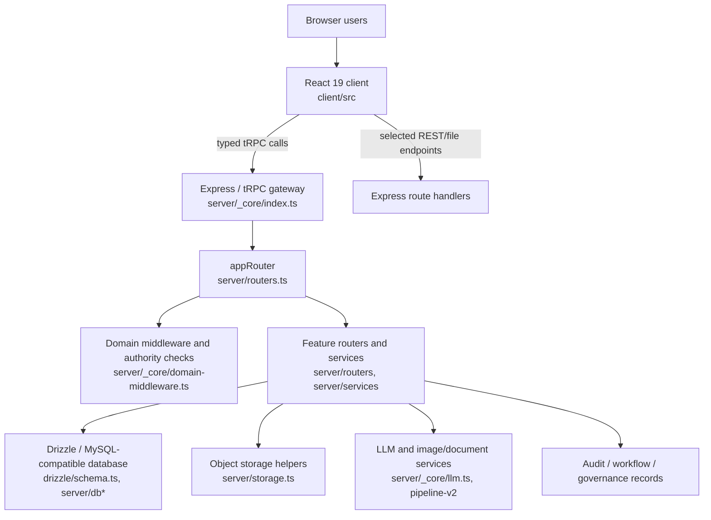

# KINGA Architecture

> **Verified architectural baseline:** current `main` at `f100e65a1f01d71f461e6bd42d6f15944af41eca`. This document identifies code boundaries, not an idealised target architecture.

## 1. Runtime topology

The entrypoint is `server/_core/index.ts`. It mounts the server runtime and tRPC transport; `server/routers.ts` composes the top-level `appRouter`. The frontend registers browser routes in `client/src/App.tsx` and normally calls procedures using `client/src/lib/trpc.ts`.

## 2. Architecture boundaries

| Boundary | Ownership | Key dependencies | Main consumers | Change rule |
|---|---|---|---|---|
| Client route and portal layer | Navigation, role-facing presentation, loading/empty/error states | Wouter, React Query/tRPC hooks, UI components | Browser users | Do not let a page become the source of authority or fabricate operational data. |
| Router / API layer | Input validation, session context, roles, tenant/object access, procedure orchestration | tRPC core, domain middleware, Zod, services | Client and permitted integrations | Tenant and object checks must precede data access or side effects. |
| Domain/service layer | Feature-specific implementation of claims, reports, fleets, engineering, governance and other domains | Drizzle helpers, resolvers, pipeline utilities | Routers and report generators | Avoid raw duplicate derivation when a canonical resolver exists. |
| Canonical report/resolution layer | Stable, tenant-scoped data contracts for report consumers | Claims, assessments, events, quote/document evidence | CL/CI/FR and report paths | Treat type/field changes as data-contract changes requiring consumer review. |
| Pipeline layer | Document/image ingestion, deterministic processing, AI-assisted analysis, evidence/provenance handling | LLM helper, parsing/image libraries, pipeline contracts | Claims analysis and reports | Preserve confidence, provenance, degradation and retry semantics. |
| Persistence | Schema, relational records, audit entries, tenant ownership | Drizzle/mysql2, migrations | All server domains | Schema/DDL changes require separate review and an environment plan. |

## 3. Cross-cutting architecture

### Authentication, authorisation and tenant isolation

Request context is built beneath `server/_core/`. The implementation exposes protected and role/domain-aware procedure patterns through `server/_core/trpc.ts` and `server/_core/domain-middleware.ts`. The tenant boundary must be enforced at the procedure and query level; tests in `server/engineer/inspectionAuthority.p0.test.ts`, `server/routers/notificationsTenantAuthority.p0.test.ts`, and router-specific suites are essential reference evidence.

### Data and reports

The relational schema is defined by `drizzle/schema.ts`. Router/service code accesses it through Drizzle helpers and some domain-specific SQL. Reporting modules live under `server/reporting/`, with report routers including `server/routers/reports.ts`, `server/routers/reporting.ts`, `server/routers/claim-reports-core.ts`, and `server/routers/executive.ts`. Canonical report record types are a control against disagreement across output tiers.

### AI and intelligence

AI access is server-side. `server/_core/llm.ts` is the built-in access boundary; `server/pipeline-v2/` contains staged processing; `server/routers/ai-analysis.ts`, `ai-assessments-core.ts`, and `ai-reanalysis.ts` expose related application paths. Image, PDF and evidence utilities are deliberately separated in parts of Stage 6; public compatibility exports remain at `server/pipeline-v2/stage-6-damage-analysis.ts`.

### Audit and observability

Audit and workflow evidence are represented in source through routers such as `server/routers/audit.ts`, `super-audit.ts`, `workflow-audit.ts`, and schema tables including `audit_logs`, `audit_trail`, `workflow_audit_trail`, and `report_access_audit`. Operational and platform routes include `operational-health.ts`, `pipeline-observability.ts`, `platform-observability.ts`, and `platform-operations.ts`. Do not represent a log as a security control without tracing the actual enforcement point.

## 4. Deployment and operations

The repository includes a root `Dockerfile`, `drizzle.config.ts`, `.github/workflows/cicd-pipeline.yml`, `deployment/kafka/docker-compose.yml`, `deployment/monitoring/docker-compose.yml`, and `deployment/mlflow/Dockerfile`. Their presence proves deployment/operations artefacts exist; it does **not** prove that Kafka, MLflow, Docker Compose monitoring, or every documented environment is deployed in production. See [KINGA_DEPLOYMENT_OPERATIONS.md](./KINGA_DEPLOYMENT_OPERATIONS.md) for the verified versus unverified split.

## 5. Architectural review triggers

Architectural review is required before changing session/user identity, any tenant-authority helper, database schema or migration, canonical resolver/report contracts, workflow transition rules, AI persistence semantics, forensic evidence interpretation, or a public barrel export. See [KINGA_ARCHITECTURAL_INVARIANTS.md](./KINGA_ARCHITECTURAL_INVARIANTS.md) and [KINGA_ENGINEERING_CHANGE_GUIDE.md](./KINGA_ENGINEERING_CHANGE_GUIDE.md).
