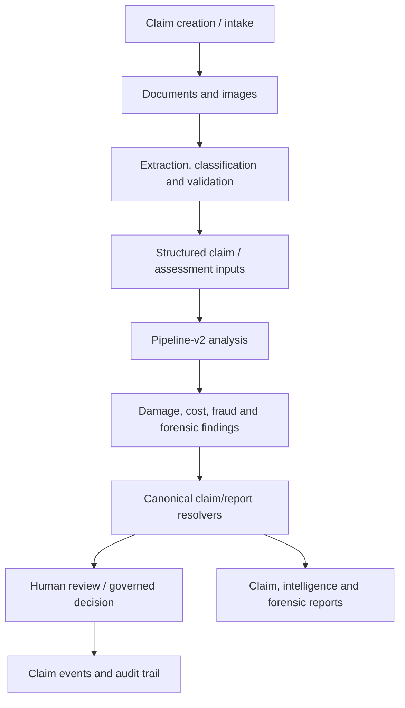

# KINGA Claims and Intelligence Pipeline Manual

## 1. Scope and source map

The current codebase implements claim-facing routes in `server/routers/claims-core.ts`, `claim-completion.ts`, `claim-replay.ts`, `document-ingestion.ts`, `ai-analysis.ts`, `ai-assessments-core.ts`, `ai-reanalysis.ts`, and the pipeline modules under `server/pipeline-v2/`. Claim-facing UI includes `client/src/pages/SubmitClaim.tsx`, claimant/insurer/claims-manager dashboards, document pages, review queues and report pages.

The implementation is modular rather than a guarantee of a single, universal path. A claim may enter with different evidence sets and may follow degraded or review-required paths. Do not add an assumption that every claim has photos, a PDF, a quote, an AI assessment, an assessor report, or a final approval.

## 2. Evidence-to-report flow

| Step | Verified code evidence | Output boundary | Engineering rule |
|---|---|---|---|
| Intake | `claims-core.ts`, `document-ingestion.ts`, `SubmitClaim.tsx` | Tenant-scoped claim/document records | Never infer authority from form fields alone. |
| Document/image handling | `server/pipeline-v2/`, ingestion routes, storage/PDF modules | Extraction/classification inputs and evidence metadata | Preserve source identity, failure status and provenance. |
| AI-assisted analysis | `ai-analysis.ts`, `ai-assessments-core.ts`, `ai-reanalysis.ts`, `server/_core/llm.ts` | Structured AI analysis and confidence/evidence fields | Advisory output is not an approval or settlement. |
| Damage analysis | `stage-6-damage-analysis.ts` compatibility barrel plus `.vision`, `.fallback`, `.merge`, `.stage` modules | Damage components, per-photo result/accounting and degradation information | Preserve canonical component names, eligibility and timeout/retry semantics. |
| Report resolution | `server/reporting/resolvedReportRecord.ts`, `resolvedPlatformReportCollection.ts`, `forensicReportModel.ts` | Tenant-scoped read models | Do not bypass canonical resolvers with independent raw fact derivation. |
| Review and decision | `review-queue.ts`, `decision.ts`, `approval.ts`, workflow routes | Authorised record/event/audit state | A recommendation requires a valid human/governed workflow transition to become a decision. |

## 3. Evidence, AI and decision boundaries

| Input or result | What it may establish | What it must not establish alone |
|---|---|---|
| Submitted document/photo | Existence of submitted evidence and its metadata | Truth of a repair value, liability conclusion or fraud conclusion |
| Extracted text/image classification | Machine-assisted structural interpretation | An approved claim decision |
| AI confidence or fraud signal | Need for review, explanation or further evidence | A deterministic finding of fraud or rejection |
| Cost/repair/physics calculation | A computed result under its input/assumption set | Authority to settle or override policy/workflow rules |
| Human review/approval record | An authorised decision in its configured scope | Cross-tenant or unassigned authority |

## 4. Failure and retry behaviour

Stage 6 source documents explicit image-call timeouts, retry logic, a success threshold, an input budget, fallbacks, per-photo results, and degradation semantics. A key compatibility path remains at `server/pipeline-v2/stage-6-damage-analysis.ts`; its specialised modules are implementation details that should retain the public exports `readDamageFromPhotos` and `runDamageAnalysisStage`.

Other pipeline retry, idempotency and queue semantics must be verified at the specific stage/worker being changed. The repository contains replay and historical claim facilities, but a complete production retry scheduler and exact worker topology are **[NOT VERIFIED IN CODEBASE]** from the current documentation baseline.

## 5. Tests and safe modifications

Relevant regression areas include `server/pipeline-v2/pipeline-fixes.test.ts`, `rinf-audit.test.ts`, `stage-6-r2-degraded.test.ts`, `stage-6-vision.test.ts`, report consistency suites under `server/reporting/`, and router-level claim/assessment tests. Add behaviour tests—not source-shape assertions—when changing a split module. For an AI or evidence change, include a no-fabrication/degraded-path assertion as well as the happy path.

See [KINGA_AI_ENGINEERING_MANUAL.md](./KINGA_AI_ENGINEERING_MANUAL.md), [KINGA_FORENSIC_ENGINE_MANUAL.md](./KINGA_FORENSIC_ENGINE_MANUAL.md), and [KINGA_WORKFLOWS.md](./KINGA_WORKFLOWS.md).
