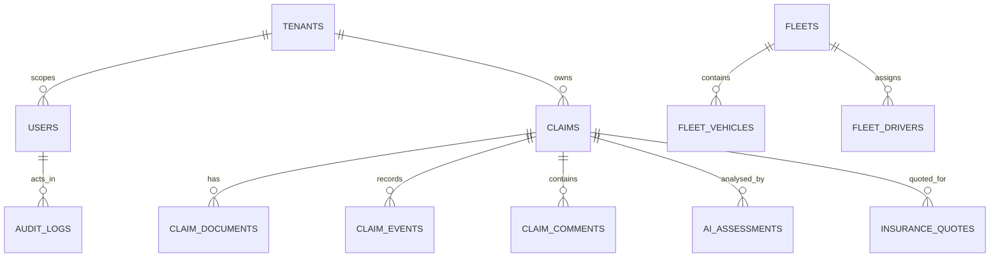

# KINGA Database Manual

## 1. Database implementation status

The application uses **Drizzle ORM** with the MySQL driver (`drizzle-orm`, `mysql2`) and a source schema in `drizzle/schema.ts`; `drizzle.config.ts` supplies migration tooling configuration. Environment and operational records identify a MySQL-compatible TiDB-oriented managed database pattern, but exact production account ownership, connection parameters, backup policy and environment separation are **[NOT VERIFIED IN CODEBASE]**. Never copy a real connection string into documentation, source control, issue comments or logs.

> **Schema caution:** `drizzle/schema.ts` is the source-model reference, not proof that the live database has the same tables or columns. `docs/SCHEMA_MIGRATION_DRIFT_AUDIT.md` and `docs/SCHEMA_MIGRATION_REMEDIATION_PLAN.md` are supporting evidence that reconciliation work exists. Treat live schema changes as an explicit review task.

## 2. Entity map

The diagram is a domain orientation map. Exact foreign keys, nullability, indexes, cascades and relation ownership must be read from the corresponding `mysqlTable` declaration before changing a query or migration.

## 3. Important table families

| Domain | Implemented source-schema entities (non-exhaustive) | Primary owners / readers |
|---|---|---|
| Identity and tenancy | `users`, `tenants`, `insurer_tenants`, `tenant_invitations`, `tenant_role_configs`, `tenant_workflow_configs`, `registration_requests`, `user_invitations` | Auth, tenant/admin and platform routers |
| Claim core | `claims`, `claim_documents`, `claim_events`, `claim_comments`, `claim_assignments`, `claim_review_queue`, `claim_routing_decisions`, `claim_intake_requests`, `claim_confidence_scores` | claims, document, workflow, reporting and review routers |
| Assessment and intelligence | `ai_assessments`, `claim_intelligence_dataset`, `assessor_reports`, `assessor_report_attachments`, `assessor_report_reviews`, `human_review_queue`, `fraud_alerts`, `fraud_indicators`, `fraud_rules` | assessment, pipeline, intelligence, forensic and reporting code |
| Insurance, cost and quotes | `insurance_policies`, `insurance_products`, `insurance_quotes`, `cost_components`, `service_quotes`, `service_requests`, `supplier_quotes`, `supplier_quote_line_items`, `quote_optimisation_results` | insurance, quote, panel-beater, report and decision flows |
| Vehicle and fleet | `vehicle_condition_assessment`, `vehicle_condition_snapshots`, `vehicle_history`, `vehicle_market_valuations`, `vehicle_mileage_logs`, `fleet_vehicles`, `fleets`, `fleet_drivers`, `fleet_documents`, `fleet_incident_reports`, `fleet_risk_scores` | vehicle/fleet and engineering features |
| Audit and governance | `audit_logs`, `audit_trail`, `workflow_audit_trail`, `report_access_audit`, `super_audit_sessions`, `governance_violation_log`, `governance_notifications`, `role_assignment_audit` | audit, workflow, governance and reporting paths |
| Operations and learning | `ingestion_batches`, `ingestion_documents`, `historical_claims`, `historical_replay_results`, `training_dataset`, `training_data_scores`, `training_records`, `model_training_queue`, `usage_events` | ingestion, replay, learning and operational tooling |
| Agency / marketplace | `agency_clients`, `agency_insurance_service_requests`, `agency_insurance_service_request_insurers`, `agency_insurance_valuation_deviations`, `marketplace_profiles`, `marketplace_transactions`, `insurer_marketplace_links`, `insurer_marketplace_relationships` | agency/broker and marketplace routers |

## 4. Tenant and deletion safety

The presence of a `tenant_id` column is not enough. A safe read must establish the authenticated tenant and include it (or a demonstrated equivalent ownership predicate) before data is obtained. A safe write must authorise the target object’s tenant before side effects. Do not introduce broad cleanup/delete predicates into tests; use captured IDs or a test-owned unique stamp and delete children before parents where actual foreign keys require it.

Cascade rules, database-enforced foreign keys, and production retention policy are **[NOT VERIFIED IN CODEBASE AS A COMPLETE LIVE-DB FACT]**. Read each declaration in `drizzle/schema.ts` and inspect the intended migration before modifying deletion semantics.

## 5. Migrations and local use

The package scripts expose `pnpm db:push`, and the configuration is in `drizzle.config.ts`. That script must not be interpreted as permission to alter production. Engineers must first review the generated migration SQL, confirm staging/non-production scope, run suitable tests, and use an approved migration process. See [KINGA_LOCAL_DEVELOPMENT.md](./KINGA_LOCAL_DEVELOPMENT.md) and [KINGA_ENGINEERING_CHANGE_GUIDE.md](./KINGA_ENGINEERING_CHANGE_GUIDE.md).
