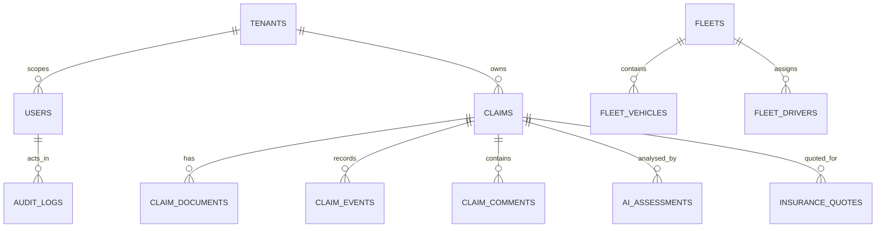

# KINGA Database Manual

## 1. Database implementation status

The application uses **Drizzle ORM** with the MySQL driver (`drizzle-orm`, `mysql2`) and a source schema in `drizzle/schema.ts`; `drizzle.config.ts` supplies migration tooling configuration. Environment and operational records identify a MySQL-compatible TiDB-oriented managed database pattern, but exact production account ownership, connection parameters, backup policy and environment separation are **[NOT VERIFIED IN CODEBASE]**. Never copy a real connection string into documentation, source control, issue comments or logs.

> **Schema caution:** `drizzle/schema.ts` is the source-model reference, not proof that the live database has the same tables or columns. `docs/SCHEMA_MIGRATION_DRIFT_AUDIT.md` and `docs/SCHEMA_MIGRATION_REMEDIATION_PLAN.md` are supporting evidence that reconciliation work exists. Treat live schema changes as an explicit review task.

## 2. Entity map

The diagram is a domain orientation map. Exact foreign keys, nullability, indexes, cascades and relation ownership must be read from the corresponding `mysqlTable` declaration before changing a query or migration.

## 3. Important table families

| Domain | Implemented source-schema entities (non-exhaustive) | Primary owners / readers |
|---|---|---|
| Identity and tenancy | `users`, `tenants`, `insurer_tenants`, `tenant_invitations`, `tenant_role_configs`, `tenant_workflow_configs`, `registration_requests`, `user_invitations` | Auth, tenant/admin and platform routers |
| Claim core | `claims`, `claim_documents`, `claim_events`, `claim_comments`, `claim_assignments`, `claim_review_queue`, `claim_routing_decisions`, `claim_intake_requests`, `claim_confidence_scores` | claims, document, workflow, reporting and review routers |
| Assessment and intelligence | `ai_assessments`, `claim_intelligence_dataset`, `assessor_reports`, `assessor_report_attachments`, `assessor_report_reviews`, `human_review_queue`, `fraud_alerts`, `fraud_indicators`, `fraud_rules` | assessment, pipeline, intelligence, forensic and reporting code |
| Insurance, cost and quotes | `insurance_policies`, `insurance_products`, `insurance_quotes`, `cost_components`, `service_quotes`, `service_requests`, `supplier_quotes`, `supplier_quote_line_items`, `quote_optimisation_results` | insurance, quote, panel-beater, report and decision flows |
| Vehicle and fleet | `vehicle_condition_assessment`, `vehicle_condition_snapshots`, `vehicle_history`, `vehicle_market_valuations`, `vehicle_mileage_logs`, `fleet_vehicles`, `fleets`, `fleet_drivers`, `fleet_documents`, `fleet_incident_reports`, `fleet_risk_scores` | vehicle/fleet and engineering features |
| Audit and governance | `audit_logs`, `audit_trail`, `workflow_audit_trail`, `report_access_audit`, `super_audit_sessions`, `governance_violation_log`, `governance_notifications`, `role_assignment_audit` | audit, workflow, governance and reporting paths |
| Operations and learning | `ingestion_batches`, `ingestion_documents`, `historical_claims`, `historical_replay_results`, `training_dataset`, `training_data_scores`, `training_records`, `model_training_queue`, `usage_events` | ingestion, replay, learning and operational tooling |
| Agency / marketplace | `agency_clients`, `agency_insurance_service_requests`, `agency_insurance_service_request_insurers`, `agency_insurance_valuation_deviations`, `marketplace_profiles`, `marketplace_transactions`, `insurer_marketplace_links`, `insurer_marketplace_relationships` | agency/broker and marketplace routers |

## 3.1 Core table field ledger

| Table | Key fields and relationships confirmed in source schema | Primary readers/writers | Safety and lifecycle notes |
|---|---|---|---|
| `claims` | `id`, `claim_number`, `kinga_ref`, `tenant_id`, claimant/vehicle/policy/incident fields, `status`, `workflow_state`, assignment IDs, assessment timestamps, risk/financial values, workflow approval/rejection fields, `pipeline_run_uuid`, recovery counter and timestamps. Indexes include `(tenant_id, status)` and `(tenant_id, workflow_state, created_at)`. | claims, workflow, decisions, reports, pipeline, quote/insurance/fleet paths | `tenant_id` must constrain tenant-owned claim access. A claim carries sensitive identity/vehicle/policy content. `claimant_stated_speed_kmh` and mutable `estimated_speed_kmh` are expressly distinct in source comments and must never be conflated. |
| `users` | `id`, unique-indexed `open_id`, identity/contact fields, `role`, `insurer_role`, `organization_id`, `tenant_id`, active/deactivated lifecycle, roles/tier/assessment metrics and restricted claimant/QA flags. | request context/auth and tenant/admin/portal paths | `is_active`, `email_verified`, `is_qa_account` and `is_unregistered_claimant` have different meanings. A missing/deactivated user must not be silently treated as a normal active tenant user. |
| `tenants` | `id`, name/display name, tier/status, contact/billing info, configuration, workflow configuration, escalation, AI rerun limit, currency/country, KINGA sequence/year, synthetic-tenant flag. | tenant/admin/configuration/platform paths | `is_synthetic_tenant` is explicitly intended to exclude QA/synthetic tenants from real analytics/dashboards/reporting. Treat tenant settings as privileged configuration. |
| `tenant_role_configs` | `tenant_id`, insurer role key, enabled/display/permissions, created/updated timestamps. | tenant role/portal configuration | Changing enabled roles affects access surfaces; router-level enforcement still controls authorisation. |
| `tenant_workflow_configs` | `tenant_id`, approval thresholds, fraud threshold, internal-assessment requirement, timestamps. | tenant/workflow/approval paths | Monetary/fraud threshold changes are policy/business changes and require explicit approval. |
| `claim_events` | Declared as a claim-core event entity. | workflow/report/audit history paths | Event completeness for every lifecycle transition must be proven from emitters; do not label it a complete history by assumption. |
| `claim_documents` / ingestion tables | Claim/document/batch records supporting submitted and processed material. | document ingestion, pipeline, reporting | Authorise the parent claim/tenant before reading a document or storage URL. |
| `ai_assessments` | `claim_id` references `claims.id` with cascade delete/update; includes cost/damage/fraud/recommendation fields, `tenant_id`, reanalysis lineage (`is_reanalysis`, `previous_assessment_id`, `version_number`), pipeline health/photograph fields, structured decision/report fields, confidence/provenance/degradation fields, and canonical truth/physics JSON. | AI assessment, pipeline, reporting | Latest-record selection, source fields and tenant parent scope must be explicit in the resolver being changed. JSON field presence must not be mistaken for a human-approved decision. |
| Quote/line-item tables | `insurance_quotes`, `service_quotes`, `supplier_quotes`, `supplier_quote_line_items`, quote optimisation results. | quotes, panel-beater, reports/decision paths | Quote input, chosen/approved value and AI-extracted interpretation must remain distinct. |
| Audit/workflow tables | `audit_logs`, `audit_trail`, `workflow_audit_trail`, `report_access_audit`, `final_approval_records`. | audit/workflow/report access paths | These are sensitive and can be tenant/platform scoped; audit records do not themselves grant access. |
| Fleet/vehicle tables | fleets, fleet vehicles/drivers/documents/incidents/risk; vehicle condition/history/market valuation/mileage. | fleet/vehicle/engineering paths | Establish fleet/vehicle/claim tenant relationship before traversal. |

## 3.2 Claim state and processing fields

The source `claims.status` enumeration covers submitted/triage/assessment/quote/comparison/repair/completed/rejected lifecycle states and document reliability states including `document_validating`, `document_ready`, `analysis_running`, `analysis_complete`, `document_failed`, `recovery_attempted`, and `human_review_required`. Its source comment says a failed document must never reach `analysis_complete`. `workflow_state` is separate and includes values such as `created`, `intake_queue`, `under_assessment`, `internal_review`, `technical_approval`, `financial_decision`, `payment_authorized`, `closed`, `disputed`, and manual/AI assessment states.

These enums are a schema fact, not evidence that every state is reachable, consistently emitted or appropriate for every tenant. Changes require workflow, report, UI and audit consumer review.

## 3.3 AI assessment field and versioning ledger

`ai_assessments` is a high-fan-out contract. Its `claim_id` is a foreign key to the parent claim with cascade rules declared in the source schema. It includes `tenant_id`, `created_at`, `updated_at`, `model_version`, `version_number`, `is_reanalysis`, `previous_assessment_id`, `triggered_by`, `triggered_role`, and `reanalysis_reason`. A resolver selecting an assessment for a claim must explicitly determine the latest/appropriate row; it must not rely on a table scan returning an accidental row order.

| Field group | Confirmed fields | Consumer safety rule |
|---|---|---|
| Damage/cost/fraud | `estimated_cost`, damage description/type fields, confidence, fraud fields/score/breakdown, vehicle value, repair/value ratio, parts/labour cost, `recommendation` | A stored recommendation/fraud signal is analytical input, not a human approval. Preserve currency and unit semantics. |
| Pipeline output | hidden damage, repair intelligence, parts reconciliation, cost intelligence, enriched photographs, image success/failure counts/rate, run summary, unresolved parts, inconsistencies | Missing, failed or degraded processing must stay visible; do not replace it with a default successful result. |
| Evidence/provenance | evidence bundle, forensic execution ledger, assumption registry, FCDI score, IFE result, image/photo classification and evidence registry fields | Evidence source, assumptions, failures and confidence must travel with a conclusion where the consumer needs them. |
| Truth/physics | `claim_truth_json`, `claim_truth_object_json`, `physics_truth_json`, causal/consistency/coherence/realism/benchmark/consensus data | Downstream reports, APIs and dashboards should use the canonical truth/physics source selected by the owning resolver rather than legacy independent derivation. |
| Decision/report readiness | decision authority, contradiction gate, report readiness, explanation, route/trace, report signals, human override fields | AI/engine data and a human override are separate facts. Preserve actor/time/reason/audit semantics. |

## 4. Tenant and deletion safety

The presence of a `tenant_id` column is not enough. A safe read must establish the authenticated tenant and include it (or a demonstrated equivalent ownership predicate) before data is obtained. A safe write must authorise the target object’s tenant before side effects. Do not introduce broad cleanup/delete predicates into tests; use captured IDs or a test-owned unique stamp and delete children before parents where actual foreign keys require it.

Cascade rules, database-enforced foreign keys, and production retention policy are **[NOT VERIFIED IN CODEBASE AS A COMPLETE LIVE-DB FACT]**. Read each declaration in `drizzle/schema.ts` and inspect the intended migration before modifying deletion semantics.

## 5. Migrations and local use

The package scripts expose `pnpm db:push`, and the configuration is in `drizzle.config.ts`. That script must not be interpreted as permission to alter production. Engineers must first review the generated migration SQL, confirm staging/non-production scope, run suitable tests, and use an approved migration process. See [KINGA_LOCAL_DEVELOPMENT.md](./KINGA_LOCAL_DEVELOPMENT.md) and [KINGA_ENGINEERING_CHANGE_GUIDE.md](./KINGA_ENGINEERING_CHANGE_GUIDE.md).
