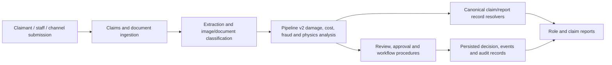

# KINGA System Overview

> **Documentation status:** This guide is an implementation-oriented onboarding manual. It was started from repository commit `f100e65a1f01d71f461e6bd42d6f15944af41eca`. Source code is the primary authority; existing design and audit documents are supporting evidence only. A statement marked **[NOT VERIFIED IN CODEBASE]** must not be treated as implemented behaviour.

## 1. What KINGA is

KINGA is a multi-tenant motor-claims platform. Its implemented source tree combines claim intake, document handling, vehicle and fleet records, damage and cost intelligence, fraud and forensic analysis, human review, reports, administration, and operational dashboards. The browser client is in `client/src`; the Express/tRPC application is registered from `server/_core/index.ts` and `server/routers.ts`; the MySQL/TiDB-oriented Drizzle schema is in `drizzle/schema.ts`.

KINGA is not a single automated decision engine. Its code deliberately contains both deterministic business calculations and AI-assisted analysis. New engineers must preserve the difference between an observed document or image, an AI interpretation, a derived recommendation, and an authorised human decision.

| Concept | Meaning in KINGA | Primary implementation evidence | Authority level |
|---|---|---|---|
| Persisted fact | A saved record such as a claim, document, quotation, event, or assessment. | `drizzle/schema.ts`; relevant routers under `server/routers/` | Authoritative only within its tenant and lifecycle rules |
| Evidence | Submitted or extracted material used to support analysis. | `claim_documents`, `ingestion_documents`, `extracted_document_data`, image/pipeline modules | Supports a decision; does not itself decide it |
| Deterministic result | A value calculated from explicit rules and stored inputs. | `server/pipeline-v2/`, `server/reporting/`, shared utilities | Authoritative only where the owning workflow makes it so |
| AI finding | Structured model output or an AI-assisted classification/inference. | `server/_core/llm.ts`, `server/pipeline-v2/`, `server/routers/ai-*.ts` | Advisory unless an authorised workflow explicitly records a decision |
| Recommendation | A system-proposed action or review signal. | `server/routers/decision.ts`, `server/routers/approval.ts`, reporting modules | Never silently equate with approval |
| Decision / approval | A human or governed workflow action changing an authoritative record. | `server/routers/approval.ts`, `server/routers/decision.ts`, `server/routers/workflow*.ts`, audit tables | Requires role, tenant, object, and transition authority |

## 2. Major implemented product areas

| Area | What the code implements | Frontend entry points | Backend / data entry points |
|---|---|---|---|
| Claims and claim intake | Claim creation, documents, comments, review queues, lifecycle, replay and completion paths. | `client/src/pages/SubmitClaim.tsx`, `ClaimantDashboard.tsx`, `ClaimsManagerDashboard.tsx`, `ReviewQueue.tsx` | `server/routers/claims-core.ts`, `document-ingestion.ts`, `claim-completion.ts`, `claim-replay.ts`; `claims`, `claim_documents`, `claim_events` |
| Insurance and policy | Insurer views, policies, quotes, triage and related tenant operations. | `InsuranceDashboard.tsx`, `InsurerDashboard.tsx`, `PolicyManagementDashboard.tsx` | `insurance-core.ts`, `policy-management.ts`, `quotes-core.ts`; `insurance_policies`, `insurance_quotes`, `insurance_carriers` |
| Vehicle and fleet | Vehicle registry/passport/history, fleet accounts, drivers, RFQs, maintenance and risk views. | `VehicleRegistry.tsx`, `FleetManagement.tsx`, `FleetManagerDashboard.tsx` | `vehicle-*.ts`, `fleet-*.ts`, `driver-registry.ts`; `fleet_vehicles`, `fleets`, `fleet_drivers`, vehicle history tables |
| Assessment and engineering | Assessor workflows, inspections, assignments, engineering intelligence, report review. | `InternalAssessorDashboard.tsx`, `EngineerDashboard.tsx`, `EngineerInspectionList.tsx` | `assessors-core.ts`, `inspections.ts`, `assessor-onboarding.ts`, `engineeringIntelligence` router |
| Reporting and intelligence | Claim reports, executive/role reports, fraud, anomaly, portfolio, forensic and operational analysis. | `ReportsCentre.tsx`, `InteractiveReport.tsx`, `ExecutiveDashboard.tsx`, `RiskManagerDashboard.tsx` | `server/reporting/`, `reports.ts`, `reporting.ts`, `executive.ts`, `analytics.ts` |
| Administration and governance | Tenant, user, platform, workflow, audit, observability, marketplace, subscription and governance interfaces. | `client/src/pages/admin/`, `PlatformOperationsCentre.tsx`, `OperationalHealthDashboard.tsx` | `admin.ts`, `tenant.ts`, `platform*.ts`, `governance*.ts`, `monetization.ts` |

## 3. User and tenant model

The repository contains role-aware portals for claimants/clients, insurer and claims personnel, assessors, engineers, fleet users, agencies/brokers, panel beaters, tenant administrators, and platform administrators. Exact role strings and permitted procedures are defined in code, particularly `drizzle/schema.ts`, `server/_core/domain-middleware.ts`, `server/routers/auth-core.ts`, and each router. A page existing in `client/src/pages/` is not proof that every named role may access it; access must be traced through the relevant procedure.

Tenant context is a security boundary, not presentation metadata. The expected pattern is an authenticated session-derived tenant, an early refusal if a tenant-scoped call has none, and a tenant predicate before reading or changing a tenant-owned object. The reference implementation and regressions include `server/routers/inspections.ts`, `server/engineer/inspectionAuthority.p0.test.ts`, and `server/routers/notificationsTenantAuthority.p0.test.ts`.

## 4. Claim and intelligence workflow at a glance

The following describes code families rather than asserting every claim takes every branch.

The code has document and photo processing modules, pipeline stages, AI assessment routers, review/approval routers, and reporting generators. It does **not** establish that every workflow is fully automated, that every incoming channel is live, or that a generated recommendation is a settlement decision. In particular, payment processing should be treated as **[NOT VERIFIED IN CODEBASE AS AN OPERATING PAYMENT SERVICE]** unless a specific provider integration and workflow are verified for the environment being deployed.

## 5. Non-negotiable engineering distinctions

1. **AI is not a decision maker.** Pipeline and LLM output may be persisted as analysis, confidence, evidence, or recommendations; approval/workflow code controls authoritative outcomes.
2. **Reports must use canonical data contracts.** `resolveClaimRecord()`, `resolveReportRecord()`, `resolveForensicReportModel()`, and normalisation helpers exist to prevent separate reports deriving inconsistent facts. Direct re-derivation of claims or `ai_assessments` data is a review concern.
3. **Tenant authority is derived, not accepted from the client.** Caller-supplied tenant values must not substitute for the authenticated session.
4. **No fabricated evidence or “normal” empty states.** A missing/unavailable data state must stay distinguishable from successful zero data; see the dashboard and reporting tests/implementations.
5. **A workflow transition is not a UI label.** Changes to a status, assignment, approval, or report access require router-side checks and appropriate audit/event handling.

## 6. Read next

Start with [KINGA_ARCHITECTURE.md](./KINGA_ARCHITECTURE.md), then [KINGA_CODEBASE_GUIDE.md](./KINGA_CODEBASE_GUIDE.md), [KINGA_SECURITY_MANUAL.md](./KINGA_SECURITY_MANUAL.md), and [KINGA_ENGINEER_ONBOARDING.md](./KINGA_ENGINEER_ONBOARDING.md). For limitations and items requiring a human decision, use [KINGA_KNOWN_LIMITATIONS.md](./KINGA_KNOWN_LIMITATIONS.md) rather than assuming a product label represents completed capability.
