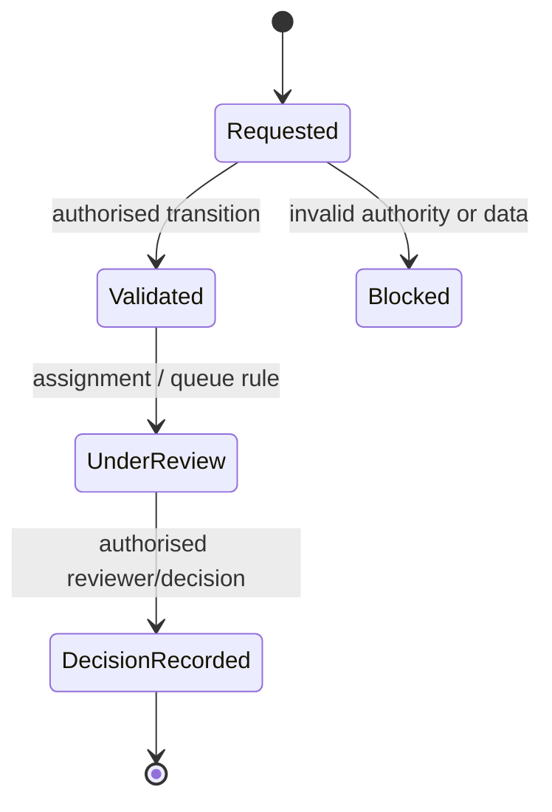

# KINGA Workflows and State-Machine Manual

## 1. Workflow implementation map

Core workflow code is in `server/workflow-engine.ts`, `server/workflow.ts`, `server/workflow-validator.ts`, `server/workflow-middleware.ts`, `server/workflow-notifications.ts`, `server/workflow-simulation.ts`, and supporting router files `server/routers/workflow.ts`, `workflow-queries.ts`, `workflow-audit.ts`, `workflow-analytics.ts`, `approval.ts`, `decision.ts`, `review-queue.ts`, and `claim-completion.ts`.

The schema includes workflow/audit entities such as `workflow_audit_trail`, `workflow_configuration`, `workflow_states`, `claim_events`, `claim_assignments`, and `final_approval_records`. Read the exact implementation before claiming a particular state exists or a transition is globally allowed.

## 2. Workflow control pattern

This diagram is a generic control pattern. Actual state names and configured transitions are data/code-specific and must be verified through `workflow-engine.ts`, validator rules, configuration entities and the relevant feature router.

## 3. Required transition evidence

| Requirement | What to inspect |
|---|---|
| Current state | Canonical record / workflow helper and persisted status field |
| Actor authority | Session role, tenant, assignment/ownership and domain middleware |
| Permitted transition | Workflow validator/engine/configuration rule |
| Write set | Claim/related records plus any final-approval/review record |
| Audit/event effect | `claim_events`, workflow audit helper/table and notification path |
| Reversibility | Explicit compensation/recovery code; never assume a UI “undo” is authoritative |

## 4. Important workflow families

- **Claims:** creation, document/intake, routing, assessment/review, decision/completion and replay-related activity.
- **Inspections/engineering:** professional profile, assignment/project/inspection action with tenant/assignment authority.
- **Assessor reports:** onboarding, submission, attachments, attestation/review and accepted-version projection.
- **Quotes and panel-beater work:** quotation, comparison and optimisation routes; verify authoritative quote status before displaying a cost conclusion.
- **Administration:** tenant/user/role/configuration operations and audit/observability paths.
- **Subscriptions/monetisation:** router and schema artefacts exist; complete commercial lifecycle and production billing operation are **[NOT VERIFIED IN CODEBASE]** without an implementation trace.

## 5. Workflow safety rules

No workflow may create tenant context from the request payload. No transition may bypass an assignment/role rule simply because a client page exposes a button. Notifications and audit writes should occur only after target authority has been established. Tests including `workflow-engine.test.ts`, `workflow-validator.test.ts`, `workflow-integration.test.ts`, `workflow-queries-rbac.test.ts`, and tenant-authority workflow suites are key regression evidence.
