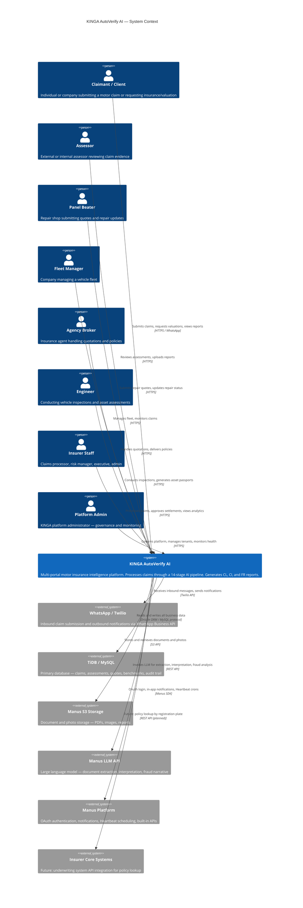

# KINGA System Context Diagram

**Author:** Tavonga Shoko, Lead Engineer

This diagram shows KINGA in relation to all external actors and systems.

## Key Observations

KINGA is the central hub for all motor insurance intelligence. It does not own the underwriting system — it processes claims and generates intelligence that informs decisions made by insurer staff. The LLM is used as an advisory tool only; all decisions require human approval.

The WhatsApp channel is the primary intake channel for claimants in the Zimbabwean market, where smartphone penetration is high but web browser usage for insurance is low.
