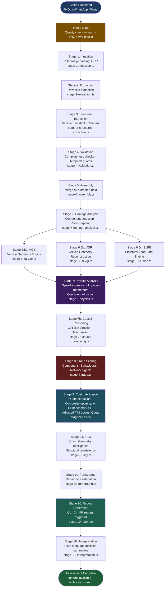

# KINGA 14-Stage AI Pipeline Flow

**Author:** Tavonga Shoko, Lead Engineer

This diagram shows the complete flow of a claim through the KINGA AI pipeline, from document ingestion to report generation.

## Key Design Principles

**Resume support:** If the pipeline is interrupted at any stage, `loadCompletedStages()` allows it to skip already-completed stages on restart. Each stage writes its output to the DB before the next stage begins.

**Gate policy:** The intake gate checks quality conditions (photo count, document completeness, description length) but **never blocks** the pipeline. It warns, logs to the notification centre, and allows the pipeline to proceed.

**Concurrency:** A semaphore (`MAX_CONCURRENT_PIPELINES = 1`) prevents multiple pipelines from running simultaneously on the same server instance. Concurrent claims are queued.

**Benchmark learning:** After Stage 9 (Cost), selected prices are written back to `component_repair_outcomes`. This grows the benchmark database with every claim processed, making future cost optimisation more accurate.

## Stage Output Storage

Each stage writes its output to `ai_assessments` as a JSON column:

| Stage | Column in ai_assessments |
|---|---|
| 1–3 | `ingestion_json`, `extraction_json`, `structured_json` |
| 4–5 | `validation_json`, `assembly_json` |
| 6 | `damage_analysis_json`, `enriched_photos_json` |
| 7 | `physics_analysis_json`, `cross_validation_json` |
| 8 | `fraud_analysis_json` |
| 9 | `cost_intelligence_json` |
| 9.5 | `cgi_analysis_json` |
| 10i | `interpretation_json` |
