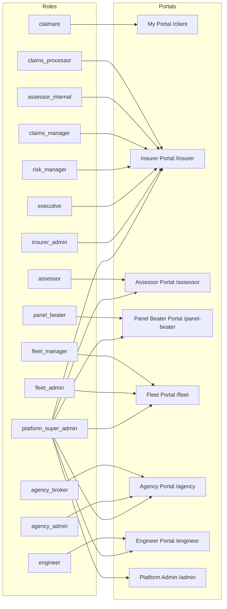
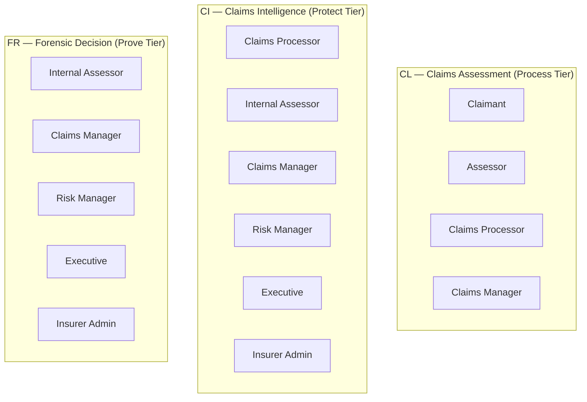

# KINGA Portal Access Matrix

**Author:** Tavonga Shoko, Lead Engineer

This diagram shows which roles can access which portals and key features.

## Role → Portal Mapping

## Feature Access by Role

| Feature | claimant | claims_processor | assessor_internal | claims_manager | risk_manager | executive | insurer_admin | assessor | panel_beater | fleet_manager | engineer | platform_super_admin |
|---|:---:|:---:|:---:|:---:|:---:|:---:|:---:|:---:|:---:|:---:|:---:|:---:|
| Submit claim | ✅ | ✅ | — | — | — | — | — | — | — | — | — | ✅ |
| View own claims | ✅ | ✅ | — | — | — | — | — | — | — | — | — | ✅ |
| View all claims (tenant) | — | ✅ | ✅ | ✅ | ✅ | ✅ | ✅ | — | — | — | — | ✅ |
| Trigger AI assessment | — | ✅ | — | — | — | — | — | — | — | — | — | ✅ |
| View CL report | ✅ | ✅ | ✅ | ✅ | — | — | — | ✅ | — | — | — | ✅ |
| View CI report | — | ✅ | ✅ | ✅ | ✅ | ✅ | ✅ | — | — | — | — | ✅ |
| View FR report | — | — | ✅ | ✅ | ✅ | ✅ | ✅ | — | — | — | — | ✅ |
| Approve settlement | — | — | — | ✅ | — | — | — | — | — | — | — | ✅ |
| Submit repair quote | — | — | — | — | — | — | — | — | ✅ | — | — | ✅ |
| Assign assessor | — | ✅ | — | ✅ | — | — | — | — | — | — | — | ✅ |
| View executive dashboard | — | — | — | — | ✅ | ✅ | — | — | — | — | — | ✅ |
| Manage fleet | — | — | — | — | — | — | — | — | — | ✅ | — | ✅ |
| Conduct inspections | — | — | — | — | — | — | — | — | — | — | ✅ | ✅ |
| Manage tenants | — | — | — | — | — | — | — | — | — | — | — | ✅ |
| View all portals | — | — | — | — | — | — | — | — | — | — | — | ✅ |

## Report Access Tiers

## My Portal — All Roles Can Access

Every authenticated user, regardless of their primary role, can access My Portal (`/client`). This allows a fleet manager to also be a claimant, an agent to also submit personal claims, and so on. The My Portal tabs shown depend on the user's data:

- **Home** — always shown
- **My Vehicles** — shown if user has personal vehicles
- **Valuations** — shown if user has valuation requests
- **Insurance** — shown if user has insurance requests or policies
- **Claims** — shown if user has submitted claims
- **Company** — shown if user is linked to a fleet account (fleet manager view of company vehicle claims)
