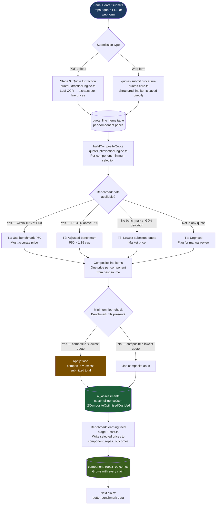

# KINGA Cost Intelligence Flow

**Author:** Tavonga Shoko, Lead Engineer

This diagram traces the complete path from a submitted repair quote PDF to the KINGA Optimised cost figure stored in the database.

## Critical Field Names

| Field | Location | Description |
|---|---|---|
| `l2CompositeOptimisedCostUsd` | `costIntelligenceJson.compositeOptimisation` | **KINGA Optimised total** — the canonical optimised cost |
| `documentedAgreedCostUsd` | `costIntelligenceJson` | Lowest submitted quote total — recommended settlement reference |
| `documentedOriginalQuoteUsd` | `costIntelligenceJson` | Highest submitted quote total |
| `compositeLineItems` | `costIntelligenceJson.compositeOptimisation` | Per-component selected prices with source (T1/T2/T3) |

> **Common mistake:** Do not read `compositeOptimisedCostUsd` — this field does not exist in DB data. Always use `l2CompositeOptimisedCostUsd`.

## Pricing Tier Summary

| Tier | Condition | Source | Accuracy |
|---|---|---|---|
| T1 | Benchmark exists, submitted within 15% of P50 | Benchmark P50 | Highest |
| T2 | Benchmark exists, submitted 15–30% above P50 | P50 × 1.15 cap | High |
| T3 | No benchmark, or deviation >30% | Lowest submitted price | Market |
| T4 | Component not in any quote | Unpriced | Requires manual review |

## What Feeds the Benchmark

Every T1, T2, and T3 selection is written back to `component_repair_outcomes` after Stage 9 completes. This means:
- Every claim processed makes future cost optimisation more accurate
- The benchmark grows automatically — no manual data entry required
- Paint, sundries, and labour are included (fixed Aug 2026 — previously excluded)
