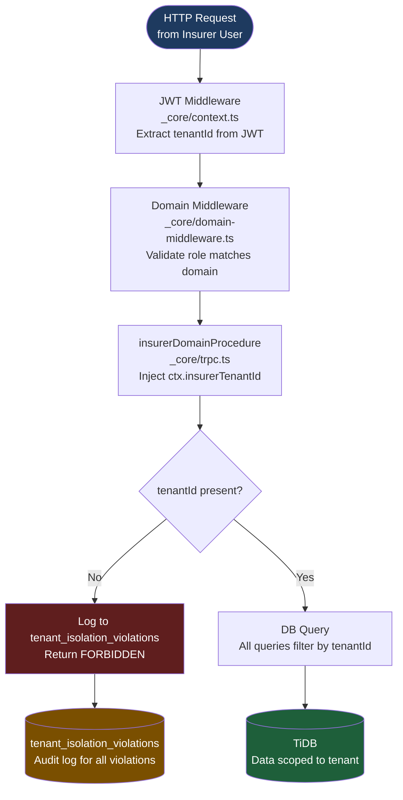

# KINGA Tenant Isolation Architecture

**Author:** Tavonga Shoko, Lead Engineer

This diagram shows how tenant isolation is enforced at every layer of the KINGA platform.

## Three Layers of Enforcement

**Layer 1 — JWT Middleware:** Every request to `/api/trpc` builds context via `_core/context.ts`. The JWT cookie is verified and the user's `tenantId` is extracted and injected into `ctx.user.tenantId`.

**Layer 2 — Domain Procedure:** `insurerDomainProcedure` (defined in `_core/trpc.ts`) validates that the user's role matches the insurer domain and injects `ctx.insurerTenantId`. This is the canonical tenant identifier for all insurer-scoped procedures. Never use `ctx.user.tenantId` directly in insurer procedures.

**Layer 3 — DB Query:** Every DB query for insurer data must filter by `tenantId`. The `getClaimById(id, tenantId)` pattern is the standard — passing `tenantId` as the second argument ensures the query is scoped to the correct tenant.

## Violation Monitoring

All tenant isolation violations are logged to `tenant_isolation_violations` with:
- Caller identity (userId, openId)
- Procedure name
- Attempted tenantId
- Timestamp
- IP address

The Platform Admin portal displays violation counts and patterns. A spike in violations is a security event.

## Known Violation Patterns (Aug 2026)

| Procedure | Violations | Root Cause | Status |
|---|---|---|---|
| `workflowQueries.getClaimsByState` | 299 (Mar–Aug 2026) | Misconfigured internal job calling without tenant context | Under investigation |
| `claimsManager.*` | 88 (Jun 2026) | Single session or automated test | Confirmed benign |
| Analytics test artifacts | 2 (Aug 2026) | Batch 2 test run | Resolved |
