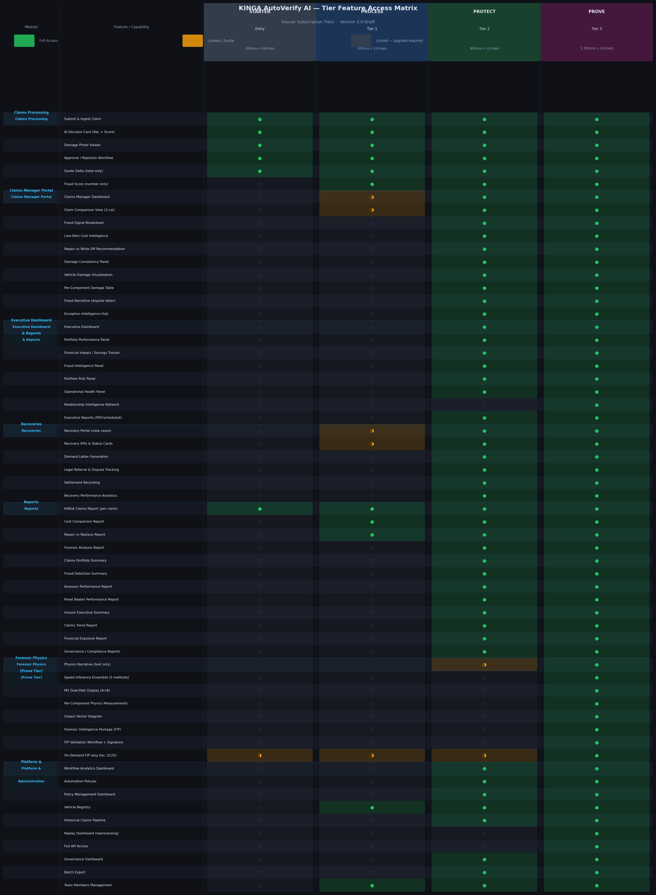

# KINGA AutoVerify AI — Platform Architecture & Monetisation Strategy

**Version:** 3.0  
**Classification:** Internal Strategic Document  
**Date:** June 2026  
**Supersedes:** Version 2.0 (April 2026)

---

## Executive Summary

KINGA AutoVerify AI is a multi-sided claims intelligence platform built on a single forensic physics engine. Every claim processed by the system — regardless of which subscription tier the insurer occupies — runs the identical nine-stage pipeline. What changes between tiers is not the quality or depth of analysis, but the **decision authority** the tier confers, the **financial impact** it enables, and the **operational surface area** it unlocks.

This version introduces three structural improvements over Version 2.0. First, the Claims Manager Portal has been repositioned as a universally accessible feature with a deliberate capability gradient: all tiers can access the portal, but the depth of intelligence visible within it scales with the subscription. This resolves the commercial tension between making the portal feel essential at every tier while preserving meaningful upgrade incentives. Second, the Recoveries module has been restructured on the same principle: all tiers can see and track recovery cases, but the ability to act on them — generating demand letters, managing legal referrals, recording settlements — is gated at Protect and above. Third, the Protect and Prove tiers have been differentiated with greater precision, resolving the overlap that made it difficult to articulate a clear commercial case for each. The distinction is now grounded in a single, defensible principle: **Protect is the tier for financial decisions; Prove is the tier for legal proceedings.**

The central commercial principle remains unchanged: KINGA does not sell computation. It sells **progressive certainty** — the right to act with increasing confidence and decreasing legal exposure at each successive tier.

---

## 1. The Engine Architecture: One Pipeline, Multiple Products

### 1.1 The Core Principle

Every claim processed through KINGA runs the identical nine-stage pipeline. Stage 0 ingests and validates documents. Stage 1 classifies the incident. Stage 2 extracts vehicle and policy data. Stage 3 analyses damage images using computer vision. Stage 4 performs cost estimation and quote reconciliation. Stage 5 runs behavioural and document fraud analysis. Stage 6 performs per-component damage analysis with absolute numeric physics measurements — crush depth in metres, deformation energy in Joules, structural displacement in metres, and vision confidence as a percentage. Stage 7 runs the forensic physics engine, including the five-method speed inference ensemble with M5 dual-path cross-validation. Stage 8 synthesises all signals into a fraud composite score, decision recommendation, and confidence level. Stage 9 assembles the output into the Forensic Intelligence Package.

The pipeline is engineered to never halt. Every stage has a defined fallback path. If Stage 7 produces a low-confidence result, Stage 8 weights the physics signal accordingly and flags the claim for human review rather than producing a corrupted fraud score.

### 1.2 The Risk Transfer Principle

KINGA does not produce legal determinations. It produces **Forensic Intelligence Packages** — structured datasets containing physics reconstructions, ensemble results, signal breakdowns, and confidence levels — which the insurer's designated reviewer validates, signs, and incorporates into their own determination. The insurer owns the conclusion. KINGA provides the computation. This distinction is the structural protection that prevents KINGA from being called as an expert witness, cross-examined on its methodology, or held liable for a claim rejection that is subsequently overturned.

Every tier's terms of service make this explicit. At onboarding, and at the point of generating any Tier 3 output, the insurer acknowledges that KINGA's output constitutes decision-support intelligence, not a legal determination, and that the insurer retains full responsibility for any decision made on the basis of that intelligence.

### 1.3 The Progressive Certainty Model

| Tier | What the insurer knows | What they can do | Risk ownership |
|---|---|---|---|
| **Starter** | "I have a consistent, fast first-pass on this claim" | Process and approve standard claims | Human-owned |
| **Process** (Tier 1) | "Something may be wrong — I can see the score and basic cost data" | Review manually, escalate, access limited portal and recovery view | Human-owned |
| **Protect** (Tier 2) | "This is wrong, and here is why — I have the evidence to act financially" | Challenge payout, trigger investigation, reduce settlement, generate demand letters | Shared — insurer validates KINGA evidence |
| **Prove** (Tier 3) | "This is provably wrong, with documented physics evidence for any forum" | Reject claim, submit validated reconstruction to regulator, use in legal proceedings | Insurer-owned — KINGA provides intelligence, insurer signs determination |

---

## 2. Insurer Tier Architecture

### 2.1 Starter Tier — KINGA Entry

**Commercial positioning:** Accessible AI-assisted claims processing for smaller insurers. Full decision support on standard claims at a cost that scales with volume.

**Target customer:** Insurers processing fewer than 50 claims per month who cannot justify a fixed platform fee proportionate to their volume.

**Pricing:** $200/month platform access + $18/claim processed. No minimum claim volume.

**Decision authority:** Assistive. KINGA provides a recommendation. The human claims processor retains full decision ownership.

**What the insurer sees on every claim:** The decision card (recommended payout, three-state recommendation, one-sentence summary), the fraud score as a single number with colour band, the total quote delta, and damage photographs. The approval workflow is fully functional. The KINGA Claims Report is downloadable for every processed claim.

**What is gated:** All portfolio analytics, the savings tracker, the fraud signal breakdown, the Claims Manager Portal, the Recoveries module, the Executive Dashboard, and all physics outputs. The locked panel for the fraud signal breakdown reads: *"Upgrade to Process to see what is driving this score."*

**On-demand access:** Any Starter tier insurer can purchase individual Forensic Intelligence Packages at $125 per claim, giving them a clear path to forensic evidence on specific high-value disputes without committing to a higher tier.

**Strategic purpose:** This tier exists to capture the long tail of the Zimbabwean insurance market and to seed the assessor channel. A small insurer on the Starter tier who sees consistent value will upgrade to Process within three to six months.

---

### 2.2 Tier 1 — KINGA Process

**Commercial positioning:** Operational efficiency for mid-size insurers. Faster decisions, consistent assessments, reduced assessor dependency on standard claims, and a first view of the Claims Manager Portal and recovery pipeline.

**Pricing:** $500/month platform access + $12/claim processed.

**Decision authority:** Assistive. KINGA's recommendation cannot be cited as the sole basis for a rejection or reduction.

**What the insurer sees, in addition to Starter:**

The **Claims Manager Dashboard** becomes accessible at this tier, but with a deliberately limited view. The claims processor can see the claims queue, status cards, intake queue, and basic workflow controls. What they cannot see are the fraud signal breakdown, the line-item cost intelligence, the damage consistency panel, and the comparison view's analytical overlay. The portal is functional as an operational tool — the claims manager can move claims through the workflow — but it does not yet provide the forensic depth needed to challenge a payout.

The **Cost Comparison Report** and **Repair vs Replace Report** become available, giving the claims processor access to basic cost benchmarking without the full line-item intelligence.

The **Recoveries module** becomes visible at this tier in read-only form. The recovery officer can see all cases, their status cards, and the recovery KPI panel. They can track cases and perform processes outside the system — making phone calls, sending manual correspondence, following up with third parties — but the platform does not yet generate demand letters, manage legal referrals, or record settlements. This is a deliberate positioning: the insurer can see that recoveries exist and what their potential value is, but to action them through the platform requires Protect.

The **Vehicle Registry** and **Team Members Management** become available, reflecting that a Process-tier insurer is a real operational customer who needs basic administrative tools.

**The deliberate friction:** A claims processor who sees a fraud score of 74 and a locked panel reading *"3 independent signals indicate inconsistency — upgrade to Protect to see which ones, required for rejection justification"* is experiencing genuine decision anxiety on a real claim. The upgrade motivation is immediate and financially anchored.

---

### 2.3 Tier 2 — KINGA Protect

**Commercial positioning:** Cost control and fraud defensibility. The ability to challenge and reduce payouts with documented evidence, to trigger investigations with specific articulable reasons, and to action recoveries through the platform. **Protect is the tier for financial decisions.**

**Pricing:** $900/month platform access + $12/claim processed.

**Decision authority:** Defensible. KINGA's fraud signal breakdown and cost intelligence can be cited as the basis for a payout reduction or investigation referral. The insurer acts on KINGA's evidence, validated by their own review.

**What the insurer sees, in addition to Tiers 1 and 2:**

The **Claims Manager Portal** expands to its full operational capability. The three-column comparison view — KINGA Assessment, Assessor Report, Panel Beater Quotes — becomes fully visible with the analytical overlay. The fraud signal breakdown expands to show three signal categories (image signals, physics signals, cost signals) each with a sub-score and specific flags. A fraud narrative is generated in plain English suitable for dispute letters. The quote comparison expands to show line-item analysis with fair-value estimates and flagged items. The repair versus write-off recommendation includes full reasoning. The damage consistency panel and vehicle damage visualisation are visible. The per-component damage table shows severity, location, and structural risk classification. The Exception Intelligence Hub — the portfolio-level view of anomalous claims requiring escalation — becomes available.

The **Recoveries module** becomes fully operational. The recovery officer can generate demand letters, manage legal referrals, record dispute outcomes, record settlements (full and partial), and access the recovery performance analytics panel. The full subrogation workflow — from case creation through demand to settlement — is available within the platform.

**KINGA Executive Intelligence** becomes available at this tier. The Executive Dashboard — the default landing view for users with the executive or risk manager role — presents six panels: Portfolio Performance, Financial Impact / Savings Tracker, Fraud Intelligence, Portfolio Risk, Operational Health, and the Workflow Analytics Dashboard. The Savings Tracker is the most commercially important element: it accumulates the delta between submitted quotes and KINGA fair-value estimates across all claims in the current period and displays it prominently. An insurer who can see that KINGA identified $34,200 in savings in the current month on a $900 subscription is not a renewal risk.

The full **Reports Centre** becomes available at this tier, including the Forensic Analysis Report, Claims Portfolio Summary, Fraud Detection Summary, Assessor Performance Report, Panel Beater Performance Report, Insurer Executive Summary, Claims Trend Report, Financial Exposure Report, and Governance / Compliance Reports.

**What remains gated:** The full Forensic Intelligence Package, physics engine raw outputs, speed reconstruction, impact vector diagram, relationship intelligence network, and replay dashboard. The physics narrative is visible in text form — the fraud narrative states *"impact pattern is inconsistent with a low-speed parking incident"* — but the specific speed estimate, crush depth measurement, and ensemble confidence are not shown. To use that reconstruction in a formal dispute or legal proceeding, the insurer requires Prove.

**The Protect / Prove distinction:** Protect gives the insurer everything they need to make and defend financial decisions — reducing payouts, triggering investigations, generating dispute correspondence, actioning recoveries. What it does not give them is the ability to produce a validated reconstruction suitable for regulatory submission or legal proceedings. That is the exclusive domain of Prove.

---

### 2.4 Tier 3 — KINGA Prove

**Commercial positioning:** Forensic intelligence for dispute resolution and regulatory engagement. The ability to produce a validated reconstruction that the insurer can stand behind in any forum. **Prove is the tier for legal proceedings.**

**Pricing:** $1,500/month platform access + $12/claim processed. Individual Forensic Intelligence Packages are available on demand at $125 per claim to insurers on any tier.

**Decision authority:** Insurer-validated authoritative. KINGA provides the full Forensic Intelligence Package. The insurer's designated reviewer validates the reconstruction, signs the determination, and owns the conclusion. KINGA is the analytical instrument. The insurer is the expert.

**What the insurer sees, in addition to Tiers 1 and 2:**

The full **Forensic Intelligence Package**: all nine report sections including per-component physics measurements (crush depth in cm, deformation energy in kJ, structural displacement in mm, vision confidence percentage), the speed inference ensemble with all five methods and their individual estimates, the M5 dual-path display showing Path A (Campbell crush depth method) and Path B (energy balance method) with their measured inputs and cross-validation result, and the impact vector diagram.

The **Relationship Intelligence Network** — the portfolio-level graph showing connections between claimants, assessors, and panel beaters across the book — becomes available. Clusters in this graph are the most reliable indicator of organised fraud rings and are the output most frequently requested by insurers who have been using the platform for more than six months.

The **Replay Dashboard** for reprocessing historical claims through updated pipeline versions, enabling the insurer to re-run closed claims through a newer model and compare outputs. This is the governance tool that gives the insurer's compliance team confidence that their historical decisions were made on the best available intelligence.

**Full API access** for integration with core insurance management systems, enabling automated claim ingestion, status polling, and result retrieval without manual portal interaction.

The **FIP Validation Workflow**: when a Prove-tier insurer generates a Forensic Intelligence Package for a disputed claim, the platform presents a structured validation checklist. The insurer's designated reviewer confirms that they have reviewed the reconstruction methodology, that the inputs are consistent with the physical evidence available to them, and that they accept responsibility for the determination. The signed validation is timestamped and appended to the package. The document the insurer submits to IPEC or a court is their validated determination, not a KINGA report. KINGA's name appears as the analytical platform used, not as the author of the conclusion.

**The on-demand variant:** An insurer on any tier can purchase individual Forensic Intelligence Packages at $125 per claim. An insurer who purchases five on-demand packages in a month has spent $625. The upgrade to Prove at $1,500/month is presented as a straightforward financial decision: *"You have purchased 5 forensic packages this month at a total cost of $625. Upgrading to KINGA Prove gives you unlimited packages plus full portfolio intelligence for $1,500/month."*

---

## 3. Tier Feature Access Matrix

The diagram below provides a complete visual reference for feature availability across all four insurer subscription tiers. The matrix covers every capability currently built in the platform, organised by module.

**Reading the matrix:**

- **●  Full Access** (green) — the feature is fully available at this tier with no restrictions.
- **◑  Limited / Partial** (amber) — the feature is accessible but with capability restrictions as described in the tier narrative above.
- **○  Locked** (grey) — the feature is visible as a locked panel with a contextual upgrade prompt.

The matrix reflects the following structural decisions made in this version:

The **Claims Manager Portal** is accessible from Process (Tier 1) upwards, with limited operational capability at Process and full analytical capability from Protect (Tier 2) upwards. This ensures that every paying insurer has a functional claims management interface, while preserving the upgrade incentive for the forensic depth that drives financial decisions.

The **Recoveries module** is accessible from Process (Tier 1) upwards in read-only form, and fully operational from Protect (Tier 2) upwards. This reflects the principle that an insurer should always be able to see their recovery pipeline and its potential value, but should need to upgrade to act on it through the platform.

The **Executive Dashboard and Executive Reports** are accessible from Protect (Tier 2) upwards. This is the correct positioning because the Executive Dashboard's primary value — the Savings Tracker — requires the line-item cost intelligence that is itself a Protect-tier feature. Showing the dashboard without the cost intelligence that populates it would produce a misleading or empty view.

The **KINGA Claims Report** (the per-claim AI assessment summary) is available at all tiers, including Starter. This is the baseline output that justifies the per-claim fee at every tier and ensures that even the smallest insurer receives a documented, consistent assessment for every claim they process.

The **Forensic Analysis Report** is available from Protect (Tier 2) upwards. The full **Forensic Intelligence Package** with physics reconstruction is Prove (Tier 3) only. This is the cleanest possible expression of the Protect / Prove distinction: Protect gives you the forensic narrative; Prove gives you the forensic evidence.

---

## 4. The Protect / Prove Distinction: A Precise Articulation

The overlap between Protect and Prove has historically been the most difficult commercial question to answer clearly. The v3.0 framework resolves it with a single governing principle:

> **Protect is the tier for financial decisions. Prove is the tier for legal proceedings.**

Every feature in Protect is oriented towards the financial outcome of a claim: reducing a payout, triggering an investigation, generating a dispute letter, actioning a recovery, understanding portfolio-level cost exposure. The insurer's counterparty in these decisions is typically the claimant or their attorney, and the forum is the claims settlement process.

Every feature exclusive to Prove is oriented towards the legal outcome of a dispute: producing a validated reconstruction that can be submitted to IPEC, cited in court proceedings, or used in a disciplinary hearing. The insurer's counterparty in these decisions is a regulator, a court, or an opposing legal team, and the forum requires a higher standard of documented evidence.

This distinction maps cleanly onto the insurer's internal organisational structure. The claims manager and risk manager — who make financial decisions every day — are the primary users of Protect. The legal team, the compliance officer, and the insurer's contracted forensic engineer — who engage with formal proceedings — are the primary users of Prove. These are different people with different needs, and the tier architecture reflects that.

The practical implication for sales is that the upgrade conversation from Protect to Prove is not about getting more of the same thing. It is about unlocking a qualitatively different capability that serves a different function within the insurer's organisation. An insurer who has been on Protect for six months and has begun encountering disputed claims that require formal evidence is already experiencing the need for Prove. The upgrade conversation should begin with the question: *"How many claims in the last quarter required you to engage external forensic engineers or legal counsel? What did that cost?"*

---

## 5. The Claims Manager Portal: Tier Gradient Design

The Claims Manager Portal is the operational heart of the platform for the insurer's day-to-day claims team. Making it accessible from Process (Tier 1) upwards — rather than gating it entirely at Protect — is a deliberate commercial decision with three rationales.

First, a claims manager who uses the portal every day develops a workflow dependency on it. That dependency is a retention mechanism independent of the tier. An insurer who has built their claims workflow around the KINGA portal does not churn, regardless of which tier they occupy.

Second, the limited Process-tier portal is genuinely useful. The claims queue, status cards, intake queue, and basic workflow controls are sufficient for a claims manager who is processing standard claims and escalating anomalies manually. The portal at this tier is not a degraded experience; it is a complete operational tool for the claims volume and complexity that a Process-tier insurer typically handles.

Third, the gap between the Process-tier portal and the Protect-tier portal is the most powerful upgrade lever in the platform. A claims manager who can see the claims queue but cannot see the fraud signal breakdown on a claim with a score of 74 is experiencing a specific, articulable problem. The upgrade prompt is not abstract — it is tied to a claim they are looking at right now.

The capability gradient within the portal is as follows:

| Capability | Starter | Process | Protect | Prove |
|---|---|---|---|---|
| Claims queue and status cards | ○ | ◑ | ● | ● |
| Intake queue management | ○ | ◑ | ● | ● |
| Basic workflow controls (approve / escalate) | ○ | ◑ | ● | ● |
| Three-column comparison view | ○ | ○ | ● | ● |
| Fraud signal breakdown (3 categories) | ○ | ○ | ● | ● |
| Line-item cost intelligence | ○ | ○ | ● | ● |
| Damage consistency panel | ○ | ○ | ● | ● |
| Vehicle damage visualisation | ○ | ○ | ● | ● |
| Per-component damage table | ○ | ○ | ● | ● |
| Fraud narrative (dispute letter text) | ○ | ○ | ● | ● |
| Exception Intelligence Hub | ○ | ○ | ● | ● |
| Physics narrative (text only) | ○ | ○ | ◑ | ● |
| Full physics reconstruction | ○ | ○ | ○ | ● |

---

## 6. Recoveries: Tier Gradient Design

The Recoveries module — subrogation and third-party recovery case management — is built around the full lifecycle of a recovery case: from identification (when a claim with a non-zero Recovery Potential Score is created) through investigation, demand, dispute, and settlement. The module is accessible from Process (Tier 1) upwards, with the following gradient:

**Process (Tier 1) — Read and Track.** The recovery officer can see all cases in the pipeline, their status (Pending Review, Under Investigation, Open, Demand Sent, Disputed / Legal, Settled, Archived), the Recovery Potential Score for each case, and the portfolio-level KPI panel showing total potential recovery value, cases by status, and overdue deadlines. They can track cases and perform processes outside the platform — making calls, sending manual correspondence, following up — but the platform does not generate documents or record formal actions. This is the correct positioning for a Process-tier insurer: they know what their recovery pipeline looks like and what it is worth, but they are managing it manually.

**Protect (Tier 2) — Full Operational Capability.** The recovery officer gains access to the full recovery workflow: demand letter generation (using KINGA's physics narrative and cost intelligence as the evidentiary basis), legal referral and dispute tracking, settlement recording (full and partial), and the recovery performance analytics panel showing recovery rate by case type, average time to settlement, and officer performance metrics. The platform becomes the system of record for the entire recovery lifecycle.

**Prove (Tier 3) — No additional recovery features.** The Prove tier does not add new recovery capabilities beyond Protect. The distinction between Protect and Prove in the recovery context is that a Prove-tier insurer can use the full Forensic Intelligence Package as the evidentiary basis for their demand letter and legal submissions — a materially stronger document than the fraud narrative available at Protect. But this is a consequence of the FIP being available at Prove, not a separate recovery feature.

The rationale for making recoveries visible (but not actionable) at Process is straightforward: an insurer who can see that they have $45,000 in potential recovery value sitting in their pipeline but cannot action it through the platform has a concrete, financially anchored reason to upgrade to Protect. The locked panel reads: *"You have 12 open recovery cases with a combined potential value of $45,200. Upgrade to KINGA Protect to generate demand letters and manage the full recovery lifecycle within the platform."*

---

## 7. KINGA Executive Intelligence

Executive analytics is not a component of the claims detail view. It is a distinct product layer that sits above the claim-level interface and addresses a different audience with a different set of questions. The claims processor asks: *"What do I do with this claim?"* The executive asks: *"How is our claims portfolio performing, where is our money going, and what is our fraud exposure?"*

**KINGA Executive Intelligence** is available from Protect (Tier 2) upwards and is the default landing view for users with the executive or risk manager role. It presents six panels:

The **Portfolio Performance Panel** shows claims volume processed in the current period, average processing time, escalation rate, and approval versus investigation versus rejection breakdown. This is the operational efficiency metric that replaces the manual claims register.

The **Financial Impact Panel** shows total submitted claim value, KINGA fair-value estimate, savings identified, and savings realised (the delta between submitted and settled amounts on closed claims). This is the number that justifies the platform fee. An insurer who can see that KINGA identified $34,200 in savings in the current month on a $900 subscription is not a renewal risk.

The **Fraud Intelligence Panel** shows fraud score distribution across the portfolio, high-risk claim count, estimated leakage prevented (based on fraud scores above the investigation threshold), and fraud signal category breakdown (image, physics, cost).

The **Portfolio Risk Panel** shows risk distribution by vehicle make and model, geographic region, claim type, and time period. This is the underwriting intelligence output — the data that informs premium pricing and risk appetite decisions.

The **Operational Health Panel** shows pipeline performance metrics: average stage processing time, stage failure rate, confidence score distribution, and escalation triggers.

The **Relationship Intelligence Network** (Prove tier only) shows the network graph of claimants, assessors, and panel beaters, with connection strength indicating frequency of co-occurrence. Clusters in this graph are the most reliable indicator of organised fraud rings.

---

## 8. Reports Architecture

The platform's reporting layer is built around five categories of output, each serving a distinct audience and purpose. The tier gating reflects the principle that reports derive their value from the intelligence that feeds them: a report that summarises data the insurer cannot see in the portal is not useful, and should not be offered.

| Report | Category | Starter | Process | Protect | Prove |
|---|---|---|---|---|---|
| KINGA Claims Report (per claim) | Claim Reports | ● | ● | ● | ● |
| Cost Comparison Report | Claim Reports | ○ | ● | ● | ● |
| Repair vs Replace Report | Claim Reports | ○ | ● | ● | ● |
| Forensic Analysis Report | Claim Reports | ○ | ○ | ● | ● |
| Claim Decision Audit Trail | Claim Reports | ○ | ○ | ● | ● |
| Claims Portfolio Summary | Portfolio | ○ | ○ | ● | ● |
| Processing Dwell Time Report | Portfolio | ○ | ○ | ● | ● |
| Panel Beater Performance Report | Portfolio | ○ | ○ | ● | ● |
| Fraud Detection Summary | Risk & Fraud | ○ | ○ | ● | ● |
| Assessor Performance Report | Risk & Fraud | ○ | ○ | ● | ● |
| Risk Portfolio Overview | Risk & Fraud | ○ | ○ | ● | ● |
| Insurer Executive Summary | Executive | ○ | ○ | ● | ● |
| Claims Trend Report | Executive | ○ | ○ | ● | ● |
| Financial Exposure Report | Executive | ○ | ○ | ● | ● |
| Governance / Compliance Reports | Governance | ○ | ○ | ● | ● |
| Forensic Intelligence Package | Forensic | ○ | ○ | ○ | ● |

The **KINGA Claims Report** is the baseline output available at all tiers. It contains the AI decision card, fraud score, damage summary, and recommended action for a single claim. It is the document that justifies the per-claim fee at every tier and ensures that every insurer — regardless of subscription level — receives a consistent, documented assessment for every claim they process.

The **Forensic Analysis Report** (available from Protect) contains the fraud signal breakdown, cost intelligence narrative, damage consistency analysis, and physics narrative in text form. It is the report that supports financial decisions — payout reductions, investigation referrals, dispute correspondence.

The **Forensic Intelligence Package** (Prove only) contains the full physics reconstruction with all numeric measurements, the speed inference ensemble, the M5 dual-path display, and the impact vector diagram. It is the document that supports legal proceedings and regulatory submissions.

---

## 9. Assessor Tier Architecture

External assessors are a separate customer type with a separate value proposition and a separate interface. The assessor channel is strategically important because it bypasses the insurer procurement cycle: an assessor using KINGA to produce their reports does not require the insurer to be a KINGA customer.

### 9.1 Assessor Tier 1 — KINGA Draft

**Pricing:** $5/claim processed.

**Output:** A pre-populated draft report containing vehicle identification, damage summary in plain English, component condition list, recommended repair versus write-off determination, and estimated cost range. The assessor reviews the draft, adds professional judgment and site observations, and submits under their own name and professional indemnity cover.

### 9.2 Assessor Tier 2 — KINGA Assess Pro

**Pricing:** $12/claim processed.

**Output, in addition to Tier 1:** The per-component damage table with severity, structural risk classification, and damage fraction estimates. The cost intelligence line-item analysis showing KINGA fair-value estimates per repair item. The damage consistency panel. The vehicle damage visualisation. A Specialist Assessment report template with a cost reconciliation section and a damage consistency statement.

### 9.3 Assessor Tier 3 — KINGA Forensic Partner

**Pricing:** $25/claim processed, or $200/month for up to 20 forensic claims.

**Output, in addition to Tiers 1 and 2:** The full physics engine outputs — speed inference ensemble results, M5 dual-path display, per-component physics measurements, impact vector diagram. A Forensic Assessment report template structured for use in dispute proceedings, incorporating the physics reconstruction narrative.

A KINGA Forensic Partner assessor produces a document that is their expert opinion, supported by KINGA's physics analysis. They are the expert. KINGA is their analytical instrument. The assessor commands a higher fee per report ($150–$300 rather than the standard $25–$40) because they are delivering a document with expert witness quality.

**The referral model:** If a KINGA Forensic Partner assessor's report leads to an insurer adopting KINGA, the assessor receives a referral fee equivalent to one month's platform fee. This converts the assessor channel from a potential leakage risk into an active sales channel.

### 9.4 Assessor Tools: A Development Priority

The current assessor portal provides a functional workflow for report generation. However, the assessor use case has a broader set of needs that the platform does not yet fully address. The following capabilities represent a prioritised development roadmap for the assessor channel:

**Site inspection workflow.** Assessors conduct physical inspections. The platform currently has no structured tool for capturing site inspection data — photographs, measurements, observations — in a format that feeds directly into the KINGA pipeline. A mobile-optimised site inspection form that uploads photographs and structured data directly to the claim would significantly reduce the manual transcription step and improve the quality of the physics analysis.

**Assessor performance dashboard.** The platform tracks assessor performance metrics (variance scores, cost reduction rates, anomaly flags) but does not currently surface these to the assessor themselves. An assessor-facing performance dashboard — showing their own metrics, their ranking relative to peers, and their trend over time — would create a quality improvement incentive and a retention mechanism.

**Quote review and markup tool.** Assessors frequently need to review panel beater quotes and mark up specific line items as accepted, rejected, or queried. The current workflow requires this to be done outside the platform. A structured quote review tool — integrated with the KINGA cost intelligence — would make the assessor's work faster and more defensible.

**Assessor-to-insurer communication channel.** The current platform has no structured communication channel between assessors and the insurer's claims team. A threaded comment system on the claim — with role-based visibility — would reduce the volume of out-of-band communication (email, phone) and create an auditable record of the assessment process.

These tools should be developed as a cohesive **Assessor Pro Toolkit** and positioned as a premium add-on to the Assessor Tier 2 subscription, or as a standalone product for assessor firms who are not yet using KINGA for report generation.

---

## 10. Fleet Risk Intelligence Product

The fleet product is an independent revenue stream that operates outside the insurance procurement cycle. Fleet operators — transport companies, mining houses, government vehicle pools, logistics firms — have a fundamentally different set of problems from insurers. KINGA's physics engine addresses those problems directly: whether drivers are telling the truth about incidents, whether panel beaters are charging fair prices, and whether vehicles are being repaired to standard.

The fleet product is positioned as **KINGA Risk Intelligence** — a pre-claim and post-incident intelligence platform for fleet operators. The word "fraud" does not appear in the fleet interface. Outputs are framed as "incident consistency scoring," "driver behaviour analysis," and "authorised repair cost validation."

| Tier | Name | Per-Vehicle Fee | Minimum Fleet | Incident Cap |
|---|---|---|---|---|
| Tier 1 | KINGA Fleet Verify | $2/vehicle/month | 20 vehicles | None |
| Tier 2 | KINGA Fleet Intelligence | $4/vehicle/month | 20 vehicles | None |
| Tier 3 | KINGA Fleet Forensic | $8/vehicle/month | 20 vehicles | 2 incidents/vehicle/month; $40/additional |

---

## 11. Pricing Architecture Summary

### 11.1 Insurer Pricing

| Tier | Name | Platform Fee | Per-Claim Fee | Decision Authority |
|---|---|---|---|---|
| Starter | KINGA Entry | $200/month | $18/claim | Assistive |
| Tier 1 | KINGA Process | $500/month | $12/claim | Assistive |
| Tier 2 | KINGA Protect | $900/month | $12/claim | Defensible — insurer validates |
| Tier 3 | KINGA Prove | $1,500/month | $12/claim | Insurer-validated authoritative |
| On-demand | Forensic Package | — | $125/package | Available to any tier |

### 11.2 Revenue Model Illustration

A mid-size Zimbabwean insurer processing 200 claims per month on Tier 2:

- Platform fee: $900/month
- Per-claim fees: 200 × $12 = $2,400/month
- **Total monthly revenue: $3,300 | Annual contract value: $39,600**

The same insurer upgrading to Tier 3 and purchasing 10 on-demand forensic packages per month:

- Platform fee: $1,500/month
- Per-claim fees: 200 × $12 = $2,400/month
- On-demand packages: 10 × $125 = $1,250/month
- **Total monthly revenue: $5,150 | Annual contract value: $61,800**

---

## 12. Action Rights Model

| Decision | Starter | Process | Protect | Prove |
|---|---|---|---|---|
| Approve a claim on KINGA recommendation | ● | ● | ● | ● |
| Access Claims Manager Portal (limited) | ○ | ◑ | ● | ● |
| View recovery pipeline and KPIs | ○ | ◑ | ● | ● |
| Reduce a payout citing KINGA cost intelligence | ○ | ○ | ● | ● |
| Trigger a fraud investigation citing KINGA signals | ○ | ○ | ● | ● |
| Generate demand letters via platform | ○ | ○ | ● | ● |
| Access Executive Dashboard and Reports | ○ | ○ | ● | ● |
| Reject a claim citing validated KINGA reconstruction | ○ | ○ | ○ | ● |
| Submit validated determination to IPEC | ○ | ○ | ○ | ● |
| Use validated reconstruction in proceedings | ○ | ○ | ○ | ● |
| Access Relationship Intelligence Network | ○ | ○ | ○ | ● |
| Auto-approve low-risk claims via API | ○ | ○ | ○ | ● |

---

## 13. Upgrade Mechanics and Conversion Design

### 13.1 The Locked Panel Strategy

Every gated panel is visible as a locked panel, not an absent feature. The locked panel shows the panel title, a brief description of what it contains, and a specific, claim-relevant upgrade prompt. Prompts are contextual and financially anchored.

For a Process-tier insurer viewing a claim with a fraud score of 74:

> **Fraud Signal Intelligence** — *Locked*  
> 3 independent signals indicate inconsistency on this claim. Upgrade to KINGA Protect to see which signals drove this score — required to document a rejection or investigation referral.  
> **[Upgrade to Protect — $900/month]**

For a Process-tier insurer viewing the Recoveries module:

> **Recovery Actions** — *Locked*  
> You have 12 open recovery cases with a combined potential value of $45,200. Upgrade to KINGA Protect to generate demand letters and manage the full recovery lifecycle within the platform.  
> **[Upgrade to Protect — $900/month]**

For a Protect-tier insurer viewing a claim where the physics narrative states "impact pattern inconsistent with claimed scenario":

> **Forensic Physics Reconstruction** — *Locked*  
> The speed inference ensemble has produced a reconstruction of this incident. Upgrade to KINGA Prove to access the full package, including speed estimates from 5 independent methods, suitable for your validated determination.  
> **[Upgrade to Prove — $1,500/month]** &nbsp; **[Purchase this package — $125]**

### 13.2 The Savings Tracker as a Retention Mechanism

The cost savings tracker, visible from Protect (Tier 2) upwards, accumulates the delta between submitted quotes and KINGA fair-value estimates across all claims in the current period. It is displayed prominently on the Executive Intelligence dashboard and on the individual claim detail view. An insurer who can see that KINGA has identified $34,200 in savings in the current month on a $900 subscription is not a renewal risk. They are a Prove upgrade prospect.

### 13.3 The Pilot Protocol

The standard sales entry point is a 30-day pilot: 50 claims, flat fee of $500. The pilot runs on Protect (Tier 2) so that the insurer experiences the fraud signal breakdown, cost intelligence, Claims Manager Portal, and Recoveries module — the features that drive the most immediate financial impact. A pilot that runs on Process shows operational efficiency but not financial impact; a pilot that runs on Protect shows both.

---

## 14. Portfolio Intelligence as a Strategic Moat

Portfolio intelligence — the ability to see patterns across a book of claims rather than within individual claims — is gated at Protect (Tier 2) and above. An insurer who has been using KINGA for six months has accumulated a relationship intelligence network calibrated to their specific portfolio, a savings tracker showing the cumulative value KINGA has identified, and a fraud score distribution that reflects their specific risk profile. That intelligence is not portable. This is the compounding switching cost that most SaaS platforms attempt to build through integrations or data migration friction. KINGA builds it through the accumulation of claim intelligence specific to each insurer's book.

---

## 15. Implementation Roadmap

### Phase 1 — Tier Gating Infrastructure (Weeks 1–6)

Implement the `pricingTier` field on the tenant record (already in schema: `process | protect | prove`, with Starter as a separate entry-level configuration). Build the `TierGate` component wrapping all gated panels in the portal. Deploy locked panel upgrade prompts with contextual messaging as described in Section 13.1. Implement the on-demand Forensic Intelligence Package purchase flow. Connect the monetisation dashboard to track tier gate interactions — these are the warmest upgrade signals.

### Phase 2 — Claims Manager Portal Gradient (Weeks 2–5)

Implement the tier-aware capability gradient within the Claims Manager Portal and Comparison View. Process-tier users see the operational controls but not the analytical overlay. Protect-tier users see the full portal. The locked panels within the portal should be the most polished locked panels in the platform, because this is where the upgrade decision is most frequently made.

### Phase 3 — Recoveries Tier Gradient (Weeks 3–6)

Implement the read-only view of the Recoveries module for Process-tier users. The KPI panel, status cards, and case list are visible; the action buttons (Generate Demand Letter, Refer to Legal, Record Settlement) are replaced with locked panels showing the portfolio-level recovery value and the upgrade prompt.

### Phase 4 — Executive Intelligence and Savings Tracker (Weeks 4–8)

Elevate the Executive Dashboard to a named, prominent feature with its own navigation entry point. Implement the cost savings tracker as a persistent, portfolio-level accumulator. Wire the executive user role to land on the Executive Intelligence dashboard by default. Gate the dashboard at Protect (Tier 2) and above.

### Phase 5 — Prove Tier Validation Workflow (Weeks 6–10)

Build the structured validation checklist for Forensic Intelligence Package generation. Implement the digital signature and timestamp workflow. Update the report generation layer to produce an insurer-validated determination document. Draft and finalise the terms of service language for all tiers with legal counsel review.

### Phase 6 — Assessor Pro Toolkit (Weeks 10–16)

Build the site inspection workflow (mobile-optimised, photograph upload, structured data capture). Build the assessor-facing performance dashboard. Build the quote review and markup tool integrated with KINGA cost intelligence. Build the assessor-to-insurer communication channel. Position as a premium add-on to Assessor Tier 2.

### Phase 7 — Fleet Risk Intelligence (Weeks 12–18)

Connect the fleet manager review dashboard to the KINGA physics reconstruction output. Build the incident consistency scoring display. Implement the driver risk scoring accumulator. Build the fleet-specific report template. Launch the fleet product as a separate entry point. This phase is deliberately deferred until insurer Tier 2–3 has demonstrated product-market fit.

---

## 16. Risk Considerations and Mitigations

**Regulatory acceptance of AI-assisted evidence.** The hybrid validation model at Prove — where the insurer's designated reviewer signs the determination — is the primary mitigation. KINGA engages with IPEC proactively to establish that a validated determination supported by a Forensic Intelligence Package is admissible, not that an AI output is admissible. A test case with a willing insurer partner, on a claim where the physics reconstruction is unambiguous, should be the first regulatory engagement priority.

**Legal exposure on action rights.** The terms of service at every tier explicitly state that action rights describe feature availability and do not constitute legal advice or authorisation. Every insurer acknowledges at onboarding that KINGA's output supports but does not replace their own legal judgment.

**Assessor channel leakage.** Technical watermarking of assessor-tier outputs, contractual restrictions on sharing raw KINGA outputs, and the referral model that converts assessors into sales advocates collectively address this risk.

**Pipeline reliability and model drift.** Stage-level circuit breakers prevent physics engine anomalies from propagating into fraud scores on claims where the customer never sees the physics output. The model governance framework addresses drift through rolling accuracy validation and distribution monitoring.

**Market concentration.** The jurisdiction portability architecture addresses this structurally. South Africa regulatory engagement begins within 12 months of Zimbabwe commercial launch.

---

*This document is confidential and intended for internal strategic alignment and investor communication. It does not constitute a binding commercial offer. Version 3.0 supersedes Version 2.0 in its entirety.*
