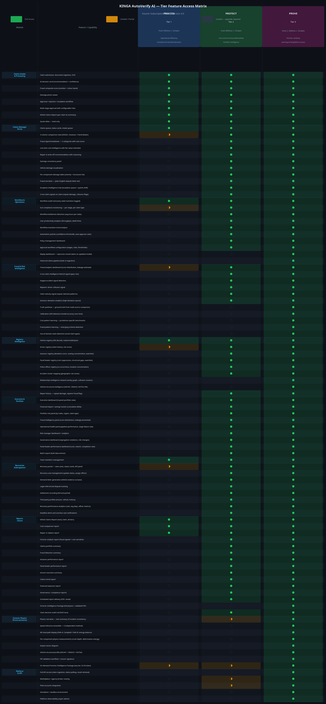

# KINGA AutoVerify AI — Platform Architecture & Monetisation Strategy
## Version 4.0 — Tier Rebuild from First Principles

**Document status:** Internal strategy — confidential  
**Replaces:** v3.0 (February 2026)  
**Prepared by:** KINGA Product & Strategy

---

## Executive Summary

This document rebuilds the KINGA monetisation architecture from first principles. The previous versions organised tiers around feature lists and legal/financial framings that did not map cleanly onto the real operational problems that insurers face. Version 4.0 organises tiers around **where the insurer is in their claims intelligence maturity journey** — from operational consistency, to financial defensibility, to forensic certainty and systemic learning.

The Starter tier is eliminated entirely. Every insurer who onboards KINGA is already committing to a transformation of their claims operation; a stripped-down entry tier sends the wrong signal and attracts customers who are not ready to extract value. The three remaining tiers — **Process**, **Protect**, and **Prove** — are designed so that each tier is genuinely complete for the insurer at that stage, while making the upgrade to the next tier feel inevitable rather than optional.

The core insight driving this rebuild is that KINGA's value does not come from any single feature. It comes from the **accumulation of signals across claims, over time, within and across insurers**. The tiers are structured to release that accumulating intelligence progressively: Process gives the insurer consistent decisions on individual claims; Protect gives them visibility into patterns across their portfolio; Prove gives them the ability to act on those patterns with forensic certainty and to feed outcomes back into the model.

---

## 1. The Problem with the Previous Tier Architecture

The v3.0 architecture made two structural errors.

The first was framing Protect as "financial protection" and Prove as "legal proof." These framings are too narrow and too late-stage. An insurer does not buy Protect because they want to protect their finances in the abstract — they buy it because they want to stop paying claims they should not be paying, and to have the evidence to defend that decision when challenged. An insurer does not buy Prove because they are going to court — they buy it because they want to understand, with scientific precision, what actually happened in an incident, and to use that understanding both in individual claim decisions and in portfolio risk management.

The second error was treating the physics engine as a Prove-exclusive feature. The physics engine is not a forensic tool used only in litigation. It is the most powerful fraud detection instrument in the platform. An insurer who sees a speed inference ensemble result of 18 km/h for a claimed highway collision does not need to be in a courtroom to act on that information. They need to be in their claims manager portal. The v4.0 architecture reflects this by surfacing the physics narrative summary at Protect tier, while reserving the full technical reconstruction and validated Forensic Intelligence Package for Prove.

---

## 2. The Governing Principle: Claims Intelligence Maturity

The three tiers map onto three stages of claims intelligence maturity that every insurer passes through as they adopt AI-assisted adjudication.

**Stage 1 — Consistency.** The insurer's first problem is not fraud detection. It is that identical claims are being decided differently by different people on different days. The value of AI at this stage is not the fraud score — it is the guarantee that every claim goes through the same analytical process, produces the same quality of output, and is decided against the same standard. Process tier delivers this.

**Stage 2 — Defensibility.** Once the insurer has consistent decisions, their next problem is that they are making decisions they cannot fully explain or defend. The fraud score says 74, but what does that mean? The cost intelligence says the quote is 23% above fair value, but on which line items? The assessor's estimate differs from the panel beater's quote, but who is right? Protect tier answers these questions by opening up the analytical layer — the signal breakdown, the line-item cost intelligence, the damage consistency panel, the cross-claim intelligence feed, and the portfolio-level view that lets the risk manager see patterns across hundreds of claims.

**Stage 3 — Certainty and Learning.** The insurer who has been running Protect for six months now has a different problem: they can see the patterns, but they cannot yet act on them with full confidence in high-value or contested cases, and they cannot yet feed what they have learned back into the model to make it better for their specific portfolio. Prove tier delivers forensic certainty on individual claims through the full physics reconstruction, and systemic improvement through the truth synthesis, calibration drift detection, and fraud pattern learning engines.

---

## 3. Tier Architecture

### 3.1 Process Tier — Operational Consistency

**Positioning:** Every claim, processed the same way, every time.

**Pricing:** From $500/month platform fee + $12 per claim processed.

**The core promise:** An insurer on Process tier will never again have a claim adjudicated without an AI recommendation, a fraud composite score, a damage photo analysis, and a structured approval workflow. The inconsistency that comes from manual processing — different handlers, different standards, different days — is eliminated.

**What is included:**

The full claims intake and processing pipeline is available without restriction. This includes document ingestion, OCR, AI decision card with recommendation and confidence level, fraud composite score (number and colour band), damage photo viewer, multi-stage approval workflow with configurable roles, and the KINGA Claims Report for every claim. The quote delta — the difference between the panel beater's quote and KINGA's fair-value estimate — is shown as a total figure.

The Claims Manager Portal is available with the core workflow tools: claims queue, status cards, intake queue, and basic workflow controls. The comparison view is available in a simplified form showing the three-party comparison (KINGA, assessor, panel beater) at the total level, without the line-item breakdown.

The workflow audit trail is fully available — every state transition is logged with user, timestamp, and reason. SLA compliance monitoring is available at the summary level (overall compliance rate per claim type).

The vehicle registry (VIN decode, make/model/year) and the KINGA Claims Report, cost comparison report, and repair vs replace report are all available. Team members management is fully available.

**What is gated:** The analytical layer — fraud signal breakdown, line-item cost intelligence, damage consistency panel, cross-claim signals, assessor and panel beater registries, portfolio analytics, executive dashboard, recovery case management, and all advanced reports. The physics narrative is not available at Process tier; the fraud composite score is a number, not an explanation.

**The upgrade trigger:** The insurer on Process tier will see a fraud score of 74 on a claim and not know why. They will see a quote delta of R28,000 and not know which line items are inflated. They will see a claim from a driver who has made three previous claims and not know that the same assessor handled all three. These locked panels are visible as locked — the insurer can see that the information exists, but cannot access it without upgrading.

---

### 3.2 Protect Tier — Financial Defensibility

**Positioning:** Know why every decision was made. Defend every rand saved.

**Pricing:** From $900/month platform fee + $12 per claim processed.

**The core promise:** An insurer on Protect tier has full visibility into the analytical reasoning behind every claim decision. They can see the fraud signal breakdown, the line-item cost intelligence, the damage consistency panel, the cross-claim signals, the assessor and panel beater registries, and the portfolio-level view. They can defend every decision with evidence, not just a score.

**What is added over Process:**

The Claims Manager Portal opens fully. The three-column comparison view shows line-item detail. The fraud signal breakdown shows all three signal categories (behavioural, physical, cross-claim) with sub-scores and contributing factors. The line-item cost intelligence shows KINGA's fair-value estimate for every repair item in the quote, with the deviation percentage and the benchmark basis. The repair vs write-off recommendation is shown with full reasoning. The damage consistency panel shows the relationship between reported damage and the physics of the incident. The vehicle damage visualisation and per-component damage table are available. The fraud narrative — plain-English text that can be used in dispute correspondence — is available. The Exception Intelligence Hub (escalation queue and system drift monitor) is available.

Cross-claim intelligence is fully available: the live fraud feed showing all nine signal types across the portfolio, staged accident detection, repairer–driver collusion signals, claim velocity signals, and assessor deviation analytics. The assessor registry (deviation score, routing concentration, watchlist), panel beater registry (cost suppression, structural gaps, watchlist), police officer registry (co-occurrence, location concentration), accident cluster mapping, and repair history (repeat damage, repairer fraud flags) are all available.

The Executive Dashboard opens with all six panels: financial impact and savings tracker, portfolio risk panel, fraud intelligence panel, operational health panel, risk manager dashboard and analytics, and governance dashboard (segregation violations, role changes). The panel beater performance dashboard is available. Batch export is available.

Workflow analytics open fully: bottleneck detection, user productivity analytics, workflow transition trend analysis, automation policies (confidence thresholds, auto-approve rules), policy management dashboard, and approval workflow configuration.

The full Reports Centre opens: forensic analysis report (fraud signals and cost narrative), claims portfolio summary, fraud detection summary, assessor performance report, panel beater performance report, insurer executive summary, claims trend report, financial exposure report, governance and compliance reports, scheduled report delivery, and the claim decision audit trail.

The Recovery Portal opens fully: case management, demand letter generation using KINGA evidence as the basis, legal referral and dispute tracking, settlement recording, third-party profiles, recovery performance analytics, and deadline alerts.

The physics narrative — a plain-English text summary of incident consistency derived from the physics engine — is available at Protect tier. This is not the full technical reconstruction; it is a human-readable statement of whether the physics of the incident are consistent with the claim narrative. This is sufficient for the vast majority of fraud decisions.

**What is gated:** The full physics reconstruction (speed inference ensemble, M5 dual-path display, per-component measurements, impact vector diagram, vehicle structural profile), the FIP validation workflow, the truth synthesis engine, calibration drift detection, cost and fraud pattern learning, out-of-domain claim detection, the relationship intelligence network, full API access, and the simulation environment.

**The upgrade trigger:** The insurer on Protect tier will encounter high-value claims where the physics narrative says "inconsistent" but they need to know by how much, and in which direction, with a methodology they can put in front of a dispute panel. They will see the fraud pattern learning engine locked and realise that their model is not improving on their specific portfolio. They will see the truth synthesis engine locked and realise that their assessors' deviations are not being systematically tracked and fed back. These are the triggers for the Prove upgrade.

---

### 3.3 Prove Tier — Forensic Certainty and Systemic Learning

**Positioning:** The science to prove it. The intelligence to prevent it next time.

**Pricing:** From $1,500/month platform fee + $12 per claim processed.

**The core promise:** An insurer on Prove tier has access to the full forensic reconstruction of every claim, the ability to validate and sign off on Forensic Intelligence Packages for use in dispute proceedings, and the systemic learning engines that make the model better over time on their specific portfolio.

**What is added over Protect:**

The full physics engine opens: the speed inference ensemble (five independent methods — Campbell formula, energy balance, momentum conservation, crush depth analysis, and witness statement cross-reference), the M5 dual-path display (Path A: Campbell stiffness coefficient method; Path B: energy balance method), per-component physics measurements (crush depth, deformation energy, impact vector), the impact vector diagram, and the vehicle structural profile (ANCAP safety rating, CRASH3 stiffness coefficients, NHTSA VIN decode).

The Forensic Intelligence Package (FIP) workflow is available: the insurer can validate a FIP for a specific claim, add their professional sign-off, and produce a document suitable for use in dispute proceedings, arbitration, or litigation. The FIP carries a digital watermark identifying the issuing insurer and the KINGA version that produced it.

The truth synthesis engine is available: for any historical claim with an assessor estimate, KINGA synthesises a ground truth from multiple reference sources and identifies the deviation between the assessor's estimate and the synthesised truth. Claims with high deviation are surfaced in a review queue. Approved syntheses are added to the training dataset.

Calibration drift detection is available: KINGA monitors the accuracy of its own models over time on the insurer's portfolio and surfaces drift alerts when a model's performance degrades. The insurer's team can review and approve calibration updates.

Cost pattern learning is available: KINGA builds jurisdiction-specific cost benchmarks from the insurer's historical claims data, improving the accuracy of fair-value estimates for the insurer's specific vehicle mix and repair market.

Fraud pattern learning is available: KINGA identifies emerging fraud schemes in the insurer's portfolio and updates its fraud signal weights accordingly. This is the mechanism by which the model improves over time rather than remaining static.

Out-of-domain claim detection is available: KINGA flags claims that fall outside the distribution of its training data, alerting the insurer that the AI's confidence on that claim may be lower than usual.

The relationship intelligence network is available: the full entity graph showing relationships between claimants, assessors, panel beaters, police officers, and vehicles, with cluster detection for organised fraud rings.

The vehicle structural intelligence profile is available in full: ANCAP safety ratings, CRASH3 stiffness coefficients, and NHTSA VIN decode, combined into a structural narrative for the claim vehicle and any counterpart vehicle.

The replay dashboard is available: the insurer can reprocess closed claims through updated models to see how the decision would have changed. This is the primary tool for model validation and for identifying claims that were incorrectly decided before a model update.

The historical claims pipeline is available: bulk re-ingestion of historical claims for retrospective analysis, training data generation, and portfolio benchmarking.

Full API access is available: programmatic claim ingestion, status polling, and result retrieval. This enables integration with the insurer's own systems and the development of custom workflows.

The simulation environment is available: a sandboxed instance where the insurer can test automation policies, model updates, and workflow changes before deploying them to the live environment.

---

## 4. The Protect–Prove Distinction: A Deeper Analysis

The question of how to separate Protect and Prove is the hardest design problem in the tier architecture. The answer is not legal vs financial, and it is not about who the user is. It is about **the nature of the claim decision being made**.

At Protect tier, the insurer is making **portfolio-level decisions**: which claims to pay, which to challenge, which to escalate, which assessors to stop using, which panel beaters to delist. These decisions are made by the claims manager, the risk manager, and the executive. They are made on the basis of patterns — fraud scores, cost deviations, signal breakdowns, portfolio analytics. The evidence required is sufficient to justify an internal decision. The standard is "we have enough to act."

At Prove tier, the insurer is making **individual-claim decisions that will be contested**. A claimant who has received a repudiation letter will challenge it. A panel beater who has been delisted will dispute the decision. A third party in a recovery case will deny liability. In all of these situations, the insurer needs to be able to produce a document that shows, with scientific precision, what happened. The physics reconstruction, the FIP, and the validated evidence trail are the tools for this. The standard is "we can prove it."

The second dimension of the Prove tier is **systemic improvement**. An insurer who has been on Protect for a year has generated hundreds of claims with known outcomes. Those outcomes — paid, repudiated, settled, recovered — are the most valuable training data in the system. The truth synthesis engine, the calibration drift detector, the cost and fraud pattern learning engines, and the out-of-domain detector are all mechanisms for feeding those outcomes back into the model. This is not a forensic tool; it is an operational tool. But it requires a level of engagement with the platform — reviewing syntheses, approving calibration updates, monitoring drift — that is appropriate for an insurer who has already extracted the full value of Protect and is ready to invest in making the model better.

---

## 5. The On-Demand Forensic Intelligence Package

Not every insurer on Process or Protect tier will need the full physics reconstruction on every claim. But every insurer will occasionally encounter a claim where the physics matter — a high-value collision, a suspected staged accident, a disputed write-off. For these cases, the on-demand FIP is available to all tiers at a per-claim fee of $125.

The on-demand FIP gives the insurer the full physics reconstruction for a single claim, without requiring an upgrade to Prove tier. It is positioned as a "specialist instrument" — the same way an insurer might commission a specialist forensic engineer for a specific claim without retaining them on a permanent basis.

The on-demand FIP is also a conversion tool. An insurer who uses the on-demand FIP three times in a month is spending $375 on per-claim forensics. The Prove tier upgrade pays for itself within four to five FIP uses per month. The upgrade conversation writes itself.

---

## 6. Workflow Analytics as a Tier Differentiator

Workflow analytics is one of the most undervalued features in the platform, and one of the most powerful tier differentiators. It is not a reporting feature — it is an operational intelligence feature.

At Process tier, the insurer gets the workflow audit trail and a summary SLA compliance rate. This is sufficient to know that the system is working.

At Protect tier, the full workflow analytics suite opens: bottleneck detection (which workflow states are causing delays, and by how much), user productivity analytics (which team members are processing claims fastest, and where dwell time is accumulating), workflow transition trend analysis (how the distribution of claim states is changing over time), and automation policy management (the ability to configure confidence thresholds for auto-approval and auto-escalation).

The automation policy feature deserves particular attention. An insurer who has been running KINGA for three months has enough data to know that claims with a fraud score below 15 and a cost delta below 5% are almost always straightforward. The automation policy engine lets them configure KINGA to auto-approve those claims without human review, subject to a maximum approval amount. This is not a risk — it is a productivity multiplier. The insurer's team can focus on the 20% of claims that require human judgment, rather than processing the 80% that do not.

---

## 7. Recovery as a Revenue Multiplier

The recovery (subrogation) module is positioned as a revenue multiplier, not a cost centre. An insurer who recovers R50,000 from a third party on a claim that KINGA identified as having strong recovery potential has generated a return that is a multiple of their monthly platform fee.

At Process tier, the recovery portal is available in read-only mode: the insurer can see all recovery cases, their status, and the KPI panel (total potential recovery, total recovered, recovery rate). This gives the insurer visibility into the recovery pipeline without the operational tools to manage it.

At Protect tier, the full recovery module opens: case management, demand letter generation using KINGA evidence as the basis, legal referral and dispute tracking, settlement recording, third-party profiles, recovery performance analytics, and deadline alerts. The demand letter generator is particularly valuable — it uses the fraud signals, cost intelligence, and physics narrative from the claim to construct a demand letter that is grounded in KINGA's analysis, not just the insurer's assertion.

---

## 8. The External Assessor Channel

The assessor channel is a separate revenue stream with a separate value proposition. It is strategically important for two reasons: it bypasses the insurer procurement cycle (an assessor using KINGA does not require their insurer clients to be KINGA customers), and it creates a referral channel (a KINGA assessor whose reports consistently outperform manual assessments will be asked by insurers how they produce them).

The assessor tier architecture from v2.0 remains valid and is not changed in this document. However, the following additional tools are identified as high-priority development items for the assessor channel:

**Mobile site inspection workflow.** An assessor at a vehicle inspection site needs to capture photos, record measurements, and annotate damage in a structured way that feeds directly into the KINGA pipeline. A mobile-optimised interface for this workflow — with guided photo capture, VIN scanning, and damage zone annotation — would significantly reduce the time between site inspection and report production.

**Assessor performance dashboard.** An assessor firm managing multiple assessors needs visibility into their team's performance: average deviation from KINGA fair value, report production time, claim type distribution, and client satisfaction. This is a management tool, not a claim tool, and it is appropriate for Assessor Tier 2 or as a firm-level add-on.

**Quote review and markup tool.** An assessor reviewing a panel beater's quote needs to be able to annotate specific line items, flag deviations, and produce a structured markup that feeds into the KINGA cost intelligence layer. This tool would replace the current manual process of producing a separate document.

**Assessor-to-insurer communication channel.** A structured communication channel between the assessor and the insurer's claims team — integrated with the KINGA claim record — would reduce the email and phone traffic that currently accompanies every claim and create a documented audit trail of all communications.

These tools are recommended as a cohesive **Assessor Pro Toolkit**, positioned as a premium add-on to Assessor Tier 2 at an additional $3/claim or $80/month for firms processing more than 30 claims per month.

---

## 9. Features Not Yet Built — Monetisation Opportunities

The following capabilities are identified as high-value additions that are not yet built but are architecturally consistent with the existing platform. They are listed in order of estimated commercial impact.

### 9.1 Predictive Portfolio Risk Scoring

Using the cross-claim intelligence data, the calibration drift data, and the accident cluster data, KINGA can produce a forward-looking portfolio risk score for each insurer: the estimated fraud exposure in the current open claims portfolio, the estimated leakage in the closed claims portfolio, and the predicted claim frequency by vehicle category and region for the next quarter. This is a Prove-tier feature that would be the primary driver of the Protect-to-Prove upgrade for risk managers and actuaries.

### 9.2 Automated Repudiation Letter Generation

Building on the fraud narrative feature in Protect tier, KINGA can generate a full repudiation letter — not just the fraud narrative text, but the complete formal document with the insurer's letterhead, the claim reference, the policy number, the grounds for repudiation, and the appeal process. This would be a Protect-tier feature and would reduce the time from repudiation decision to letter dispatch from hours to minutes.

### 9.3 Panel Beater Quote Benchmarking API

The cost intelligence layer currently operates within the KINGA platform. An API that allows panel beaters to submit quotes and receive a benchmark score before submitting to the insurer would create a new revenue stream (per-query pricing for panel beaters) and improve the quality of quotes entering the system. This is a platform-level feature appropriate for Prove tier or as a standalone product.

### 9.4 Regulatory Compliance Reporting

The governance and compliance report in the Reports Centre currently covers internal governance (segregation of duties, role changes, fast-track anomalies). A regulatory compliance report — structured to meet the specific reporting requirements of the Financial Sector Conduct Authority (FSCA) in South Africa, or equivalent regulators in other markets — would be a high-value Prove-tier feature for large insurers with compliance obligations.

### 9.5 Claimant Communication Portal

A structured portal for claimants to submit additional documents, respond to information requests, and track the status of their claim would reduce the inbound communication burden on the insurer's claims team and create a documented audit trail of all claimant interactions. This is a platform-level feature that could be offered as an add-on at any tier.

### 9.6 Multi-Insurer Benchmark Intelligence

At the platform level (not visible to individual insurers), KINGA accumulates cross-insurer data on fraud patterns, cost benchmarks, and claim outcomes. A de-identified benchmark intelligence report — showing how an insurer's fraud detection rate, cost delta, and recovery rate compare to the platform average — would be a compelling Prove-tier feature and a powerful upgrade trigger for Protect-tier insurers.

---

## 10. Pricing Architecture

The pricing architecture is designed to be simple, transparent, and aligned with the insurer's value realisation.

| Tier | Platform Fee | Per-Claim Fee | Minimum Commitment |
|---|---|---|---|
| Process | $500/month | $12/claim | 3 months |
| Protect | $900/month | $12/claim | 6 months |
| Prove | $1,500/month | $12/claim | 12 months |
| On-demand FIP (any tier) | — | $125/claim | None |
| Assessor Tier 1 | — | $5/claim | None |
| Assessor Tier 2 | — | $12/claim | None |
| Assessor Tier 3 | $200/month | $25/claim | 3 months |
| Assessor Pro Toolkit | $80/month | +$3/claim | None |
| Fleet Tier 1 | $2/vehicle/month | — | 20 vehicles |
| Fleet Tier 2 | $4/vehicle/month | — | 20 vehicles |

Notes on pricing rationale:

The per-claim fee is identical across all three insurer tiers. This is intentional: the cost of processing a claim through the KINGA pipeline is the same regardless of which tier the insurer is on. The tier fee reflects the value of the analytical and intelligence layer, not the processing cost. An insurer should never feel that they are paying more per claim because they upgraded.

The minimum commitment periods reflect the time required to realise value at each tier. Process delivers value from the first claim. Protect delivers full value after approximately three months, when the portfolio analytics have enough data to be meaningful. Prove delivers full value after approximately six months, when the learning engines have enough data to begin improving the model.

---

## 11. The Tier Upgrade Conversation

The most important commercial mechanism in the tier architecture is the locked panel. Every locked panel in the Claims Manager Portal, the Reports Centre, and the Recovery Portal is a visible reminder that the information exists and is accessible — just not at the current tier. The upgrade conversation is not a sales call; it is a response to a question the insurer is already asking.

**Process to Protect:** The insurer sees a fraud score of 74 and cannot see why. They see a quote delta of R28,000 and cannot see which line items. They see the cross-claim signals panel locked and know that the same driver has made three previous claims. The upgrade conversation is: "You are making the right decisions. Protect tells you why."

**Protect to Prove:** The insurer has been using the fraud narrative to support repudiations. A claimant has challenged a repudiation and the insurer needs to produce technical evidence. The physics narrative says "inconsistent" but the insurer needs the methodology. The upgrade conversation is: "You have the evidence. Prove gives you the science to stand behind it — and the learning engines to make the model better on your portfolio."

---

## 12. Tier Feature Access Matrix

The complete feature access matrix is provided as a visual reference in the accompanying diagram (`kinga_tier_matrix_v4.png`). The matrix covers 90 features across 10 modules and uses three access states: full access (●), limited/partial access (◑), and locked — upgrade required (○).

---

## 13. Implementation Roadmap for Tier Gating

The tier architecture described in this document requires the following implementation work:

**Phase 1 — Schema and middleware (2 weeks).** The `insurer_tenants` table already has a `tier` field with values `process`, `protect`, `prove`. A middleware layer needs to be added to the tRPC router that checks the tenant's tier against a feature access map before executing any procedure. Procedures that are locked at the current tier should return a `TIER_UPGRADE_REQUIRED` error with a message explaining which tier is required.

**Phase 2 — Frontend gating (2 weeks).** The frontend needs to consume the tier information from the `trpc.auth.me` response and render locked panels with an upgrade prompt rather than simply hiding them. The upgrade prompt should show the tier required and a one-sentence description of what the feature does.

**Phase 3 — Upgrade flow (1 week).** A self-service upgrade flow needs to be built: the insurer can request an upgrade from within the platform, which triggers a notification to the KINGA team and a confirmation email to the insurer. Automated billing integration (Stripe) can be added in a subsequent phase.

**Phase 4 — On-demand FIP (2 weeks).** The on-demand FIP purchase flow needs to be built: the insurer selects a claim, requests a FIP, pays the per-claim fee, and receives the FIP document within the platform. This requires Stripe integration and a FIP generation queue.

---

*End of document — Version 4.0*
